# 第一章 概述

## 1.1 计算机网络在信息时代中的作用

## 1.2 互联网概述

## 1.3 互联网的组成

### 1.3.1 互联网的边缘部分

### 1.3.2 互联网的核心部分

#### 前置知识

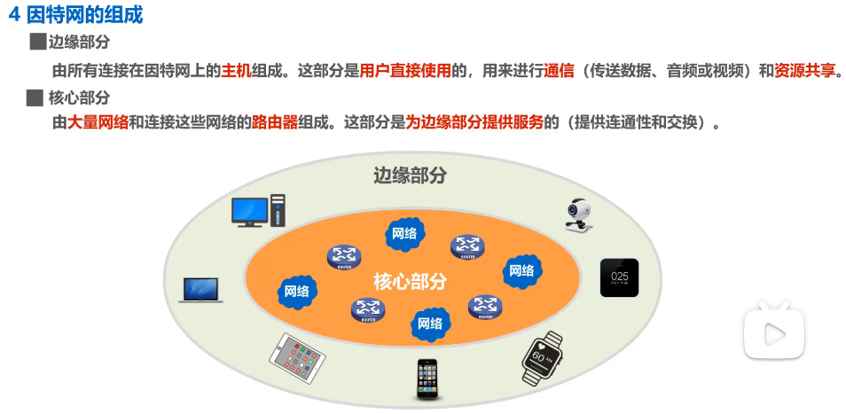

互联网的组成如上图.

互联网由边缘部分与核心部分组成。如图中所示：

* 边缘部分：由所有连接在互联网上的**主机**组成。这部分由**用户直接使用**，用来进行**通信和资源共享**。这些主机可以是台式电脑、笔记本电脑、平板电脑、手机、手环以及其他互联网连接设备
* 核心部分：由**许多网络**和连接这些网络的**路由器**组成。该部分是**为边缘部分提供服务**的，向边缘部分的大量主机提供连通性，使得边缘部分任何一台主机都可以与其他主机进行通信即**提供连通性和交换**

在核心部分中起特殊作用的是**路由器**，它是一种专用计算机（但又不能称之为主机）。

路由器是实现**分组交换**的关键构建，其任务是**转发收到的分组**(存储转发)

#### 三种交换方式：电路交换、分组交换以及报文交换

##### (1) 电路交换

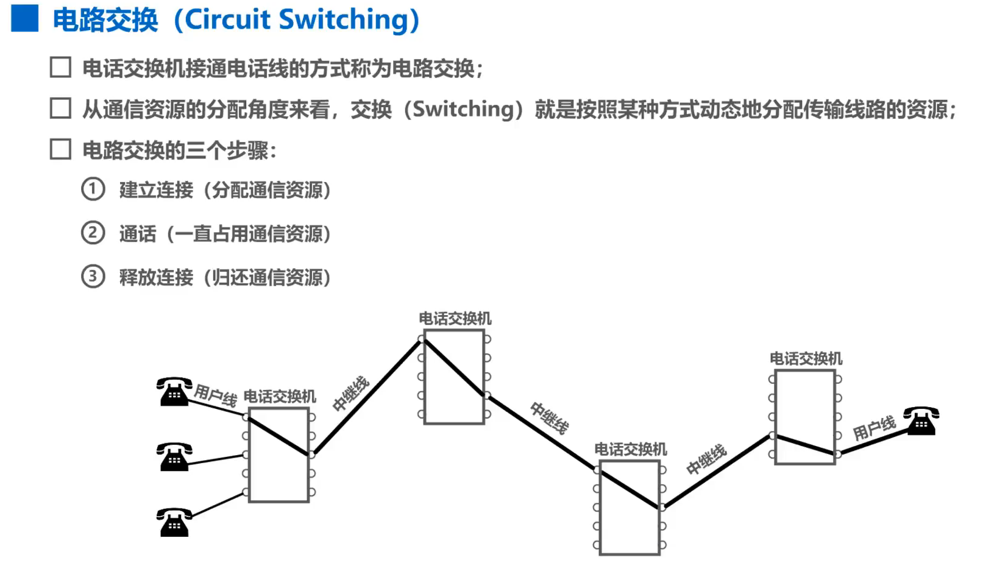

定义：必须经过「建立连接 → 通话 → 释放连接」三个步骤的交换方式称之为**电路交换**

> 由图中可知，电路交换的三个步骤：
> 建立连接 - 分配通信资源
> 通话 - 一直占用通信资源
> 释放连接 - 归还通信资源

特点：电路交换的一个重要特点是**在通话的全部时间内，通话的两个用户始终占用端到端的通信资源**

由于计算机数据是突发式的，因此用电路交换的方式传输计算机数据，传输效率是很低的

##### (2) 分组交换

分组交换采用的是**存储转发**技术

特点：在发送**报文**之前，先将其划分为多个更小的**等长数据段**，并在每个数据段的前面加上一个**首部**，这样由数据段和首部就构成了一个**分组**

> 相关概念解释：
> * 报文：通常将所要发送的整块数据称为报文
> * 首部：包含了一些必要的控制信息，如源地址、目的地址
> * 分组：**在互联网中传送的数据单元**，分组又称为「包」，分组的首部也可称为「包头」

数据传输过程如下图.

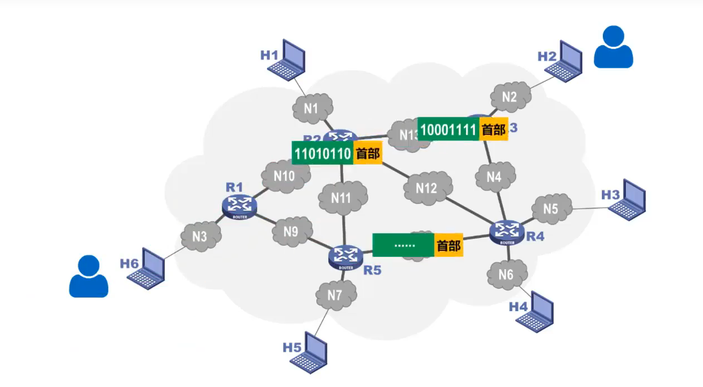

假设主机H6要向主机H2发送数据：

1. 将报文划分为一个又一个的分组，并给每个分组添加首部
2. 将分组发往路由器上，路由器采用的是**存储转发**技术，即接收分组后，将其缓存下来，查找转发表，将其发送到下一个路由器上
3. 依此类推，每个路由器对分组都采用存储转发的方式，并且在发送当前分组时，也可以接收其他分组
4. 分组传送的路径可以不同
5. 主机H2收到所有分组后，去掉首部并还原出原始报文

在传输过程中，各设备所起的作用如下图.

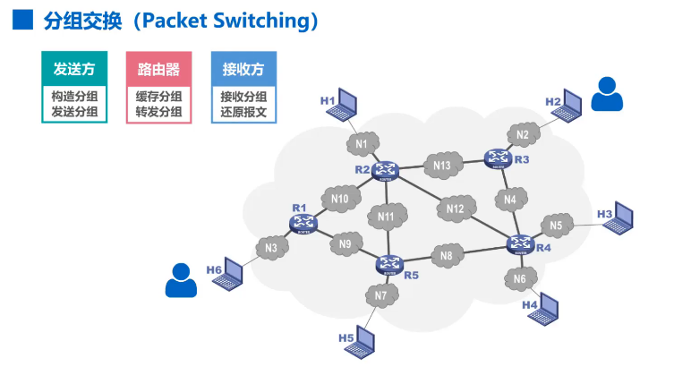

##### (3) 报文交换

与分组交换类似，报文交换中的交换节点也采用存储转发的方式，但对报文的大小没有限制，需要先将整个报文全部缓存下来，再查表转发

##### (4) 三种交换方式的比较

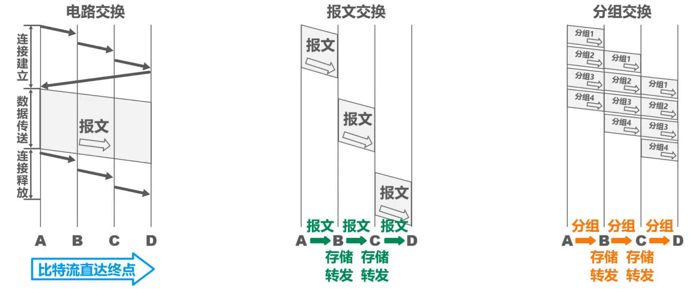

* A、B、C、D是分组交换传输路径要经过的四个节点交换机
* 纵轴表示时间
* 电路交换中，需要先建立用户之间的连接，在数据传送阶段一直占用通信线路，传送完毕后释放连接
* 在报文交换和分组交换中，都不需要事先建立连接

优缺点如下.

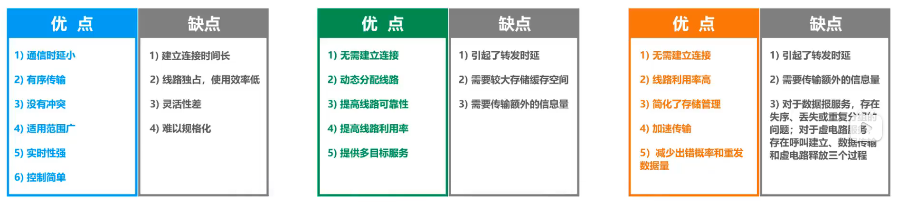

## 1.4 计算机网络的定义和分类

## 1.5 计算机网络的性能指标

计算机网络的性能指标有：速率、带宽、吞吐量、时延、时延带宽积、往返时间、利用率、丢包率

### 1.5.1 速率

在了解速率之前，需要了解比特这一概念

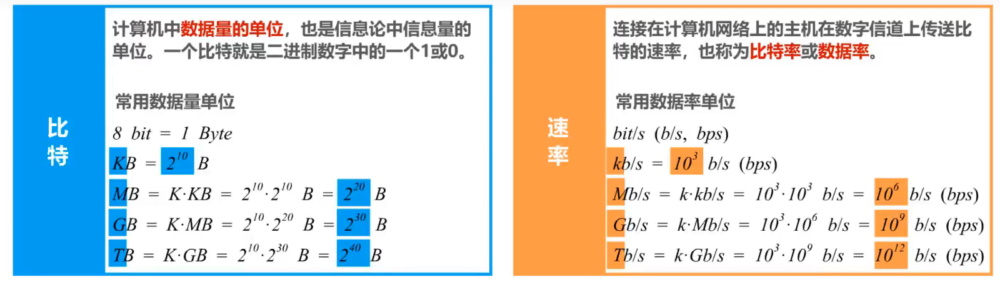

上图展示了比特和速率的概念及其单位转换

比特(binary digit)：即 **一个二进制数字**，是信息论中信息量的一个基本单位

网络技术中的速率是指：数据的传送速率，也称为数据率(data rate)或比特率(bit rate)

数据量单位和数据率单位如上图所示，可以发现在数据量单位中，单位的转换是以 $2^{10}$ 进行的，而数据率单位中的转换是以 $10^3$ 进行的

### 1.5.2 带宽

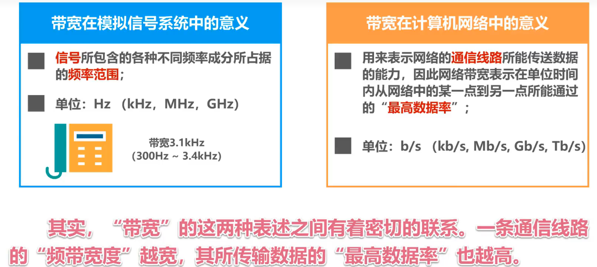

带宽具有两种不同的表述如上图所示。左边为 **频域** 称谓，右边为 **时域** 称谓

简单来讲就是，前者是指**某个信号所具有的频带宽度**，而后者是在计算机网络中，表示网络中**某信道传送数据的能力**

但二者的本质是相同的即一条通信链路的「频带宽度」越宽，其所传输数据的「最高比特率」也越高

### 1.5.3 吞吐量

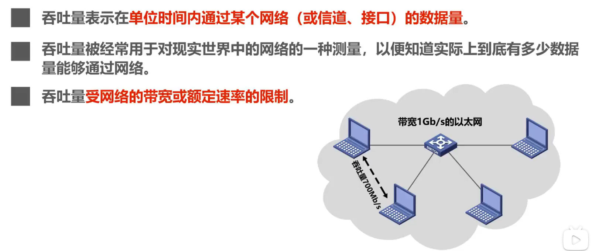

吞吐量表示单位时间内通过某个网络（或信道、接口）的实际数据量

### 1.5.4 时延

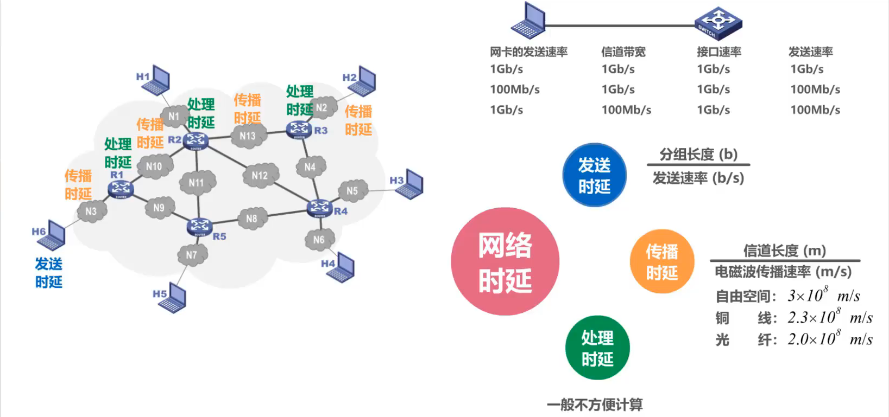

时延是指数据从网络的一端传送到另一端所需要的时间，有时也成为延迟或迟延

网络中的时延由发送时延、传播时延、处理时延三部分组成

1. 发送时延
   
   含义：主机或路由器发送数据帧所需要的时间即从发送数据帧的第一个比特算起，到该数据帧最后一个比特发送完毕的时间

   计算公式：分组长度 / 发送速率

2. 传播时延
   
   含义：电磁波在信道中传播一定距离所需要的时间
   
   计算公式：信道长度 / 电磁波传播速率

3. 处理时延
   
   含义：主机或路由器对收到的分组进行处理（如检查首部、提取数据部分、差错校验、查找转发表）所花费的时间

   计算复杂，一般不方便计算

### 1.5.5 时延带宽积

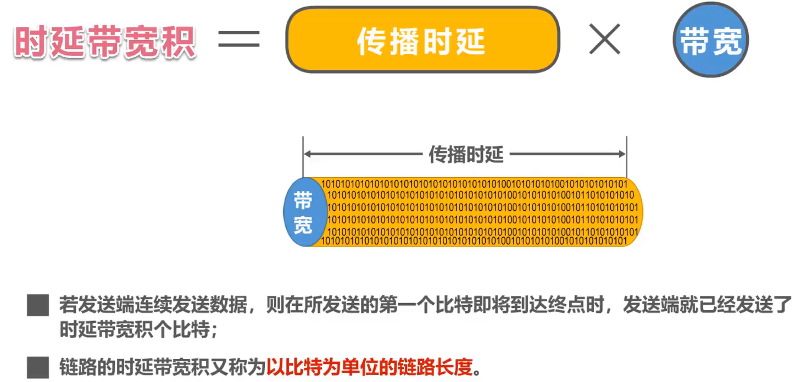

顾名思义就是时延与带宽的乘积，并且是传播时延与带宽的乘积

时延带宽积可以看作一个管道，传播时延是该管道的长度，而带宽就是该管道的横截面积

### 1.5.6 往返时间RTT

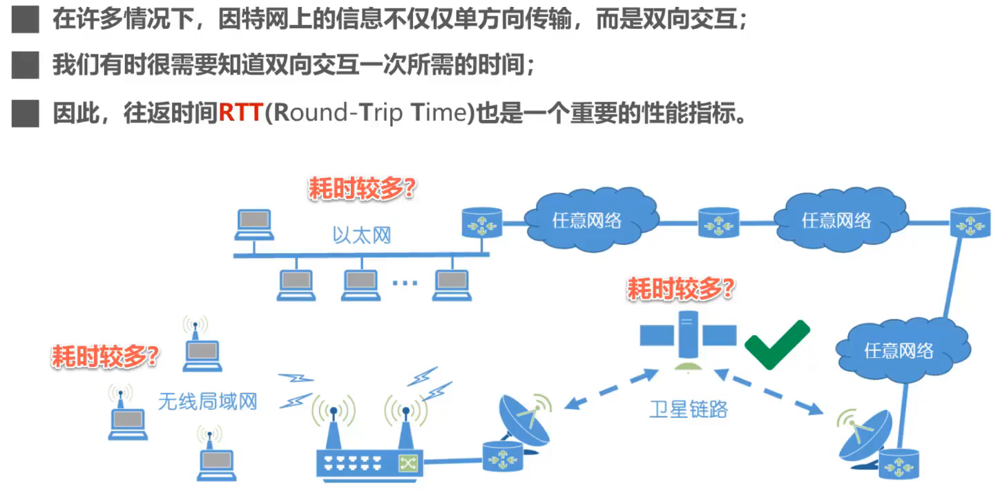

上图展示了往返时间RTT(Round-Trip Time)的一些重要概念

### 1.5.7 利用率

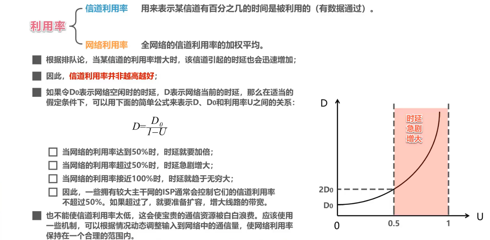

上图为利用率的一些重要概念

* 利用率分为信道利用率和网络利用率两种
  * 信道利用率：表示某信道有百分之几的时间是被利用的（即有数据通过）
  * 网络利用率：全网络信道利用率的加权平均

**信道利用率并非越高越好**，这是因为根据排队理论，当某信道的利用率增大时，该信道引起的时延也会迅速增加

**当信号利用率或网络利用率过高就会产生非常大的时延**

### 1.5.8 丢包率

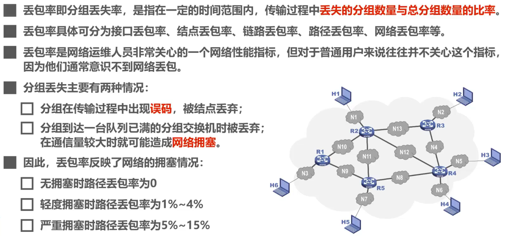

上图展示了丢包率的一些概念，但由于在实际课程中并未介绍，因此不详细展开