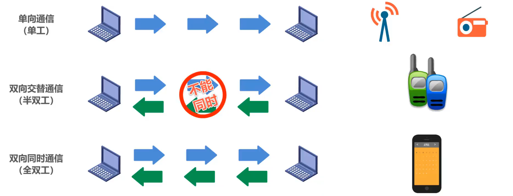
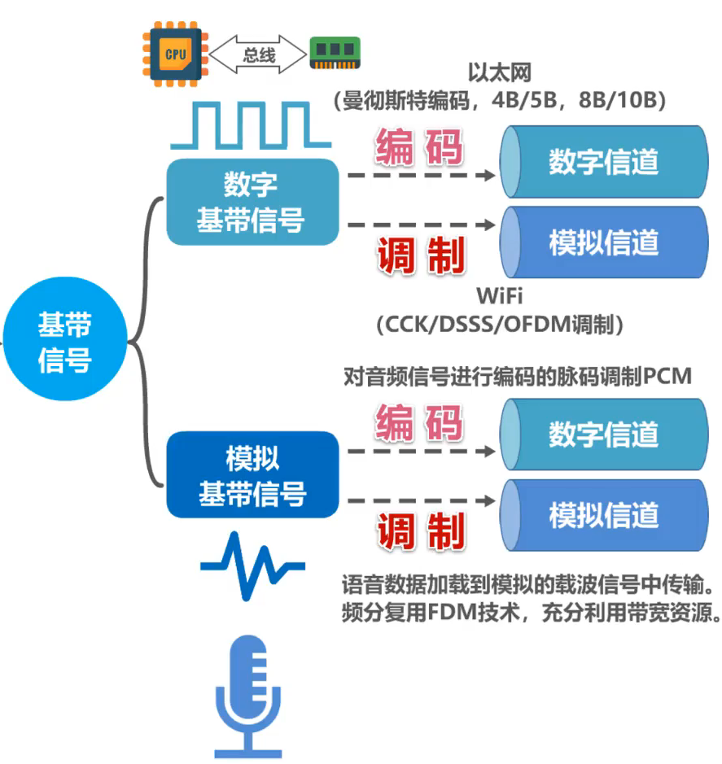
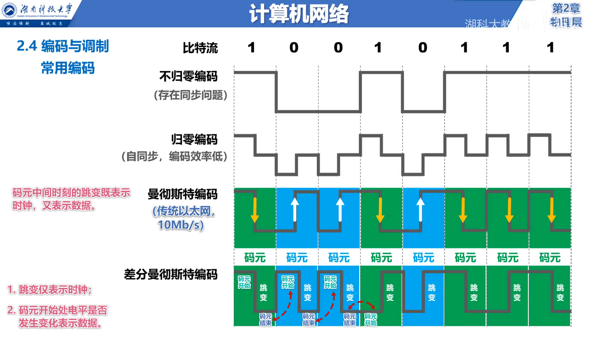
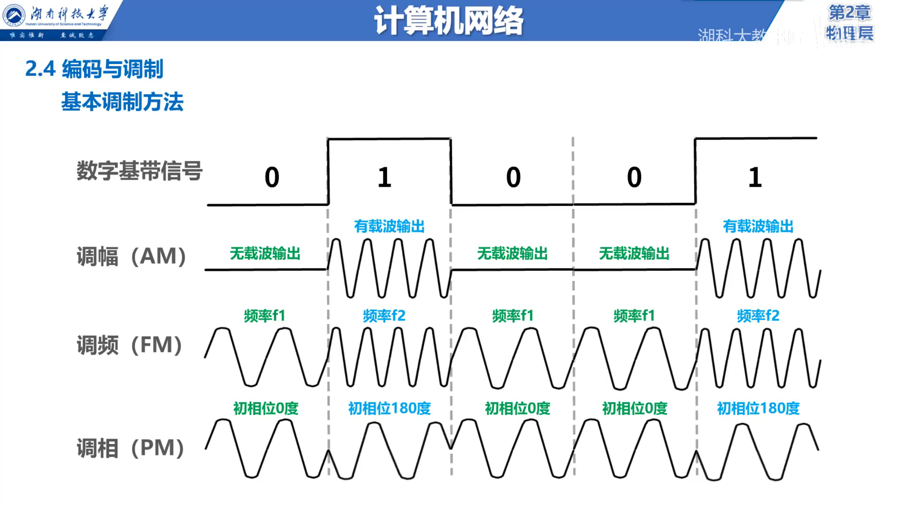
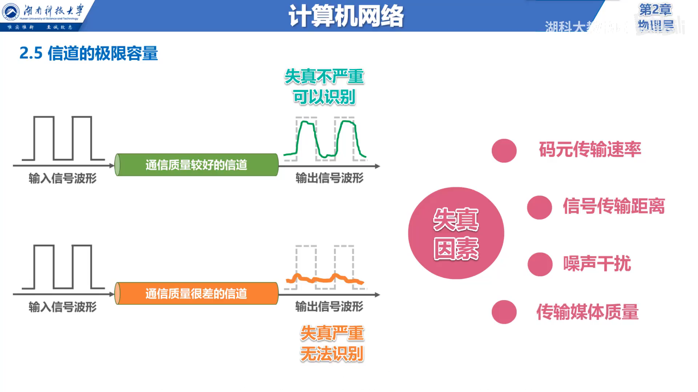
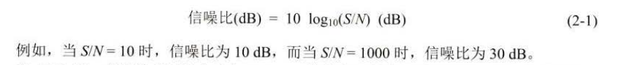
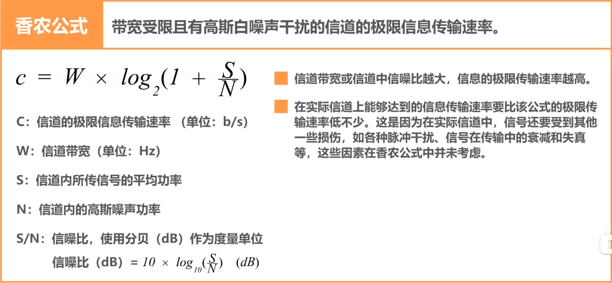

# 第二章 物理层

## 2.1 物理层的基本概念

物理层考虑的是如何在连接各种计算机的传输媒体上传输数据比特流，而不讨论具体的传输媒体

物理层的作用就是尽可能地屏蔽不同传输媒体和通信手段的差异，使物理层上面的数据链路层感受不到这些差异，进而给数据链路层提供「透明」传输比特流的服务

> 所谓「透明」是指，数据链路层看不见，也无须看见物理层是使用什么方法来传输数据比特流的，只需享受物理层提供的数据比特流传输服务即可

用于物理层的协议常称为物理层规程(procedure)

物理层的主要任务可以描述为确定与传输媒体接口有关的一些特性，如：

## 2.2 数据通信的基础知识

### 2.2.1 数据通信系统模型

一个数据通信系统包括三大部分：源系统（又称为发送端或发送方）、传输系统和目的系统（也可称为接收端或接收方）

上图为一个数据通信系统的模型

上面表示实例，中间为各部分的对应情况，下面为模型抽象后的过程

### 2.2.2 常用术语

* 消息：在计算机网络中，计算机需要处理和传输用户的文字、图片、音频和视频，它们可以统称为**消息**。通信的目的是传送消息
* 数据：**数据**是运送消息的实体。计算机只能处理二进制数据
* 信号：**信号**是数据的电气或电磁表现。计算机中的网卡将比特0和比特1转化成相应的电信号后发送到网线
* 基带信号：由信源发出的原始电信号称为基带信号。基带信号又可分为数字基带信号和模拟基带信号
  * 数字信号：离散信号，代表消息的参数的取值是离散的
  * 模拟信号：连续信号，代表消息的参数的取值是连续的
* 码元：在使用时间域（或简称为时域）的波形表示数字信号时，代表不同离散数值的基本波形。简言之，**码元**就是构成信号的一小段波形
  
  

### 2.2.3 有关信道的基本概念

信道：一般用来表示向某一方向传送信息的媒体。因此，一条通信线路往往包含一条发送信道和一条接收信道

通信双方信息交互的三种基本方式：

* 单向通信：又称为单工通信，通信双方只有一个数据传输方向，没有反方向的交互
* 双向交替通信：又称为半双工通信，通信双方可以相互传输数据，但不能同时进行，只能是一方发送另一方接收，过一段时间后可以反过来
* 双向同时通信：又称为全双工通信，通信双方可以同时发送和接收信息
  
  

  > 对于单工传输，传输媒体中只包含一个信道，要么是发送信道，要么是接收信道
  > 对于半双工和全双工，传输媒体中包含两个信道，即发送信道和接收信道

### 2.2.4 编码与调制

* 信道可以分为数字信道和模拟信道两种
* 在不改变性质的前提下，仅对数字基带信号的波形进行变换，称为**编码**，编码后产生的信号仍为数字信号，可以在数字信道传输
* 将数字基带信号的频率范围搬移到较高的频段，并转换为模拟信号，称为**调制**，调制后产生的信号是模拟信号，可以在模拟信道中传输
* 对于模拟基带信号也有编码和调制两种方法

下图展示了几种常用的编码方式：

* 不归零编码：在整个码元时间内，电平不会出现零电平。正电平表示1，负电平表示0
* 归零编码：每个码元在传输结束后都要归零。实际上，归零编码相当于把时钟信号用「归零」的方式编码在了数据中（称为自同步信号），但正因为这样，归零编码中的大部分数据带宽都用来传输「归零」而浪费
* 曼彻斯特编码：在每个码元的中间时刻，信号都发生了跳变。但正负跳变的含义可以自行定义，比如负跳变表示比特1，正跳变表示比特0。码元中间时刻的跳变既表示时钟又表示数据
* 差分曼彻斯特编码：在每个码元的中间时刻，信号都会发生跳变（跳变仅表示时钟），用码元开始处的电平是否发生变化来表示数据

下图展示了几种调制方法：

* 数字基带信号是来自信源的原始数字信号。当需要在模拟信道中传输时，就要将数字基带信号通过调制的方法，调制成可以在模拟信道中传输的模拟信号
* 调幅（AM）：载波的振幅随数字基带信号而变化，0和1分别对应于无载波输出和有载波输出
* 调频（FM）：载波的频率随数字基带信号而变化，0和1分别对应于不同的频率 $f_1$ 和 $f_2$
* 调相（PM）：载波的初始相位随数字基带信号而变化，0和1分别对应于相位0°或180°
* **使用基本的调制方法，一个码元只能表示一个比特信息**

### 2.2.5 信道的极限容量

任何实际的信道都不是理想的，在传输信号时会产生失真以及受到各种因素的干扰

* 产生失真的原因如图所示，主要有：码元传输速率、信号传输距离、噪声干扰、传输媒体质量等
* 接收端收到的信号波形失去了码元之间的清晰界限，这种现象称为**码间串扰**。严重的码间串扰会使得原本很清楚的一串码元变得模糊而无法识别

从概念上讲，限制码元在信道上的传输速率的因素有两个：信道能够通过的频率范围、信噪比

奈氏准则：在假定的理想条件下，为了避免码间串扰，码元传输速率是有上限的

结论：在带宽为 $W$ (Hz) 的低通信道中，若不考虑噪声影响，则码元的最高速率是 $2W$ (码元 / 秒)。传输速率超过此上限，就会出现严重的码间串扰问题，使接收端对码元的识别成为不可能

所谓信噪比，就是指信号的平均功率和噪声的平均功率之比，常记为 $S / N$ ，但通常使用分贝(dB)作为度量单位，即：

信噪比(dB) = $10 \log_{10}(S / N)$ (dB)

香农公式如下

## 2.3 物理层下面的传输媒体

## 2.4 信道复用技术

## 2.5 数字传输系统

## 2.6 带宽接入技术