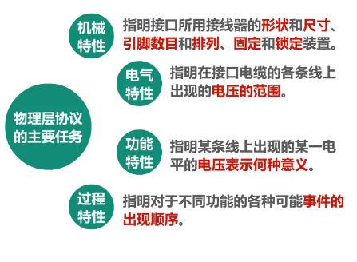
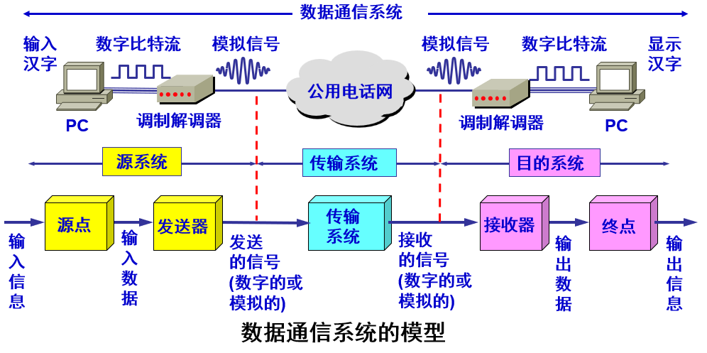
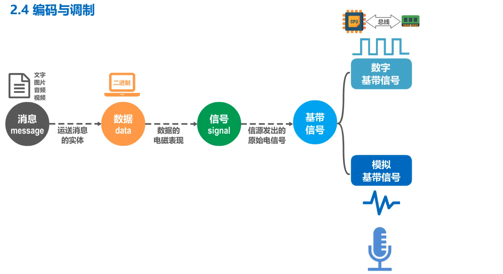
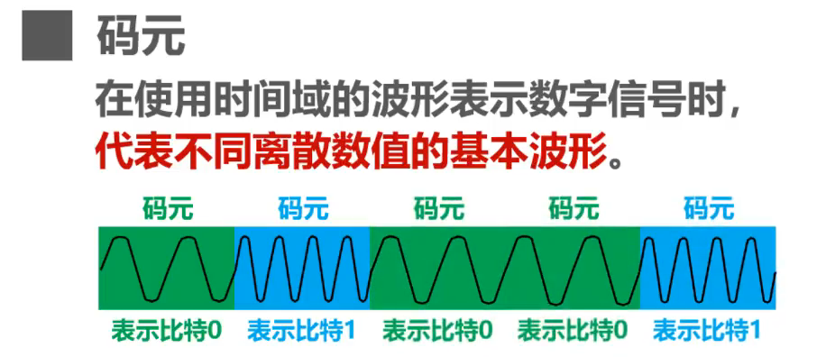

# 第二章 物理层

## 2.1 物理层的基本概念

物理层考虑的是如何在连接各种计算机的传输媒体上传输数据比特流，而不讨论具体的传输媒体

物理层的作用就是尽可能地屏蔽不同传输媒体和通信手段的差异，使物理层上面的数据链路层感受不到这些差异，进而给数据链路层提供「透明」传输比特流的服务

> 所谓「透明」是指，数据链路层看不见，也无须看见物理层是使用什么方法来传输数据比特流的，只需享受物理层提供的数据比特流传输服务即可

用于物理层的协议常称为物理层规程(procedure)

物理层的主要任务可以描述为确定与传输媒体接口有关的一些特性，如：

## 2.2 数据通信的基础知识

### 2.2.1 数据通信系统模型

一个数据通信系统包括三大部分：源系统（又称为发送端或发送方）、传输系统和目的系统（也可称为接收端或接收方）

上图为一个数据通信系统的模型

上面表示实例，中间为各部分的对应情况，下面为模型抽象后的过程

### 2.2.2 常用术语

* 消息：在计算机网络中，计算机需要处理和传输用户的文字、图片、音频和视频，它们可以统称为**消息**。通信的目的是传送消息
* 数据：**数据**是运送消息的实体。计算机只能处理二进制数据
* 信号：**信号**是数据的电气或电磁表现。计算机中的网卡将比特0和比特1转化成相应的电信号后发送到网线
* 基带信号：由信源发出的原始电信号称为基带信号。基带信号又可分为数字基带信号和模拟基带信号
  * 数字信号：离散信号，代表消息的参数的取值是离散的
  * 模拟信号：连续信号，代表消息的参数的取值是连续的
* 码元：在使用时间域（或简称为时域）的波形表示数字信号时，代表不同离散数值的基本波形。简言之，**码元**就是构成信号的一小段波形
  
  

  