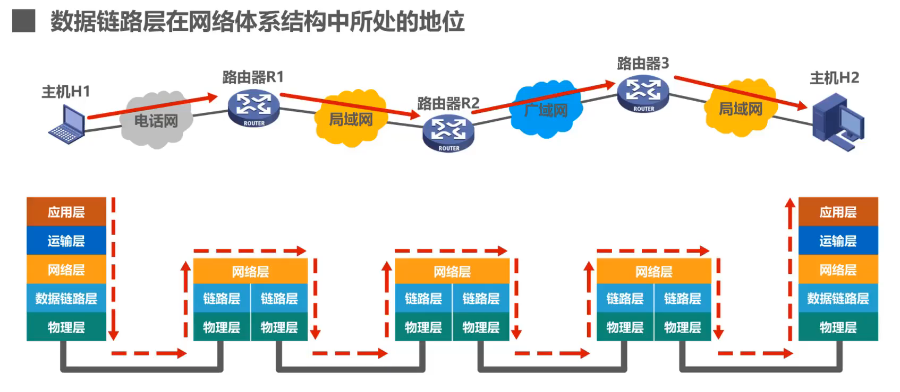
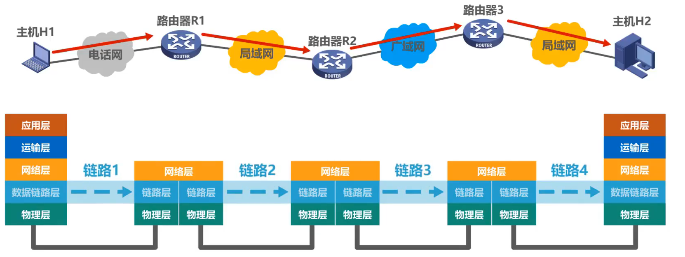
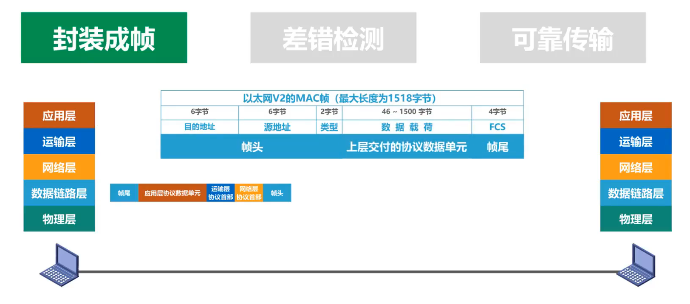
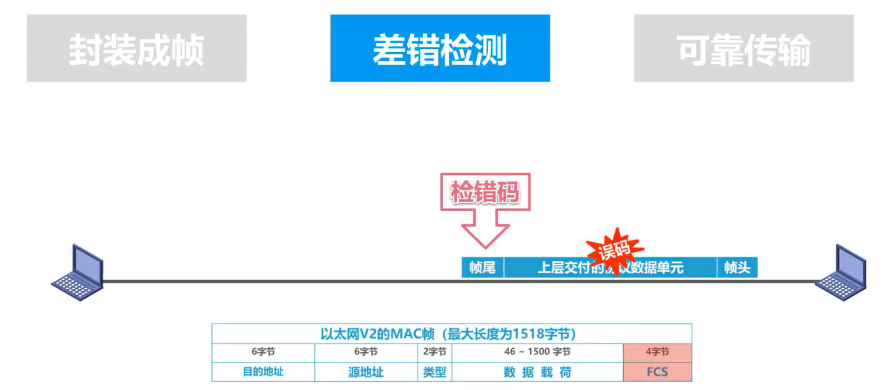
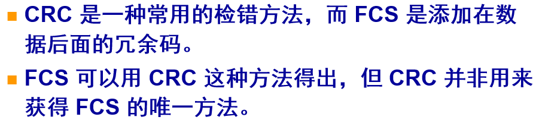
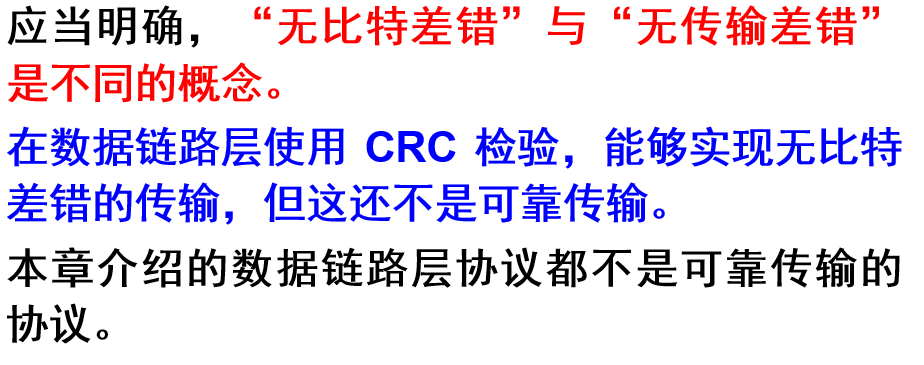
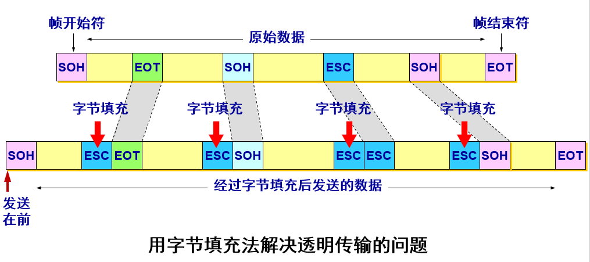
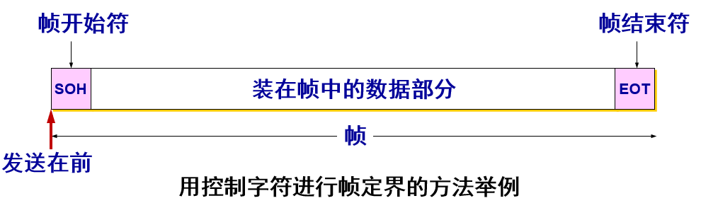
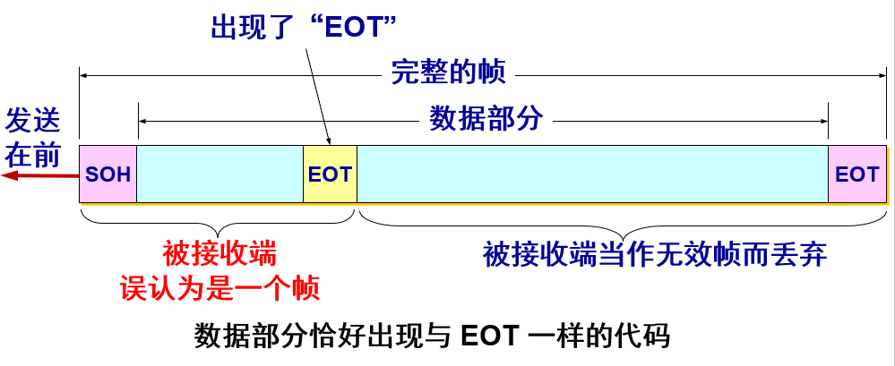

# 第三章 数据链路层

## 3.1 数据链路层概述

### 3.1.1 数据链路层在网路体系结构中所处的地位

如下图所示，两台主机通过互联网进行通信时数据链路层所处地位

上半部分的图中，主机 H1 向主机 H2 发送数据，中间经过了三个路由器分别为 R1、R2、R3 和多种网络如电话网、局域网以及广域网

下半部分图则表示主机 H1 向主机 H2 发送数据时，从协议层次上看数据的流动，需要经过不断的层层封装和层层解封，最终才能将数据送达目标

当我们专门研究数据链路层的问题时，可以只关心数据在数据链路层上的流动，而不考虑网络体系结构中的其他层，如下图所示.

此时，主机 H1 向主机 H2 发送数据时，可以把数据看成只在数据链路层中从左往右沿水平方向传输，因此，主机H1 到 主机 H2 的通信可以看成是由4段不同**链路**上的通信组成：

H1 的链路层 → R1 的链路层 → R2 的链路层 → R3 的链路层 → H2 的链路层

### 3.1.2 数据链路和帧

链路(Link)：从一个节点到相邻节点的一条物理线路，中间没有任何交换节点

数据链路(Data Link)：把实现通信协议的硬件和软件都加到链路上，就构成了 **数据链路**。

> 当需要在一条线路上传送数据时，除了需要有物理线路外，还需要一些必要的通信协议来控制这些数据的传输。因此，若把实现这些通信协议的硬件和软件加到链路上，就构成了数据链路

数据链路层以帧为单位传输和处理数据

### 3.1.3 数据链路层的三个重要问题

数据链路层的协议有许多种，但都有三个共同的基本问题：**封装成帧、透明传输、差错检测**

#### 封装成帧

含义：数据链路层将网络层交付的协议数据单元添加帧头和帧尾的操作，称为 **封装成帧**

目的：添加帧头和帧尾（帧头和帧尾中包含有重要的控制信息）的一个重要作用就是进行 **帧定界**，**以实现在链路上以帧为单元进行数据传输**

图中还展示了以太网V2的MAC帧格式，前三个字段为头部即帧头，最后一个字段是尾部即帧尾，中间就是上层交付的协议数据单元

#### 差错检测

含义：封装好的数据在传输过程中，可能会出现比特差错，即0变为1，1变为0的情况

误码率(BER, Bit Error Rate)：出错的比特数占所有传输比特总数的比率

如何解决这一问题也就是接收方主机如何判断在传输过程中是否出现了误码的情况：借助 **检错码** 来发现

发送方在发送帧之前，基于待发送数据和检错算法，计算好检错码并将其封装在帧尾

以太网V2的MAC帧的尾部就是4字节的 **帧检验序列** FCS(Frame Check Sequence)

在数据链路层中，广泛使用 循环冗余检验CRC(Cyclic Redundancy Check) 的检错技术

为了检错在数据后面添加上的冗余码称为帧检验序列 FCS (Frame Check Sequence)，但是 **循环检验CRC和帧检验序列FCS并不等同**

CRC并不是获取FCS的唯一方法，FCS也可以通过其他方法得到

> 区分1：无差错接受 vs 可靠传输
> 仅用循环冗余检验CRC检错技术只能做到无差错接受
> * 无差错接受是指「凡是接受的帧（即**不包括丢弃的帧**），我们都能以非常接近于 1 的概率认为这些帧在传输过程中没有产生差错」，也就是**凡是接收端数据链路层接受的帧都没有传输差错，而有差错的帧就丢弃而不接受**
>
> 要做到可靠传输就应该是，发送端发的所有东西接收端都应该全部都能收到，即使在传输过程出了错误，借助确认和重传机制，接收端可以重新获取这些帧
>
> 区分2：无比特差错 vs 可靠传输
> 

#### 透明传输

含义：透明传输是指**数据链路层对上层交付的传输数据没有任何限制**，如同数据链路层不存在一样

解决透明传输问题的方法：

* 字节填充：又称字符填充，面向字节的物理链路使用字节填充的方法实现透明传输
* 比特填充：面向比特的链路使用比特填充的方法实现透明传输

下图为字节填充法.

* 当原始数据中，某个字节的二进制代码恰好与帧开始符、帧结束符或转义符一致，此时就在这些控制字符（SOH、EOT、ESC）前面插入一个转义符「ESC」
* 对于帧开始符SOH、帧结束符EOT：接收端的数据链路层在将数据送给网络层前，删去插入的转义符
* 对于转义符：接收端在收到两个连续的转义符时，删去其中前面的一个

由于帧的开始和结束的标记使用**专门指明的控制字符**，因此，所传输的数据中的任何8比特的组合一定不允许和**用作帧定界的控制字符**的比特编码—样，否则就会出现帧定界的错误。

当传送的帧是用文本文件组成的帧时，其数据部分显然不会出现像 SOH 或 EOT 这样的帧定界控制字符，因此，无论数据是什么样，帧都可以完整的传输给接收方主机

但当数据部分是非 ASCII 码的文本文件时（如二进制代码的计算机程序或图像），如果数据中的某个字节的二进制代码恰好和 SOH、EOT 这种控制字符一样，数据链路层就会错误地「找到帧的边界」，接收部分帧，而将剩余部分丢弃

