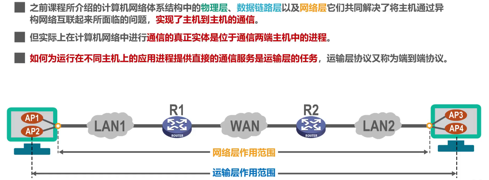
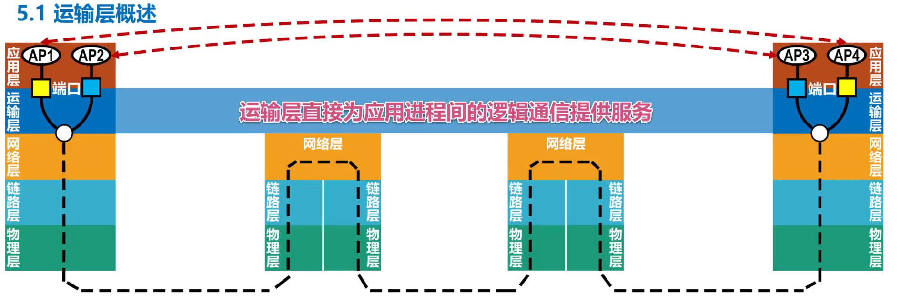

# 第五章 运输层

## 5.1 运输层概述

### 5.1.1 进程之间的通信

从通信和信息处理的角度看，**运输层向它上面的应用层提供通信服务**，它属于**面向通信部分的最高层，同时也是用户功能中的最低层**

如上图中，局域网LAN1中的主机和局域网LAN2中的主机通过互连的广域网WAN进行通信

从 IP 层来看，**通信的两端是两台主机**。但这并不准确，严格地讲，两台主机进行通信就是两台主机中的应用进程互相通信

从运输层的角度看，通信的真正端点并不是主机而是**主机中的进程**。端到端的通信是应用进程间的通信

真正进行通信的实体是主机中的应用进程，是一台主机中的应用进程和另一台主机中的应用进程交换数据

上图中的四个 AP 是通信双方应用层中的应用进程，AP1 和 AP4 之间进行基于网络的通信，AP2 和 AP3 之间进行基于网络的通信

运输层使用不同的端口对应不同的应用进程，并通过网络层及其下层来传输应用层报文，接收方的运输层通过不同的端口，将收到的应用层报文交付给应用层中对应的应用进程

> 注意：
> 1. 此处所指的「端口」，并不是实际存在的物理端口，而是指用来区分不同应用进程的**标识符**
> 2. 在学习的过程中，可以简单理解为**运输层直接为应用进程间的逻辑通信提供服务**。这里的「逻辑通信」是指：这种通信**看起来像是沿水平方向直接传送数据，但事实上，运输层之间并没有一条水平方向上的物理连接。数据的传送是沿图中虚线方向（即经过多个层次）进行传送**
> 3. 运输层向高层用户屏蔽了下面网络核心的细节（如网络拓扑、所采用的路由选择协议等），它使应用进程看见的就是好像在两个运输层实体之间有一条**端到端的逻辑通信信道**
> 4. 根据应用程序的不同需求，运输层需要有两种不同的运输协议，即面向连接的 TCP 和无连接的 UDP 

