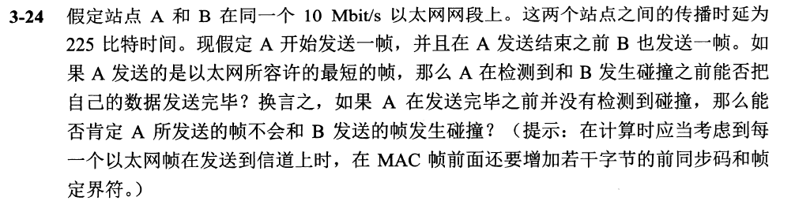
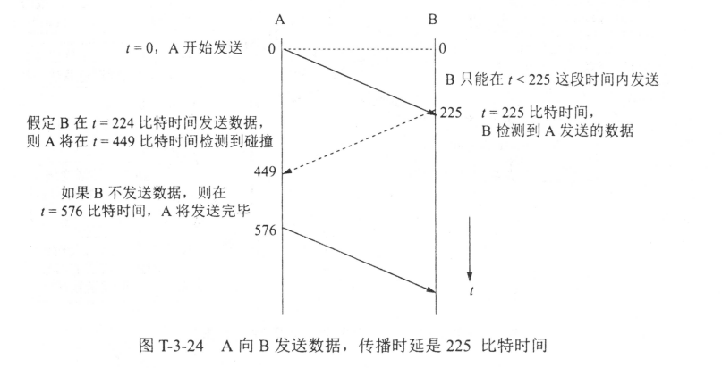

# 第一次作业(第一、二章)

## 第一章习题

### 1-02 简述分组交换的要点

分组交换采用的是存储转发技术。路由器是实现分组转发的关键构件，路由器收到分组后将其暂存下来，检查首部和查找转发表后，再将分组转发出去

> 分组交换最主要的特点是**采用了存储转发技术**
> * 将一段报文分成多个分组，并给每个分组添加首部
> * 经路由器暂存转发
> * 在目的地进行合并

### 1-22 网络协议的三要素是什么？各有什么含义？

网络协议的三要素分别为：语法、语义和同步

语法：数据与控制信息的结构或格式

语义：需要发出何种控制信息，完成什么动作，以及作出何种响应

同步：事件实现顺序的详细说明

### 1-28 计算题如图.

首先需要写明的几个换算关系

$1 MB = 2^{20} bit$

$1 KB = 2^{10} bit$

$1 B = 8 bit$

$1 Mbit/s = 10^6 bit/s$

$1 Kbit/s = 10^3 bit/s$

> 注意，在容量的换算关系是以 $2^{10}$ 为转换单位
> 而在速率的换算关系则是以 $1 \times 10^3$ 为转换单位
> 但需要灵活应对，因为 $2^{10} = 1024$ 和 $1 \times 10^3 = 1000$ 近似，有些题目中为了方便会将二者看作近似相等

#### (1)

发送时间为：文件大小 / 数据发送速率

由题可知，传送数据前还需要 2RTT 的时间建立TCP连接，因此建立连接的时间为：2RTT

最后，题目最后一句话：**接收方收完该文件的最后一个比特所需的时间**。因此，还需要加上最后一个分组从发送方到接收方这个单程传送时间即半个RTT：0.5RTT

综述所述，可得：

发送这些分组的时间：$t_1 = \frac{1.5MB}{10Mbit /s} = \frac{1.5\times 2^{20} \times 8 bit}{10 \times 10^6} = 1.258 s$

总时长为：$t = t_1 + 2 RTT + 0.5 RTT = 1.258s + 0.16s + 0.04s = 1.458s$

#### (2)

由题2所增加的一个条件 **每发送完一个分组后要等待一个 RTT 时间才能发送下一个分组** 可知，需要计算这个等待总时长。

分组总数为：$\frac{1.5MB}{1KB} = \frac{1.5 \times 2 ^{20}}{1 \times 2^{10}} = 1536$ 个

因此，中间需要间隔等待的次数是 1535 次（因为发送第一个分组不需要等待），等待时间为：1535 RTT = 122.8 s

题2只是在题1的基础上多了个等待时间，发送分组时间、建立连接时间以及最后一个分组从发送方到接收方的单程传送时间仍与题1相同

因此，总时长为：$t = 122.8 + 1.458 = 124.258s$

#### (3)

题3 与 题4 都不需要考虑发送数据所需时间

题3 中的关键信息是**在每一个RTT往返时间内只能发送20个分组**。因此要以20个分组为单位来计算需要多少个 RTT 往返时间

由题2 可知，分组总数为 1536个

而 $\frac{1536}{20} = 76 \cdots 16$ 即76个RTT往返时间可以发送 $20\times 76 = 1520$ 个分组，余下的16个分组在最后一次传送过程中一次性发送完毕

而我们在计算最后一次的传送过程中不需要算上一个完整的 RTT 往返时间，因为题目的根本是要求**接收方收完该文件的最后一个比特所需的时间**，所以最后一次传送过程中16个分组的最后一个分组从发送方到接收方需要的时间仍然是 0.5 RTT

而建立连接的时间仍为 2 RTT

因此，总时长为：76 RTT + 0.5 RTT + 2 RTT = 78.5 RTT = 6280 ms = 6.28s

#### (4)

由题可知，该规律是一个首项为1，公比为2的等比数列，而 **n个RTT后总共发送的分组数量相当于等比数列求和**

经过 n 个 RTT 后共发送了 $2 ^ n - 1$ 个分组

当 n = 10 时，发送了 $2^{10} - 1 = 1023$ 个分组，总共有1536个分组，因此此时还不足以发送全部分组

当 n = 11 时，发送了 $2^{11} - 1 = 2047$ 个分组，此时足够发送全部分组

因此经过了10个RTT后，已发送 1023 个分组，剩余分组将一次性发送完毕，此时的情况与题3类似，只需要算最后一次传送过程中剩余分组的最后一个分组从发送方到接收方需要的时间，仍然是 0.5 RTT

建立连接的时间仍为 2 RTT

因此，总时长：(2 + 0.5 + 10) RTT = 1 s

## 第二章习题

### 2-01 物理层要解决哪些问题？物理层的主要特点是什么？

#### 1 解决问题

1. 物理层考虑的是**怎样才能在连接各种计算机的传输媒体上传输数据比特流**，而不是指具体的传输媒体，为此，物理层应该**解决物理连接的建立、维持和释放问题**

2. 物理层要**尽可能地屏蔽掉物理设备和传输媒体，通信手段的差异**，使数据链路层感觉不到这些差异，只考虑完成本层的协议和服务

3. **在两个相邻系统之间唯一地标识数据电路**

#### 2 主要特点

1. 物理层协议涉及的范围广泛，沿用已存在的物理规程，将物理层确定为描述与传输媒体接口的机械，电气，功能和规程特性
2. 物理连接的方式很多，传输媒体的种类也很多，因此，具体的物理协议相当复杂

### 2-13 为什么要使用信道复用技术？常见的信道复用技术有哪些？

原因：通过共享信道，最大限度地提高信道的利用率

常见的信道复用技术：频分、时分、波分、码分复用

## 第三章习题

### 3-09 一个PPP帧的数据部分（用十六进制写出）是7D 5E FE 27 7D 5D 7D 5D 65 7D 5E。试问真正的数据是什么（用十六进制写出）

由题可知，PPP帧的数据部分是：7D 5E FE 27 7D 5D 7D 5D 65 7D 5E

要将上述数据中的 **7D 5E** 还原成 **7E** , **7D 5D** 还原成 **7D**

因此，真正的数据是：7E FE 27 7D 7D 65 7E

> PPP帧规定：当信息字段中出现和标志字段一样的比特0x7E时，就必须采取一些措施。因PPP协议是面向字符型的，所以它不能采用HDLC所使用的零比特插入法，而是使用一种特殊的字符填充。
具体的做法是将信息字段中出现的每一个**0x7E**（(符号0x表示它后面的字符是用十六进制表示的）字节转变成**2字节序列（0x7D，0x5E）**。若信息字段中出现一个**0x7D**的字节，则将其转变成**2字节序列（0x7D，0x5D）**
> 7D 5E 实际是7E ; 7D 5D 实际是7D

### 3-10 PPP协议使用同步传输技术传送比特串0110111111111100。试问经过零比特填充后变成怎样的比特串？若接收端收到的PPP帧的数据部分是0001110111110111110110，问删除发送端加入的零比特后变成怎样的比特串？

原始比特串为：0110111111111100

零比特填充后的比特串：011011111**0**11111**0**00

> **零比特填充就是在连续五个1之后必须插入一个0**。上述加粗的比特0就是填充的

接收端收到的比特串：000111011111**0**11111**0**110

删除零比特后的比特串：00011101111111111110

> **删除发送端加入的零比特，就是把一连5 个1 后面的0 删除**。上述接收端收到的比特串中加粗的比特0就是要删除的

### 3-24 题干如图

以太网所容许的最短帧长度为 64B = 512 bit

在信道上实际传输时，还需要加上 8B = 64 bit 的前同步码和帧定界符

因此，A 发送的实际帧长为 512 + 64 = 576 bit 也就是 A应当在 576比特时间发送完毕

假设 t = 0 时，A开始发送一帧，因为两个站点的传播时延是 225 比特时间，所以在 t = 225 比特时间，B检测到A发送的数据，但在 t ＜ 225 这段时间，B 是可以发送数据的

因此，假设 B 在 t = 224 比特时间发送数据，则 A 将在 224 + 225 = 449 比特时间检测到碰撞。因为 449 ＜ 576 ，所以 A 无法将自己的数据发送完毕

换言之，如果 A 在发送完毕之前（576比特时间之前）没有检测到碰撞，则 A 所发送的帧不会和 B 发送的帧发生碰撞

### 3-27 题干如图

(1) 假设以太网的利用率基本上达到100%, 那么10 个站共享10 Mbit/s, 即平均每一个站可得到1 Mbit/s 的带宽

(2) 假设以太网的利用率基本上达到100%, 那么10 个站共享100 Mbit/s, 即平均每一个站可得到10 Mbit/s 的带宽

(3) 每一个站独占交换机的一个接口的带宽10 Mbit/s 。这里我们假定这个交换机的总带宽不小于100 Mbit/s 

## 第四章习题

### 4-10 当某个路由器发现一IP数据报的检验和有差错时，为什么采取丢弃的办法而不是要求源站重传此数据报？计算首部检验和为什么不采用CRC检验码？

IP 首部中的源地址也可能出错，要求错误的源地址重传数据报是没有意义的

不使用 CRC可减少路由器进行检验的时间

### 4-19 某单位分配到一个地址块 129.250/16。该单位有 4000 台计算机，平均分布在16个不同的地点。试给每一个地点分配一个地址块，并算出每个地址块中 IP 地址的最小值和最大值

4000 台计算机平均分布在16个不同的地点，则每个地点有 $\frac{4000}{16} = 250$ 台计算机。因此，主机号只需要 8 位就足以表示这 250 台不同的计算机

网络前缀选用 $32 - 8 = 24$ 位，16 个不同的地点就需要 16 个地址块，每个地点分到一个 /24 地址块

所以，每个地址块中 IP 地址的最小值和最大值如下：

129.250.1.0/24 , IP 地址范围：129.250.1.0 ~ 192.250.1.255
129.250.2.0/24 , IP 地址范围：129.250.2.0 ~ 192.250.2.255
$\cdots $
129.250.16.0/24 , IP 地址范围：129.250.16.0 ~ 192.250.1.255

### 4-20 一个数据报长度为 4000 字节(固定首部长度)。现在经过一个网络传送，但此网络能够传送的最大数据长度为 1500 字节。试问应当划分为几个短些的数据报片?各数据报片的数据字段长度、片偏移字段和 MF 标志应为何数值?

## 期中猜题

### 1 名词解释

#### 1.1 基带信号、带通信号

基带信号：来自信源的信号常称为**基带信号**即基本频带信号

带通信号：经过载波调制后的信号称为**带通信号**（即仅在一段频率范围内能够通过信道）。而使用载波的调制称为**带通调制**

#### 1.2 频分复用、时分复用

频分复用：假设有 $N$ 路信号在一个信道中传送，通过调制的方法，将各路信号搬移到适当的频率位置，使彼此不产生干扰。**频分复用的信号在相同的时间占用不同的带宽资源**

时分复用：将提供给整个信道传输信息的时间划分成若干时间片（简称时隙），并将这些时隙分配给每一个信号源使用，每一路信号在自己的时隙内独占信道进行数据传输。**时分复用的信号在不同的时间占用同样的频带宽度**

#### 1.3 IGP、EGP

IGP：内部网关协议（(Interior Gateway Protocol），在一个自治系统内部使用的路由选择协议

EGP：外部网关协议（External Gateway Protocol），若源主机与目的主机处在不同一个自治系统中，则在不同自治系统之间的路由选择，就需要使用**外部网关协议EGP**

#### 1.4 VPN、VLAN

VPN：虚拟专用网（(Virtual Private Network），利用公用的互联网作为本机构各专用网之间的通信载体，这样的专用网又称为虚拟专用网VPN

> 称为「专用网」是因为这种网络是**为本机构的主机用于机构内部的通信**，而不是用于和网络外非本机构的主机通信
> 「虚拟」是因为并没有真正使用通信专线，而VPN只是在效果上和真正的专用网一样

VLAN：虚拟局域网（Virtual LAN），是由一些局域网网段构成的与物理位置无关的逻辑组，而这些网段具有某些共同的需求

### 2 简答题

#### 2.1 协议与服务之间有什么关系？两者之间又有什么区别？

区别：
* 协议是控制对等实体之间通信的规则的集合，是水平的
* 服务是下层通过层间接口向上层提供的功能，是垂直的

关系：协议的实现保证了能够向上一层提供服务，要实现本层协议还需使用下层提供的服务

#### 2.2 请简述 IEEE802.3 以太网采用的介质访问控制协议的工作原理

1. 工作站要发送数据时,必须先检测信道，若检测到信道忙，则继续不停地检测，一直等待信道空闲。此时若在96比特时间内信道保持空闲，立即发送数据;
2. 在发送数据过程中进行冲突检测，如果在冲突窗口内没有发生冲突，则表示数据发送成功，否则立即停止发送，并采用二进制指数回退算法，等待一个随机时间后在重复发送过程;
3. 对于接收方,则根据数据包的校验和 正确与否和物理地址是否为自己来决定是否将数据交付给上层协议

#### 2.3 试说明 IP 地址与硬件地址的区别，为什么要使用这两种不同的地址？

区别：

1. 从层次角度来看，物理地址是数据链路层和物理层使用的地址，而IP地址是网络层及以上各层使用的地址，是一种逻辑地址

2. IP地址放在IP数据报的首部，而硬件地址放在MAC帧的首部

原因：IP层抽象的互联网屏蔽下层复杂的细节，只要在IP层讨论问题就能使用统一的IP地址，IP 地址就是给每个连接在因特网上的主机（或路由器）分配一个在全世界范围是唯一的 32 位的标识符。从而把整个因特网看成为一个单一的、抽象的网络，但在实际网络的链路上传送数据帧时，最终还是必须使用硬件地址