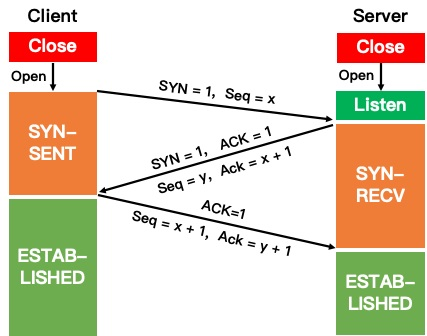

# 期末复习

## 1 选择题

需要注意，这部分题目顺序是期中之后的内容在前，期中之前的看情况，大概率期中考过的可能不会再考了（猜的）

### 1.1 下面关于 TCP 滑动窗口机制的描述正确的是 ( )

A. 是 3 位的滑动窗口
B. 仅用于流量控制
C. 传输过程中窗口大小不调整
D. 窗口大小为 0 是合法的

解析：可以直接做出答案的。因为在课件的示例中，可以知道，在传输过程中，可以根据网络环境的变化，对窗口的大小进行 **动态调整**，可以变大，也可以变小甚至小到为 0. 因此选项 D 的说法正确，故答案为 D.

> 用排除法做：
> * 传输过程中，窗口的大小可以调整，是动态变化的，不是一成不变的
> * TCP 滑动窗口机制除了可以用于实现流量控制，还能用于可靠传输
> * 滑动窗口的大小是以字节为单位，并且是可以动态调整其大小的

### 1.2 电子邮件应用程序利用 POP3 协议来做什么？( )

A. 创建邮件
B. 加密邮件
C. 发送邮件
D. 接收邮件

解析：POP3 协议是在接收邮件时使用的协议，所以选 D. 接收邮件还可以使用 IMAP 协议。**使用 SMTP 协议来发送邮件**

### 1.3 下列有关 ASP 和 Javascript 的表述正确是 ( )

A. 两者都能够在 WEB 浏览器上运行
B. ASP 在服务器端执行，而 Javas cript 一般在客户端执行
C. Javas cript 在服务器端执行，而 ASP 一般在客户端执行
D. 它们是两种不同的网页制作语言，在制作网页时一般选择其一

解析：ASP 是网页的一种格式,ASP是「Active Server Page」的缩写，意为「动态服务器页面」；Javascript是一种面向对象的动态类型的区分大小写的 **客户端脚本语言**，主要目的是为了解决服务器端语言。因此，从名称上可以判断，ASP 是服务器端的，而 JavaScript 是客户端的。故选 B.

### 1.4 甲方和乙方采用公钥密码体制实现数据文件加密传送，甲方用乙方的公钥加密数据文件，请问乙方使用什么来对数据文件进行解密？（ ）

A. 甲的公钥
B. 甲的私钥
C. 乙的公钥
D. 乙的私钥

解析：由题可知，采用的是 **公钥密码体制**。甲方使用 **乙方** 的公钥来加密数据文件，则乙方在解密数据文件是就要采用自己的私钥即 **乙的私钥**。故答案选 D.

### 1.5 关于防火墙的功能，下列说法哪项是错误的？( )

A. 防火墙可以检查进出内部网的通信量
B. 防火墙可以使用应用网关技术在应用层上建立协议过滤和转发功能
C. 防火墙可以使用过滤技术在网络层对数据包进行选择
D. 防火墙可以阻止来自内部的威胁和攻击

解析：需要明确一个事实，防火墙试图在入侵行为发生之前阻止所有可疑的通信，但事实是不可能阻止所有的入侵行为。同样，防火墙不能解决来自内部网络的攻击和安全问题。例如,通过发送带木马的邮件、带木马的URL等方式,然后由中木马的机器主动对攻击者连接,将瞬间破坏象铁壁一样的防火墙。因此答案选 D.

> 防火墙技术一般有两类：分组过滤路由器和应用网关
> 分组过滤路由器的过滤规则是基于分组的 **网络层或运输层** 首部的信息，根据过滤规则对进出内部网络的分组执行转发或者丢弃（即过滤），故选项 C 正确
> 在应用网关中，可以实现基于应用层数据的过滤和高层用户鉴别，故选项 B 正确

## 2 名词解释

### 2.1 VPN、VLAN

VPN：虚拟专用网（(Virtual Private Network），利用公用的互联网作为本机构各专用网之间的通信载体，这样的专用网又称为虚拟专用网VPN

> 称为「专用网」是因为这种网络是**为本机构的主机用于机构内部的通信**，而不是用于和网络外非本机构的主机通信
> 「虚拟」是因为并没有真正使用通信专线，而VPN只是在效果上和真正的专用网一样

VLAN：虚拟局域网（Virtual LAN），是由一些局域网网段构成的与物理位置无关的逻辑组，而这些网段具有某些共同的需求

### 2.2 DoS、DDoS

DoS：拒绝服务(Denial of Service)，是指攻击者向互联网上的某个服务器不停地发送大量分组，使该服务器无法提供正常服务，甚至完全瘫痪

DDoS：分布式拒绝服务(Distributed Denial of Service)，从互联网上的成百上千个网站集中攻击一个网站

## 3 简答题

### 3.1 简述在 TCP 协议中连接建立时进行三次握手的应答过程

TCP协议连接建立时的三次握手过程如下：

* 第一次握手，客户端向服务器发送一个SYN包，请求建立连接，并进入 SYN_SENT 状态
* 第二次握手，服务器收到客户端发来的SYN包后，发送ACK确认收到客户端的连接请求，并向客户端发起SYN连接请求，此时服务器进入 SYN_RECV 状态；
* 第三次握手，客户端收到服务器的SYN+ACK包后，发送ACK确认收到服务器的连接请求，此时客户端进入ESTABLISHED状态，当服务器收到客户端的确认后，也进入 ESTABLISHED 状态，完成三次握手

> 补充：为何是「三」次握手？因为三次是保证 `client` 和 `server` 端均让对方知道自己具备发送和接收能力的最小次数
>* client > server：client具备发送能力
>* server > client：server具备接收和发送能力
>* client > server：client具备接收能力

### 3.2 万维网必须解决哪 4 个问题？简述解决这 4 个问题的思路

1. 怎样标志分布在整个互联网上的万维网文档？ 
   
   思路：使用 **统一资源定位符 URL** (Uniform Resource Locator) 来标志万维网上的各种文档，并使每一个文档在 **整个互联网** 的范围内具有 **唯一** 的标识符 URL

2. 用什么样的协议实现万维网上的各种链接？

   思路：在万维网客户程序与万维网服务器程序之间进行交互所使用的协议是 **超文本传送协议 HTTP (HyperText Transfer Protocol)** 。HTTP 是一个应用层协议，它使用 TCP 连接进行可靠的传送

3. 怎样使各种万维网文档都能在互联网上的各种计算机上显示出来，同时使用户清楚地知道在什么地方存在着超链？ 
   
   **超文本标记语言** HTML (HyperText Markup Language) 使得万维网页面的设计者可以很方便地用一个超链从本页面的某处链接到互联网上的任何一个万维网页面，并且能够在自己的计算机屏幕上将这些页面显示出来

4. 怎样使用户能够很方便地找到所需的信息？ 
   
   为了在万维网上方便地查找信息，用户可使用各种 **搜索工具** 即 **搜索引擎**

## 4 解答题

### 4.1 假定 TCP 在开始建立连接时，发送方设定超时重传时间 RTO=7.5 秒

(**提示：诸系数均采用推荐或典型值，即：α=1/8；β=1/4；γ=2**)

(1) 当发送方收到对方的连接确认报文段时，测量出 RTT 样本值为 2 秒。试计算现在的RTO 值

因为是第一次，所以有：

$RTT_S = RTT_1 = 2 s$

$RTT_D = \frac{1}{2} RTT = 1 s $

因此，有 $RTO = RTT_S + 4 RTT_D = 2 + 4 = 6 s$

(2) 当发送方发送数据报文段并收到确认时，测量出 RTT 样本值为 3.5 秒。试计算现在的RTO 值

由公式：$ RTT_S = (1 - \alpha) \times $ (旧的 $RTT_S$) + α × (新的 RTT 样本值) , 得 : $RTT_S$ = 2.1875 s

由公式 : 新的 $RTT_D$ = (1 - β) × (旧的 $RTT_D$ ) + β × | $RTT_S$ - 新的 RTT 样本 | , 得 : $RTT_D$ = 1.078125 s

最后 : RTO = $RTT_S$ + 4 × $RTT_D$ = 6.5 s

(3) 发送方发送数据报文，超时后又重新发送了一次，2.5 秒后收到了确认。试计算现在的RTO 值

因为报文重传了，所以采用公式 : 新的 RTO = γ × ( 旧的 RTO )

所以 新的 RTO = γ × ( 旧的 RTO ) = 13 s

---

补充：利用到的公式如下

$RTT_S$ : 加权平均往返时间，又称为平滑的往返时间，S 表示 Smoothed。每当第一次测量 RTT 样本时， $RTT_S = RTT$. 之后每测量到一个新的 RTT 样本，就用下式更新 $RTT_S$ 

**$ RTT_S = (1 - \alpha) \times $ (旧的 $RTT_S$) + α × (新的 RTT 样本值)**

超时重传时间 RTO 应略大于上面的 加权平均往返时间 $RTT_S$. 使用下式计算 RTO:

**RTO = $RTT_S$ + 4 × $RTT_D$**

而 $RTT_D$ 是 RTT 的偏差的加权平均值，第一次测量时，$RTT_D$ 值取为测量到的 RTT 样本值的一半。在以后的测量中，则使用下式计算加权平均的 $RTT_D$:

**新的 $RTT_D$ = (1 - β) × (旧的 $RTT_D$ ) + β × | $RTT_S$ - 新的 RTT 样本 |**

报文段每重传一次，就把 RTO 增大一些：

**新的 RTO = γ × ( 旧的 RTO )**

当不再发生报文段的重传时，才根据报文段的往返时延更新平均往返时延 RTT 和超时重传时间 RTO 的数值