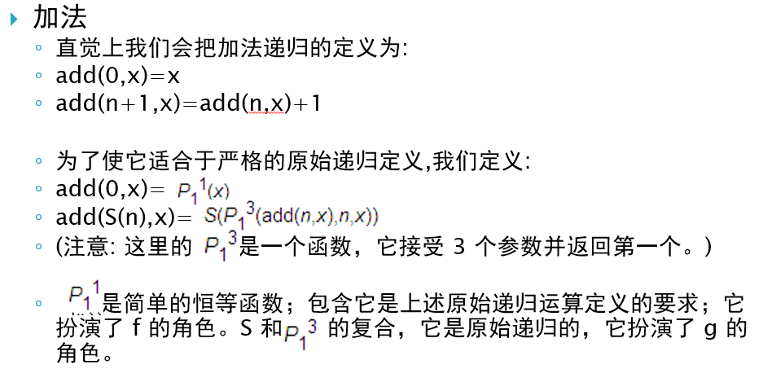

# 非经典计算第一次作业

## 1 请总结原始递归函数的定义，并自行查阅课外资料，介绍一下原始递归函数的相关原理

### 1.1 原始递归函数的定义

原始递归函数接受自然数或自然数元组作为参数，并生成自然数。接受 n 个参数的函数叫做 n-元函数。基本原始递归函数可以由常数函数、后继函数、投影函数这三个公理给出，更复杂的递归函数可以由复合、原始递归式这两个运算给出。总的来说，服从上述这些公理的函数是原始递归的。

### 1.2 原始递归函数的相关原理

#### 1.2.1 复合方法

给定 k 元的原始递归函数 $h(y_1, y_2, \ldots , y_k)$ , 和 k 个 n 元的原始递归函数 $g_1(x_1, x_2, \ldots , x_n), g_2(x_1, x_2, \ldots , x_n), \ldots , g_k(x_1, x_2, \ldots , x_n)$, 则复合函数是：

$$
f(x_1, x_2, \ldots x_n) = h(g_1(x_1, x_2, \ldots , x_n), g_2(x_1, x_2, \ldots , x_n), \ldots , g_k(x_1, x_2, \ldots , x_n))
$$

即 $f$ 是由 $g$ 和 $h$ 复合得到的, 写作 $f = g \circ h$

#### 1.2.2 递归方法

已知函数 $g(x_1, x_2, \ldots , x_n), h(x_1, x_2, \ldots , x_n, y, z)$, 则递归函数：

$$
f(x_1, x_2, \ldots , x_n, 0) = g(x_1, x_2, \ldots , x_n)
$$

$$
f(x_1, x_2, \ldots , x_n, y+1) = h(x_1, x_2, \ldots , x_n, y, f(x_1, x_2, \ldots , x_n, y))
$$

即 $f$ 是由 $g$ 和 $h$ 递归得到的

## 2 请模仿课件里加法的描述，用原始递归函数表示减法

加法描述如下图.

依葫芦画瓢，用原始递归函数表示减法：

为方便表示，这里的减法只截止到0，也就是不考虑负数的情况。由于加法中有后继函数的概念，因此，在减法中，需要定义一个与「后继」相对立的概念即「前驱」

直觉上，我们把前驱定义为：

* pred(0) = 0
* pred(n + 1) = n

为了使它适合于严格的原始递归定义，我们定义：

* pred(0) = 0
* $pred(S(n)) = P_2^2(pred(n), n)$

以类似加法的定义来定义减法：

* $sub(0, x) = x$
* $sub(S(n), x) = pred(P_1^3(sub(n, x), n, x))$

> sub(a, b) 相当于 b - a 
> 因为减法截止到0，不考虑负数，所以 pred(0) = 0

## 3 参考资料

1. 维基百科：原始递归函数。网址：https://zh.wikipedia.org/wiki/%E5%8E%9F%E5%A7%8B%E9%80%92%E5%BD%92%E5%87%BD%E6%95%B0
2. 张寅生的个人博客：递归函数的通俗解释。网址：https://blog.sciencenet.cn/blog-320682-974114.html
3. 知乎：什么是「原始递归」。网址：https://www.zhihu.com/question/22047221