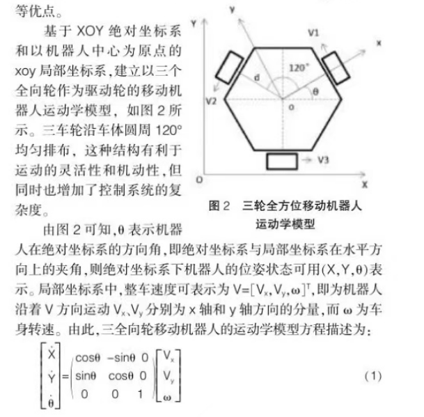
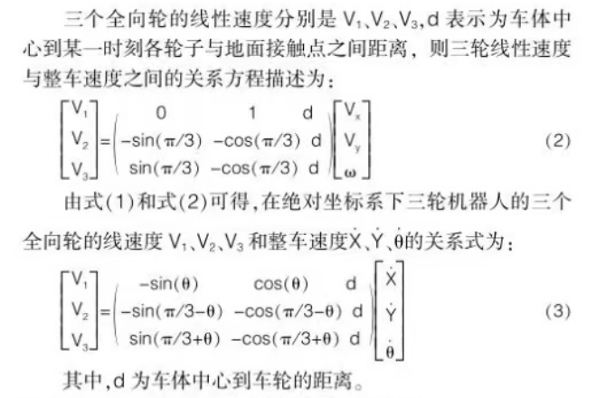
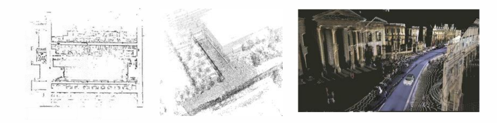
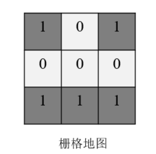
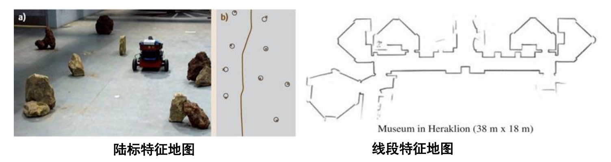
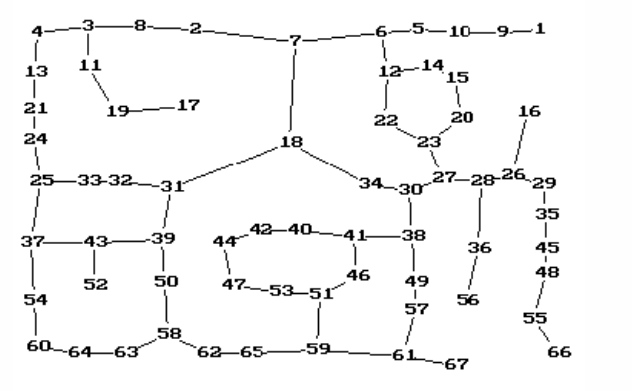

# 机器人学导论期末复习

## 后半学期：移动机器人考点概要

题目形式为问答题，每题约 8 - 10 分。会有一些概念性的问答。还有上半学期机械臂的画图题。

### 1 移动机器人的基本概念

#### 1.1 考点描述

第一章中机器人的关键性能、应用、分类的基本概念需要掌握

三维动态系统中坐标系之间的旋转、平移变换

#### 1.2 移动机器人的应用

移动机器人的应用有：

* 工业应用
* 空间探测：火星探测机器人、勇气号等
* 家庭应用：扫地机器人
* 军事领域
* 农业领域

#### 1.3 移动机器人的分类

移动机器人的分类可以有以下维度：

* 按移动方式：轮式、履带式、足式、躯干式
* 按工作环境：室内/室外，结构/半结构/非结构
* 按工作空间：陆地、水下、空中、空间
* 按应用领域：工业、农业、军事、服务

以移动方式为例，各移动方式的特点如下：

* 轮式：机构简单、与地面为**连续点接触**、**在非结构环境中移动性能较差**
* 履带式：与地面为连续面接触、**稳定性好、接地比压大、牵引力大**、会对地面造成较大磨损、适合于军事、救援等领域
* 足式：
  * 优势：离散落脚点使其能够适应复杂多变的地形、较小的地面支撑压力、跨越障碍物和沟壑，多自由度、多肢体使其能够主动调节身体高度、具有静态稳定运动容错性、主动隔振、确保稳定
  * 不足：自由度高，不易建模控制、易受扰动而失稳、成本高
* 躯干式：依附于空间的移动方式，以仿生为主要研发趋势

#### 1.4 移动机器人的关键性能

移动机器人的关键性能包括：机动度、速度、载荷能力、运动精度、运动稳定性、移动自主性

**机动度**：是指空间运动的灵活度，或称为移动自由度。轮式移动机器人机动度包括：

* 可移动度：通过**速度控制**可以实现的参考点移动能力
* 可操纵度：通过**方向控制**可以实现的参考点移动能力

速度：最大最小的速度/加速度

载荷能力：在满足其他性能要求的情况下，机器人能够承载的负荷重量

运动精度：

* 到点精度：机器人移动到点的实际位置和理想位置之间的差距
* 重复精度：在相同的位置指令下，机器人连续重复运动若干次，其位置的分散情况

运动稳定性：

* 静态稳定：质心点在支撑域内
* 动态稳定：ZMP(零力矩点)和CoP(压力中心)等在支撑域内

移动自主性：遥控、半自主、全自主

机器人自主移动需要解决的关键问题有：

* Where am I ? (在哪里?)：**自定位**
* Where am I going ? (到哪里?)：**目标规划**
* How do I get there ? (怎么去?)：**导航规划**
* 地图表示
* 未知环境地图构建

### 2 运动学建模

#### 2.1 考点描述

运动学建模

最简单的轮式机器人建模：给出轮速（以后两轮驱动机器人为例），求出它的移动速度和旋转速度

#### 实例：三轮全方位移动机器人运动学建模

### 3 路径规划

路径规划只压**人工势场法**

人工势场法的**基本思想**：将机器人在周围环境中的运动，设计成一种抽象的在人造引力场中的运动，**目标点对移动机器人产生「引力」，障碍物对移动机器人产生「斥力」**，最后**通过求合力来控制移动机器人的运动**

人工势场法的步骤：

1. **步骤1：构建人工势场**(Artificial Potential Field)
   
   * 目标点：吸引势场
   * 障碍物：推斥势场
2. **步骤2：根据人工势场计算力**
   
   * 对势场求偏导数
3. **步骤3：计算合力，并进而由力计算得到控制律**。力的方向就是机器人运动方向，大小可以对应加速度控制，使得机器人避开障碍物，移动向目标

人工势场法的缺点：存在局部最小，容易产生振荡和死锁

**重点来了：如何克服或避免人工势场法的局部最优问题？**

* 加入随机扰动，使物体跳出局部最优值
* 使用名为「波前规划」的方法，引入时间参数
* 引入虚拟力：当陷入局部极小值时，可以用虚拟力进行逃离
* 将近距离密集分布的多个障碍物连锁起来，形成一个大障碍物，进行大范围区域避障
* 选取子目标点：通过合理选取横向子目标点M和纵向子目标点O打破力的平衡，即可使小车逃出局部极小值

> 什么是局部最优？
> 在某个点，引力和斥力刚好大小相等，方向想反，则物体容易陷入局部最优解或震荡，发生「死锁」现象。

### 4 地图表示

#### 4.1 考点描述

地图表示与构建

需要大概知道有哪些类型的地图

#### 4.2 常用的地图表示方法

常用地图表示方法有：点云地图、栅格地图、特征地图、拓扑地图

##### 点云地图

基本思想：由空间中障碍物边缘点集合构成

传感器：激光测距仪、深度相机、相机等传感器均可用于构建点云地图

优点：

* 可以完全表示环境三维信息
* 所构建地图不需要预先定义尺寸
* 可方便地利用ICP等匹配方法进行里程估计和定位

缺点：

* 存储要求高
* 环境描述层次低，未区分所测量物体是道路还是障碍物，也没有说明点与点之间的空间是空闲、被占还是未知，需处理后才能应用于导航

##### 栅格地图

栅格地图又称为占用栅格地图(Occupied Grid Map)

基本思想：栅格地图就是把环境划分成一系列栅格，其中每一栅格给定一个可能值，表示该栅格被占据的概率

构建：主要采用**激光测距仪**数据来构建

优点：

* 是一种几何度量地图，**可以详细描述环境信息**
* 可以**方便地**采用A*等搜索算法**进行最优路径规划**
* 可以方便地根据栅格被占概率计算获得当前观测的可能性，实现定位估计

缺点：由于地图存储空间由所需建图的环境范围和栅格的分辨率确定，因此**随着栅格数量的增加和环境的扩大，地图所需内存和维护时间也迅速增长**，**地图维度的增加更会随着环境的扩大造成空间需求呈指数级增长**

##### 特征地图

基本思想：以抽象的特征描述环境，通常采用拟合障碍物的陆标、线段、平面、多边形等结构性几何特征，通过一组参数对特征进行建模。（太长不看：**用有关的几何特征（如点、直线、面）表示环境**）

优点：

* 简洁、紧凑、内存占用量小
* 表示方式更接近人对环境的感知
* 对环境具有更高层次的描述性，使定位与建图的鲁棒性更强

缺点：

* 无法精确表征复杂的真实环境
* 不能表示环境被占用/空闲/未知情况，不能直接用于导航规划

##### 拓扑地图

基本思想：**把环境表示为带结点和相关连接线的拓扑结构图**，其中结点表示环境中的重要位置点，边表示结点间的连接关系

优点：易于扩展，可以实现快速路径规划

缺点：由于信息的抽象性，使得机器人难以实现精确可靠的自定位

### 5 里程计估计

#### 5.1 考点描述

里程估计和 SLAM 部分

里程估计的几种方案：激光雷达里程计的经典算法，请简述 ICP算法 用于激光雷达里程计的计算。不需列公式，要知道怎么算的也就是思路

#### 5.2 激光里程计的迭代最近点算法（ICP 算法）

简述 ICP 算法的思路：

* **估计** P' 集合点和 P 集合点的**初始位姿关系**
* 根据最近邻域规则**建立 P' 集合点与 P 集合点的关联**
* 利用线性代数或非线性优化的方式**估计旋转平移量**
* **对点集合 P' 的点进行旋转平移**
* 如果旋转平移后重新关联的**均方差小于阈值**，则结束
* 否则**迭代重复上述步骤**

### 6 定位与建图

#### 6.1 考点描述

定位与建图

后端优化的两种经典思路、优缺点

#### 6.2 后端优化的两种思路

##### SLAM 的 MAP 方法

思路：

* 对约束进行概率建模
* 确定优化目标：在位姿图的所有约束条件下找到最小二乘误差的正确节点配置

---

* 优点：
  * 构造精简，可以采用最小二乘优化器进行求解
  * 精度最好，逼近所有的约束方程
* 缺点：
  * 整条轨迹都是变量，运行越久，变量越多
  * 复杂度没有上界，哪怕是在固定大小的环境中运行

##### 基于滤波器的方法

Kalman滤波算法的本质就是**利用两个正态分布的融合仍是正态分布这一特性进行迭代**

步骤：

* 步骤一：用**上一次**的**最优状态估计**和**最优误差估计**去计算**这一次**的先验状态估计和先验误差估计
* 步骤二：用步骤一得到的本次先验误差估计和测量噪声，得到**卡尔曼增益**
* 步骤三：用步骤一、步骤二得到的**所有先验估计和卡尔曼增益**得到**本次的最优估计**
* 步骤四：步骤四就又回到步骤一了，**用本次的最优估计算下一次的先验估计**

> 最优估计就是「最准确的估计」（其实就是已经经过卡尔曼滤波之后的数据），先验估计就是「粗略的估计」（其实就是还没经过卡尔曼滤波之后的数据）
> **卡尔曼增益用于把「粗略的估计」变成「最准确的估计」**

* 优点：
  * 推导简单清楚，适用各种传感器形式
  * 易于多传感器的融合
* 缺点：
  * 具有线性化误差
  * 需要存储所有状态量的均值和方差，呈平方增长

##### 两种方法的对比

**MAP构造的SLAM精度好，但非实时**。当求解SLAM是为了离线构建地图，则MAP是最佳选择

**EKF（扩展卡尔曼滤波）构造的SLAM精度差，但计算和环境大小保持一致**

当求解在线SLAM时，目前的前沿方法通常选择MAP和滤波的均衡，将一个窗口内的多个变量放到优化变量中提高里程的精度。同时采用另一个线程求解整个SLAM，以非实时的频率对里程进行纠正。比如ORB-SLAM等