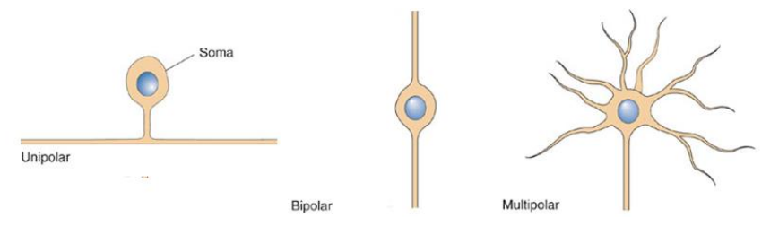
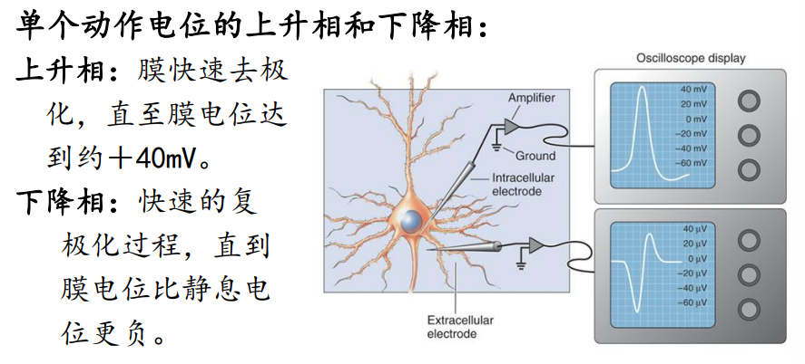
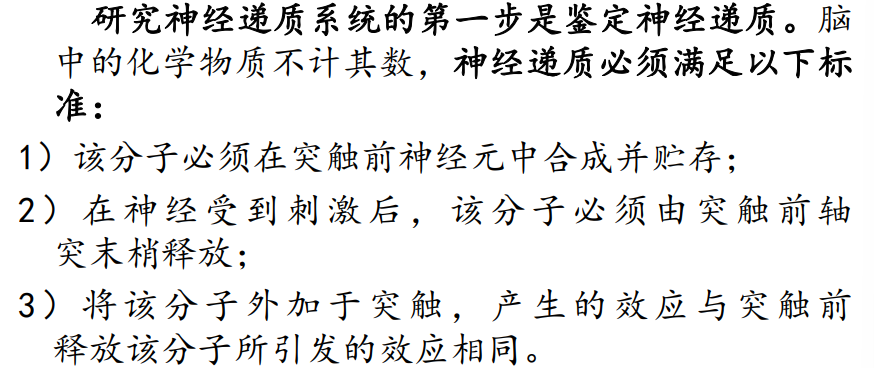

# 脑与认知科学期末复习

## 第一部分 基础

### 1 第1讲 脑科学概述

本讲摘要：

* 脑科学的起源
* 脑科学的演变历史

#### 1.1 脑科学的起源

##### 史前一直到古罗马时期

主流思想认为「心脏是智慧之源」。而在古希腊时期，已有学者提出「脑不仅参与对环境的感知，而且是智慧的发祥地」，但并未得到广泛认可。

##### 古代中国

「主心说」和「主脑说」长期并存

##### 文艺复兴时期到19世纪

17、18世纪：发现脑组织可分为两部分，**灰质(gray matter)和白质(white matter)**

18世纪末：神经系统已经可以被完整的剥离出来，并被确认为具有**中枢和外周**两个部分。神经解剖学史上一个重大的突破是在脑表面观察到广泛存在的一些**隆起（脑回，gyri）**，以及一些**凹槽（称为沟和裂，sulci和fissure）**

19世纪，在这100年里，人类对脑功能的了解远远超过了此前有记载的所有知识的总和：

1. 神经「电缆」论：神经像一些「电缆」，它们将电信号传入和传出脑
2. 特定功能在脑不同部位中的定位：法国生理学家Flourens通过系统地损毁脑的某一部位，来决定其功能的方法，研究脑的功能
3. 神经系统的进化：1859，达尔文出版《物种起源》（On the Origin of Species）一书，提出进化理论
4. 神经元，脑的基本功能单位：1900年，神经元(Neuron)被确认为神经系统的基本功能单位

#### 1.2 当今的脑科学

研究层次：根据研究对象的尺度划分依次为 **分子神经科学、细胞神经科学、系统神经科学、行为神经科学、认知神经科学**

* 分子神经科学：研究脑的分子成分
* 细胞神经科学：研究分子如何协同工作，从而使神经元具有一些特殊性质
* 系统神经科学：研究不同的神经环路
* 行为神经科学：研究神经系统如何一起工作，从而产生协调的行为
* 认知神经科学：弄清人类高级精神活动的神经机制（如自我意识、思维想像和语言）

### 2 第2讲

本讲摘要：

* 动物神经系统的基本结构
* 中枢神经系统
* 外周神经系统

#### 2.1 神经系统的结构

#### 2.2 中枢神经系统

##### 大脑(cerebrum)

大脑被一条很深的 **矢状裂** 沿中间分成两个大脑半球(cerebral hemisphere)。功能上，**右半球接受左侧躯体的感觉并控制其运动；左半球则负责右侧躯体的感觉和运动**

##### 小脑(cerebellum)

小脑是主要的运动控制中心，并和大脑、脊髓有着广泛的信息联系

##### 脑干(brain stem)

脑干由神经元和神经纤维组成，它的一个重要作用是在大脑、脊髓和小脑间进行信息传递。脑干还是调节一些重要生命活动的区域。若脑干受损，将很快致死

##### 脊髓(spinal cord)

脊髓是脑与皮肤、关节、肌肉之间信息交换的主要通道

#### 2.3 外周神经系统(peripheral nervous,PNS)

外周神经系统是脑和脊髓以外的神经系统，可以分为两部分：**躯体外周神经系统和内脏外周神经系统**

* 躯体外周神经系统(somatic PNS)：支配皮肤、关节和骨骼肌的脊神经
* 内脏外周神经系统(visceral PNS)：由支配内脏器官、血管和腺体的神经元组成

##### 大脑皮层

大脑中那些与**感觉、感知、随意运动、学习、语言和认知有关的系统都集中在大脑皮层**

##### 前额叶

人的前额叶约在25岁才发育成熟，前额叶涉及大脑的复杂和高级功能

### 3 第3讲 神经细胞Ⅰ

本讲摘要：

* 神经元学说
* 典型的神经元
* 神经元的分类
* 神经胶质细胞

#### 3.1 神经元学说

脑细胞直径：0.01-0.05mm

Franz Nissl发明染色方法，使得：神经元和胶质细胞得以区分；可以研究不同脑区神经元的排列

高尔基染色法

组织神经学家认为：「脑研究的主要成就来自于染色」

#### 3.2 典型的神经元

神经元 **由胞体、树突和轴突几个部分组成**。神经元内外由**神经元膜**隔开

胞体：在神经元的中心；由神经细胞Ⅰ膜把它与外界隔开；胞体内存在细胞器

神经元膜：细胞膜赋予神经元奇妙的本领，从而将电信号传遍大脑和全身

细胞骨架：包含**微管、神经丝、微丝**

**胞体、细胞器、膜和细胞骨架都不是神经元特有的，但轴突仅存在于神经元，并专门肩负神经系统内信息传递的使命**

轴突(axon)：轴突经常有分支，称为**轴突侧支**。**轴突的作用就像一根电线，把电脉冲传导到神经系统的远端**

轴突终末和突触：轴突终末和其他神经元的树突或胞体形成**突触**。当**神经冲动**到达突触前轴突终末，**神经递质分子**就从**突触囊泡**释放到**突触间隙**，然后结合于特定的受体蛋白，使**突触后细胞产生电信号或化学信号**

树突(dentritic)：相当于神经元
的「天线」

#### 3.3 神经元的分类

人脑中约存在860亿个神经元

* 按神经突起数目分类
* 按树突分类
* 按连接分类

##### 按神经突起数目分类

按神经突起的总数来分类：单极神经元、双极神经元、多极神经元

##### 按树突分类

形状：

* 锥体细胞
* 星形细胞

是否有棘：

* 棘状神经元
* 无棘神经元

##### 按连接分类

* 初级感觉神经元：有神经突起伸到身体感官的表面
* 运动神经元：神经元有轴突和肌肉形成突触并支配运动
* 中间神经元：只和其他神经元建立连接的神经元

##### 按轴突长度分类

* 高尔基Ⅰ型神经元：轴突很长，能从大脑的一个区域延伸到另一个区域
* 高尔基Ⅱ型神经元：轴突较短，只延伸到胞体附近

##### 按神经递质分类

根据神经元的化学特性分类，比如**胆碱神经元**，能在突触释放一种神经递质乙酰胆碱

#### 3.4 神经胶质细胞

没有神经胶质细胞，大脑将无法正常运作

神经胶质细胞有：

* 星形胶质细胞
* 成髓胶质细胞
* 其他非神经元细胞

##### 星形胶质细胞

脑内**最多**的神经胶质细胞是**星形胶质细胞**

星形胶质细胞的作用：

* 一个重要作用是调节细胞外空间的化学物质
* 另外一个作用是严格控制一些物质的细胞外浓度。比如星形胶质细胞能调节细胞外液的钾离子浓度

##### 成髓胶质细胞

提供一层层的膜以隔离轴突，螺旋状围绕着脑中的轴突

##### 其他非神经元细胞

室管膜细胞：指导细胞迁移

小胶质细胞：吞噬由死细胞或退化的神经元及神经胶质细胞留下的残渣

### 4 第4讲 神经细胞Ⅱ

本讲摘要：

* 静息电位
* 动作电位

#### 4.1 静息膜电位的离子基础

##### 膜电位

膜电位(membrane potential)：指在任何状态下**跨神经元膜的电压**，一般用符号mV表示

扩散驱使离子跨膜运动需要的**两个条件**：

* 膜上有**对离子通透的通道**；
* 存在跨膜的**离子浓度梯度**

##### 平衡电位

虽然神经元膜的内和外表面呈现不均匀的电荷分布。但整个胞浆和胞外液是**电中性**的

**离子的浓度**和**选择性离子通透性**是产生跨膜稳定的电位差需要的条件

**Nernst方程**：是利用物理化学的原理得到的，它综合了离子的电荷、温度、细胞内外离子浓度的比值等因素，**利用Nernst方程，可以计算出任何离子的平衡电位值**

##### 静息膜电位

当一个拥有可兴奋膜的细胞不产生冲动时，我们称其为**静息态**，处于静息状态的神经元，其细胞质沿着膜的内表面，分布着负电位,胞膜两侧的电位差，一般在-70+(-)10mV。这种跨膜电荷分布的差异称为**静息膜电位**(resting membrane
potential)，或**静息电位**

##### 离子的跨膜分布

**神经元膜电位是由膜两侧离子浓度决定的**

神经元质膜上**离子泵**的作用形成离子浓度梯度。如钠-钾泵，钙泵，均为一种酶

离子泵是细胞神经生理学中的无名英雄，它们幕后的工作确保了**离子浓度梯度的建立和维持**

#### 4.2 动作电位

动作电位是神经系统中远距离传递信息的信号，静息情况下神经元的胞内电位相对于胞外为负电位，动作电位是这一电位状态的**快速翻转**，即**在瞬间使胞内电位相对于胞外为正电位。动作电位通常意指神经冲动**

**动作电位是一个对跨膜电荷进行大幅再分配的过程**。动作电位过程中细胞的**去极化**是由**钠离子跨膜内流**引起的，而**复极化**是由**钾离子的外流**所致

**单个动作电位的产生**：膜电位去极化**超过阈值**便会产生动作电位。**阈值**指去极化触发动作电位产生所必须达到的**临界膜电位水平**

**多个动作电位的产生**：当电流注入神经元时，膜被足够地去极化，从而**产生多个动作电位**

**动作电位产生的频率依赖于去极化水平**

**动作电位的传导**：为了将信息从神经系统内的某一点传递到另一点，需要将产生的动作电位沿着**轴突**传导。当轴突去极化到一定程度到达**阈值**时，电压门控的钠通道开放，产生动作电位。动作电位的传导速度随**轴突的直径**的增加而增加

### 5 第5讲 神经细胞Ⅲ

本讲摘要：

* 突触传递
* 神经递质系统

#### 5.1 突触传递

神经元之间的通信依靠**突触传递**(synaptic transmission)

突触：一个神经元轴突末梢与另一个神经元或细胞接触的特异性连接部位。正常的信息流动方向是从突触末梢到靶神经元。突触的类型一般有**电突触和化学突触**

##### 电突触

电突触：是一类简单、古老的突触形式。它允许离子流从一个细胞**直接传递**到另一个细胞。电突触产生的特定位点叫缝隙连接(gap junction)

电突触是**双向性的、传递极快的、普遍存在于某些非神经细胞**包括胶质细胞、上皮细胞、平滑肌细胞等

##### 化学突触

成人的神经系统突触传递均是化学性的

突触间隙的宽度（20-50nm）10倍于缝隙链接

突触连接并非脑和脊髓专享。自由神经系统等的轴突支配腺体、平滑肌和心肌。这类突触称为神经肌肉接头

##### 化学突触的传递原理

大多数神经递质可划分为3类：**氨基酸、单胺、多肽**

* 神经递质的合成与储存：化学突触传递需要神经递质首先被合成，以备释放
* 神经递质的释放：神经递质的释放是由动作电位到达轴突末梢所触发的。末梢的去极化导致了活性带上的电压门控钙通道的开放
* 神经递质的受体和效应器：神经递质与受体结合可引起受体蛋白质分子的构象改变，激活受体的功能。神经递质大致可分为两类：递质门控的离子通道和G蛋白耦联的受体
* 神经递质的重摄取与降解：重摄取是由突触前膜上的特异性神经递质转运蛋白承担，一旦被重摄取进入末梢胞浆后，递质就被酶降解或重新转入突触囊泡

##### 突触整合的原理

突触后神经元需要整合所有这些复杂的离子和化学信号，然后给出一种简单形式的输出——动作电位

神经传递的缺陷是许多神经和心理疾病的基础

所有的心理性活性药物，包括治疗性和滥用性药物，都在化学突触处发挥它们的效应

化学突触传递的知识也是理解学习和记忆基础的关键所在。记忆的建立归根于大脑中化学突触效应的调节

#### 5.2 神经递质系统

神经递质是神经元之间及神经元与效应器（肌细胞和腺细胞）之间必不可少的联系中介

除了递质分子之外，递质系统还包括所有与递质合成、囊泡包装、递质重摄取、降解、递质作用相关的分子元件

一个神经元可接受多个信号通路的信息，而且在神经元内也存在多条信号途径，这些信息途径形成了一个信息网络。随着机体生理活动的变化，整个信息网处于一个精细的**动态平衡**

## 第二部分 感觉和运动系统

## 第三部分 脑的行为及高级功能

