# 人工智能基础总复习

## 谓词逻辑和消解反演

### 将谓词演算公式化成一个子句集

在一个谓词演算公式上，通过应用一系列规则、定理等，可以将其化成一个子句集

课件talk8的第35页-第40页说明了变换步骤

课件talk8的第41页-第49页说明了将谓词演算公式化成子句集的一个例子的全过程

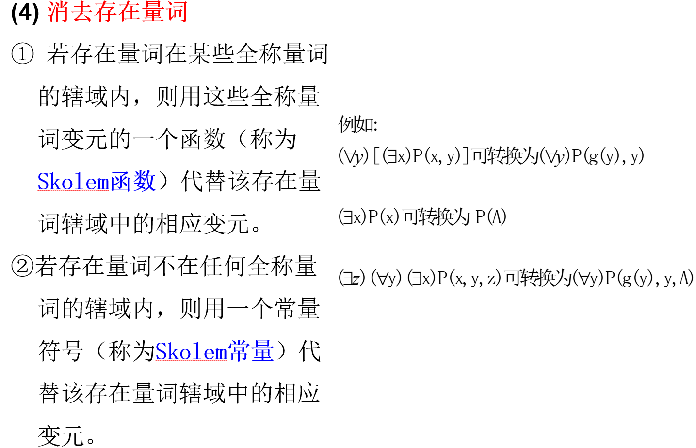

上图为第4个步骤：消去存在量词。下面主要是对这个步骤应用的理解

消去存在量词分为两种情况：

* 存在量词在全称量词的辖域内
* 存在量词不在任何全称量词的辖域内

当存在量词在全称量词的辖域内时：

可以用含有全称量词变元的一个函数去代替存在量词辖域里的变元。

如所给的例子所示，存在量词在全称量词的辖域里，而全称量词的变元为 $y$ ，因此我们可以用一个 Skolem函数 $g(y)$ 去代替存在量词的变元 $x$ ，并去掉存在量词。需要注意的是Skolem函数符号不能命名为已经出现的函数名称，如果原公式含有函数g，则我们就应该用其他的符号(f、h等等)来命名Skolem函数

当存在量词不在任何一个全称量词的辖域中：

用一个常量符号代替该存在变量辖域内的变元

如所给的中间例子，将 $x$ 换成 A 后，再去掉存在量词即可

最后一个例子中：可以看到 $x$ 是在全称量词的辖域中，而 $z$ 不在全称量词的辖域中，因此 用 Skolem常量 A 代替 $z$ ，用Skolem函数 $g(y)$ 代替 $x$ 

### 常用的等价关系

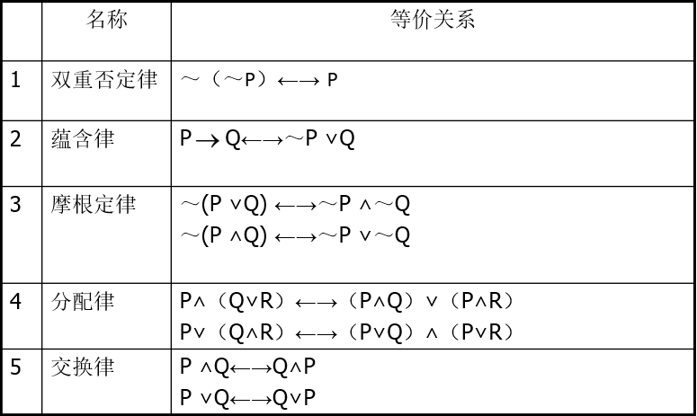

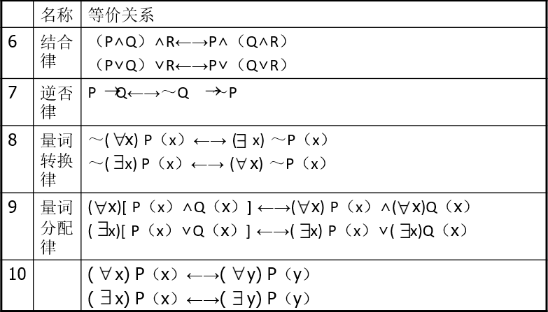

### 置换与合一

#### 置换

(作业10第3题)**置换定义**：一个置换 $s$ 是形如 $\left\{ t_1 / x_1, t_2 / x_2, \ldots , t_n / x_n \right\} $ 的有限集合，其中 $t_1$ 是项(项可以是变量、常量或函数)，$x_1, x_2, \ldots , x_n$ 是 **互不相同** 的变量， **$t_i / x_i$ 表示用 $t_i$ 置换(替换) $x_i$** .对谓词表达式 $E$ 实施置换 $s$ 的结果用 $E_s$ 来表示。没有元素的置换称为**空置换，用 $\epsilon$ 表示**

置换举例：

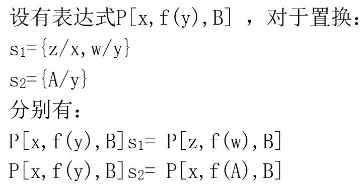

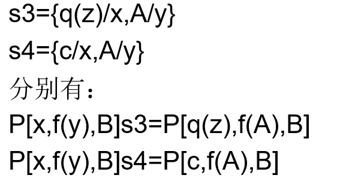

置换的性质：**置换是可结合的**，但一般置换是**不可交换**的

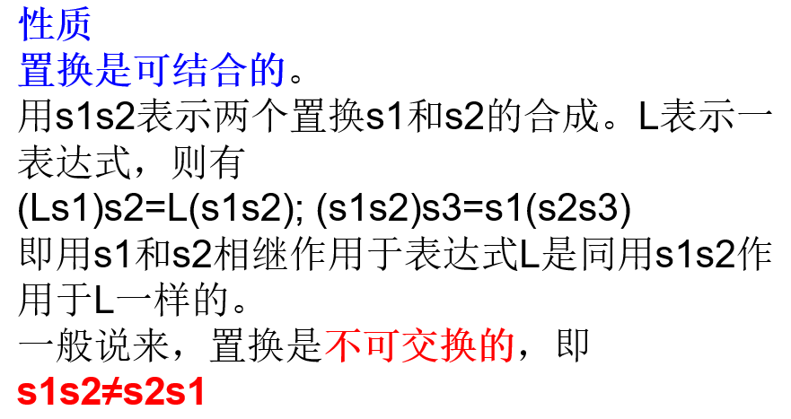

#### 合一

(作业10第4题)**合一定义**：对于谓词表达式集 $\left\{ E_i \right\} $ , 若存在一个置换 $s$ , 可以使 $E_{1}s = E_{2}s = \cdots = E_{n}s$, 则称 $s$ 为$\left\{ E_i \right\} $ 的**合一者**，称 $\left\{ E_i \right\} $ 为 **可合一的**

可合一的：如果一个置换$s$作用于表达式集$\left\{ E_i \right\} $的每个元素，则我们用$\left\{ E_i \right\}s $来表示置换例的集。我们称表达式集{Ei}是可合一的

(作业10第5题)**最一般合一者**：如果$s$是{Ei}的任一合一者，又存在某个$s'$，使得$\left\{ E_i \right\}s = \left\{ E_i \right\}gs' $成立，则称 $g$ 为$\left\{ E_i \right\} $的最一般合一者

> 也就是说，对于任意的置换 $s$ , 同一个置换 $g$ 与某个置换 s' 相组合后满足 $s = gs'$

我们来看一个例子：

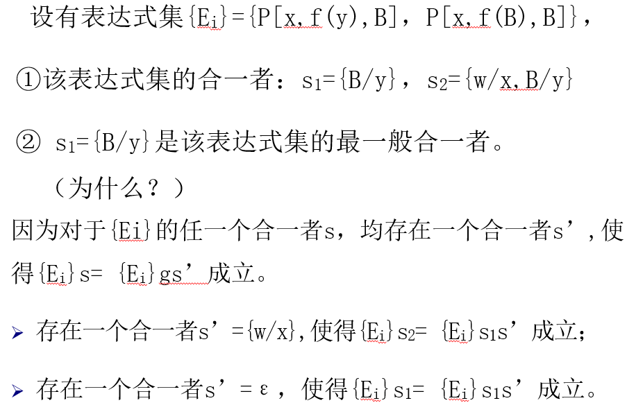

## 搜索

### A*算法

#### 1.定义及其解析

定义：A*算法是一种**静态路网中**求解**最短路径最有效**的**直接搜索方法**，也是解决许多搜索问题的有效算法。**算法中的距离估算值与实际值越接近，最终搜索速度越快**

解析：

* **A*算法是一个「搜索算法」，实质上是广度优先搜索算法（BFS）的优化**。从起点开始，首先遍历起点周围邻近的点，然后再遍历已经遍历过的点邻近的点，逐步的向外扩散，直到找到终点。
* **A*算法的作用是「求解最短路径」**，如在一张有障碍物的图上移动到目标点，以及八数码问题（从一个状态到另一个状态的最短途径）
* A*算法的思路类似图的Dijkstra算法，采用贪心的策略，即「若A到C的最短路径经过B，则A到B的那一段必须取最短」，找出起点到每个可能到达的点的最短路径并记录。
* A* 算法与Dijkstra算法的不同之处在于，A*算法是**一个「启发式」算法**，它已经有了一些我们告诉它的先验知识，如「朝着终点的方向走更可能走到」。**它不仅关注已走过的路径，还会对未走过的点或状态进行预测**。因此A*算法相较于Dijkstra而言调整了进行BFS的顺序，少搜索了那些「不太可能经过的点」，更快地找到目标点的最短路径。另外一点，由于H选取的不同，A*算法找到的路径可能并不是最短的，但是牺牲准确率带来的是效率的提升

> 什么是 A* 算法
> A* 算法是一个启发式的搜索算法，其作用是求解最短路径，它是一种在静态路网中求解最短路径最有效的直接搜索方法，它不仅关注已走过的路径，还会对未扩展的节点或状态进行预测

#### 2. A* 算法具体步骤

* (1)把S放入OPEN表，记f=h，令CLOSED为空表。
* (2)重复下列过程，直至找到目标节点止。若OPEN为空表，则宣告失败。
* (3)选取OPEN表中未设置过的具有最小f值的节点为最佳节点BESTNODE，并把它放入CLOSED表。
* (4)若BESTNODE为一目标节点，则成功求得一解。
* (5)若BESTNODE不是目标节点，则扩展之，产生后继节点SUCCSSOR。
* (6)对每个SUCCSSOR进行下列过程：
* (a) 建立从SUCCSSOR返回BESTNODE的指针
* (b) 计算g(SUC)=g(BES)+g(BES,SUC)
* (c) 如果SUCCSSOR∈OPEN，则称此节点为OLD，并把它添至BESTNODE的后继节点表中。
* (d) 比较新旧路径代价。如果g(SUC)＜g(OLD),则重新确定OLD的父辈节点为BESTNODE，记下较小代价g(OLD),并修正f(OLD)值。
* (e) 若至OLD节点的代价较低或一样，则停止扩展节点。
* (f) 若SUCCSSOR不在OPEN表中，则看其是否在CLOSED表中。
* (g) 若SUCCSSOR在CLOSED表中，则转向c。
* (h) 若SUCCSSOR既不在OPEN表中，又不在CLOSED表中，则把它放入OPEN表中，并添入BESTNODE后裔表，然后转向(7)
* (i) 计算f值。
* (7)GO LOOP

A*算法框图：

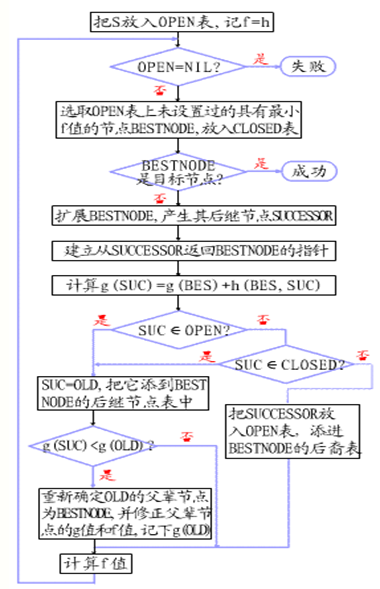

例题：

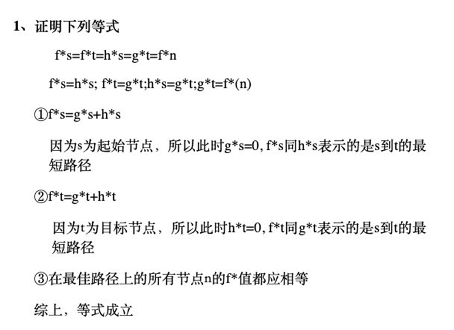

## 习题

1. 用谓词演算公式表示下列英文句子（多用而不是省用不同谓词和项。例如不要用单一的谓词字母来表示每个句子）

A computer system is intelligent if it can perform a task which, if performed by a human, requires intelligence.

首先，定义基本谓词：

* INTLT(x) : x is intelligent
* PERFORM(x, y) : x can perform y
* REQUIRE(x) : x requires intelligence
* CMP(x) : x is a computer system
* HMN(x) : x is a human

上面的句子可以表达为：

$(\forall x) \left\{ (\exists t)(\exists y) \left[ HMN(y) \land PERFORM(y,t) \land REQUIRE(t) \land CMP(x) \land PERFORM(x,t) \right] \to INTIT(x) \right\}  $

> 由题可知，该英文句子的意思是：如果一个计算机系统可以完成一个人类可以完成的任务并且该任务是需要智能的，那么这个计算机系统就是智能的
> 这是一个形如「如果...那么...」的句子，所以可以知道该谓词演算公式总体上是一个蕴含式，前面的条件都满足后，就能得出结论。所以蕴含符号的左边应该是一个合取式

用谓词表示命题时:

**对全称量词，把限定谓词作为蕴含式的前件加入，即 $(\forall x) (P(x) \to \cdots )$**

**对于存在量词，把限定谓词作为一个合取项加入，即 $\exists (x) (P(x) \land \cdots )$**

2. 分油问题：两个小孩去打油，一人带了一个一斤的空瓶，另一个带了一个七两和一个三两的空瓶。原计划各打一斤油，可是由于所带的钱不够，只好合打了一斤油，在回家的路上，二人想平分这一斤油，可是又没有其它工具。现只用这三个瓶子(一斤、七两、三两)精确地分出两个半斤油来

* 算法选择：选择广度优先搜索(BFS)
  * 理由：**广度优先以牺牲空间代价和时间代价来换取保证取得最优解**。由于该问题并不复杂，即使使用广度优先算法也不会占有太多的空间和时间，因此为了取得最优解这里选择广度优先算法来求解。
  * 与其它两个算法(深度优先、迭代加深搜索算法)比较：如果采用**深度优先算法搜索**，由于其盲目性导致搜索陷入局部陷阱，并**不一定能求得解即使得到解也不一定是最优解**，因此并不采用此算法。**迭代加深搜索**则是在固定的深度上进行深度和广度搜索结合的策略来进行搜索，这样避免了单一的深度搜索无法得到解的缺点，但是**找到的解并不一定是最优解**
* 算法描述：
  * 1.用unVisitedBttsArr表示初始节点列表(又称待扩展节点列表，此为一个动态数组)
  * 2.如果unVisitedBttsArr列表为空，则退出并返回失败信号
  * 3.将n作为unVisitedBttsArr的第一个节点，在unVisitedBttsArr删除节点n并将其移入已访问节点列表haveVisitedBttsArr
  * 4.如果n是目标节点，则退出并返回成功信号
  * 5.否则，扩展n的所有子节点，并加入到unVisitedBttsArr末尾，并返回第2步

问题分析：

问题的状态表示：用向量(T, S, R)表示状态，其中：

* T - 10两瓶中的油量
* S - 7两瓶中的油量
* R - 3两瓶中的油量

初始状态：(10, 0, 0)

目标状态：(5, 3, 2) or (5, 2, 3) or (5, 5, 0)

状态变换规则：

| 序号  |                     规则                     |           解释           |
| :---: | :------------------------------------------: | :----------------------: |
|   1   |          (S, R) AND S < 7 → (7, R)           |     7两瓶不满时装满      |
|   2   |          (S, R) AND R < 3 → (S, 3)           |     3两瓶不满时装满      |
|   3   |          (S, R) AND S > 0 → (0, R)           |     7两瓶不空时倒空      |
|   4   |          (S, R) AND R > 0 → (S, 0)           |     3两瓶不空时倒空      |
|   5   |  (S, R) AND S > 0 AND (S+R) <= 3 → (0, S+R)  | 7两瓶中的油全倒入3两瓶中 |
|   6   |  (S, R) AND R > 0 AND (S+R) <= 7 → (S+R, 0)  | 3两瓶中的油全倒入7两瓶中 |
|   7   | (S, R) AND R > 0 AND (S+R) >= 7 → (7, S+R-7) |  用3两瓶中的油装满7两瓶  |
|   8   | (S, R) AND S > 0 AND (S+R) >= 3 → (S+R-3, 3) |  用7两瓶中的油装满3两瓶  |

3. 猴子与香蕉问题，题目描述如图.

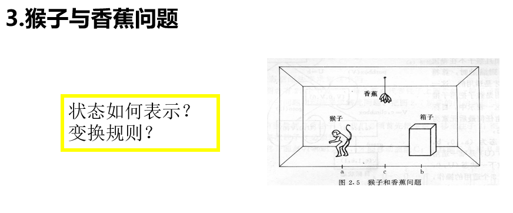

状态表示：用四元组(W, x, Y, z)表示问题某时刻的状态，其中：

* W - 猴子的水平位置，取值为 {a, b, c}
* x - 猴子是否在箱子上，在箱子上取值为1，不在箱子上为0
* Y - 箱子的水平位置，取值为 {a, b, c}
* z - 猴子是否摘到香蕉，摘到香蕉取值为1，没摘到取值为0

变换规则：一共有4种变换操作，相应的算符为：

* goto(U) - 移步，(W, 0, Y, z) → (U, 0, Y, z)
* pushbox(V) - 推箱，(W, 0, W, z) → (V, 0, V, z)
* climbbox - 爬箱，(W, 0, W, z) → (W, 1, W, z)
* grasp - 摘蕉，(c, 1, c, 0) → (c, 1, c, 1)

问题求解：设初始状态为(a, 0, b, 0)

则成功路径：{goto(b), pushbox(c), climbbox, grasp}

状态空间如图.

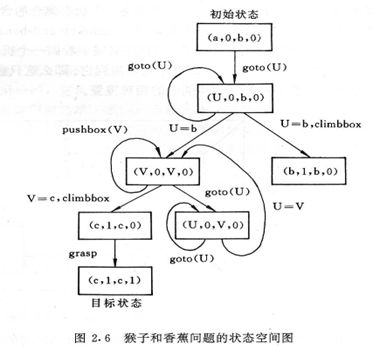

4. 知识表示的8种方法：状态空间法、问题归约法、谓词演算法、语义网络法、框架表示、面向对象表示、剧本表示以及过程表示

5. 盲目搜索又叫无信息搜索，盲目搜索方法包括**宽度优先搜索、深度优先搜索、等代价搜索**等，它是**一种没有使用知识作为指导的搜索**。宽度优先、深度优先搜索，或等代价搜索算法之间的主要差别是**OPEN表中待扩展节点的顺序问题**

6. 分析宽度优先搜索和深度优先搜索的优缺点
   * 宽度优先搜索：占内存多，可以找到最优解，必须遍历所有分支
   * 深度优先搜索：占内存少，在一定条件下可以找到最优解，但可以很快找到近似解，不必遍历所有分支

7. 一道十分经典的证明题如下图
   
   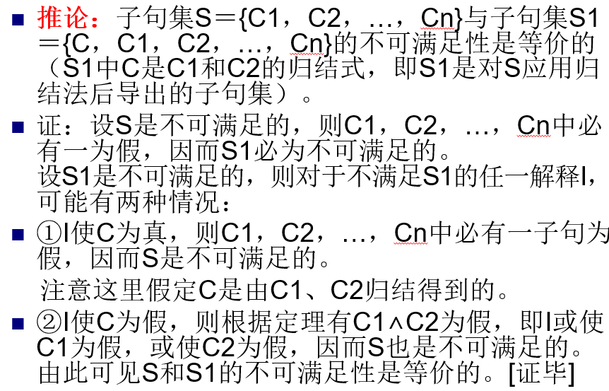

8. 反演求解的正确性
   
  * 设公式L在逻辑上遵循公式集S，那么按照定义满足S的每个解释也满足L。决不会有满足S的解释能够满足～L的，所以不存在能够满足并集S∪｛～L｝的解释
  * 如果一个公式集不能被任一解释所满足，那么这个公式是不可满足的。因此，如果L在逻辑上遵循S，那么S∪｛～L｝是不可满足的。
  * 可以证明，如果消解反演反复应用到不可满足的子句集，那么最终将要产生空子句NIL。因此，如果L在逻辑上遵循S，那么由并集S∪｛～L｝消解得到的子句，最后将产生空子句；反之，可以证明，如果从S∪｛～L｝的子句消解得到空子句，那么L在逻辑上遵循S