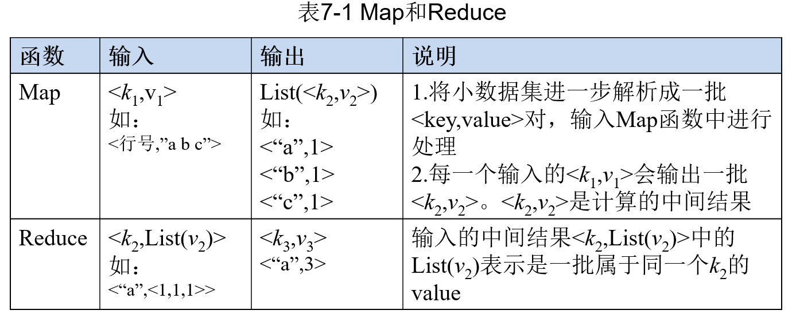
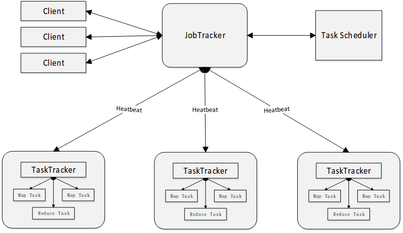
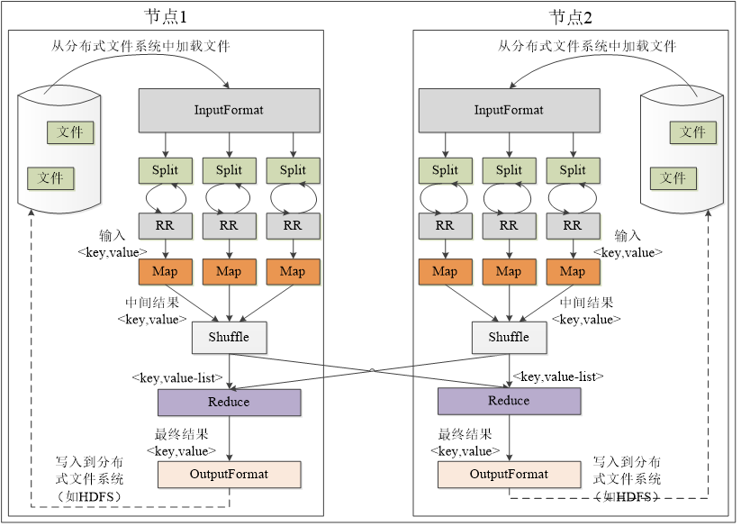
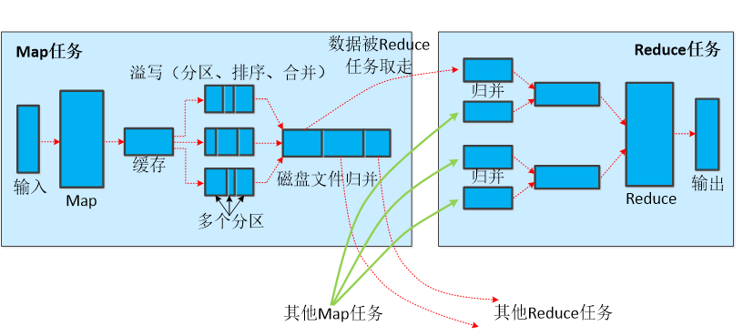
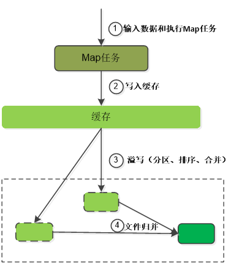
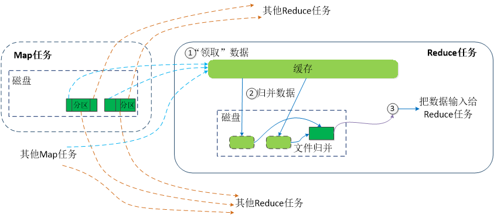
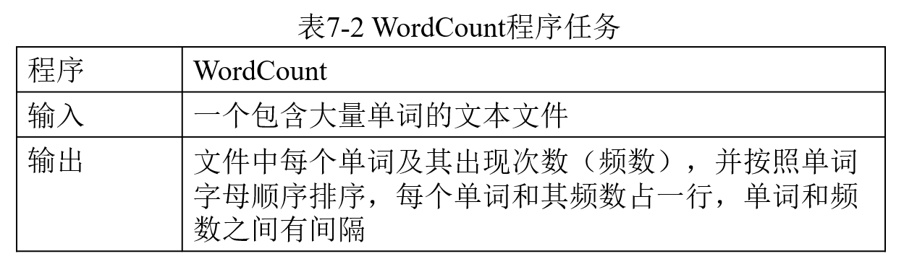
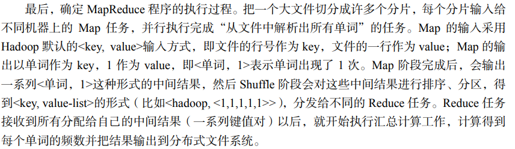

# 大数据复习

## 第七章 MapReduce

### 7.1 一些概念

#### 7.1.1 MapReduce模型简介

MapReduce将复杂的、运行于大规模集群上的并行计算过程高度地抽象到了两个函数：**Map** 和 **Reduce**

在MapReduce中，一个存储在分布式文件系统上的大规模数据集，会被切分成许多 **独立** 的小的数据块(这样独立的小数据块又称作 **分片spilt** )，这些分片可以被多个Map任务并行处理

MapReduce的设计理念是「计算向数据靠拢」，而不是「数据向计算靠拢」，这样可以减少因为数据移动产生的网络传输开销。

本着这样的理念，MapReduce框架会尽可能将Map程序 **就近** 安排在HDFS数据所在的节点运行，也就是 **将计算节点与存储节点放在一块运行** ，从而减少了节点间数据移动的开销

#### 7.1.2 Map 和 Reduce 函数

MapReduce 模型的核心是 Map 函数和 Reduce 函数

Map 函数和 Reduce 函数都是以<key,value>作为输入，按一定的映射规则转换成另一个或一批 <key,value> 进行输出

* Map函数的输入来源于分布式文件系统中的文件块，这些文件块的格式是任意的，可以是文档、二进制格式等待
* Map函数会将输入的元素转化成 <key, value> 形式的键值对。需要注意的是，这里的key不具有唯一性，可以生成相同key的多个键值对
* Reduce函数的作用就是将输入的一系列具有相同键的键值对以某种方式组合起来，输出处理后的键值对，结果会合并成一个文件

例如上图给出的例子，Map函数的输入是一个键值对，其中key表示行号，value表示行号对应的一行文本，经过Map函数处理后，会输出一系列键值对，其中key表示出现的字符，value表示出现的次数(都为1)，这些键值对是计算的中间结果

随后，经过一些操作后，将上述中间结果转化成 <k, List(v)> 的格式，这里的value值可以理解成一个列表，key仍然是出现的字符，value是该字符出现次数组成的列表，经过Reduce处理后，也就是把相同字符出现的次数都相加，最后输出键值对，表示字符以及对应的总次数

### 7.2 体系结构

MapReduce体系结构主要由四个部分组成，分别是：Client、JobTracker、TaskTracker以及Task

1. Client
   * 用户编写的MapReduce程序通过 Client 提交到 JobTracker 端
   * 用户可以借助 Client 提供的接口查看作业运行状态

2. JobTracker
   * JobTracker负责资源监控和作业调度
   * JobTracker监控所有的 TaskTracker 和 Job 的健康状况，一旦发现故障，就将相应的任务转移到其他的节点
   * JobTracker跟踪任务的执行进度与资源使用量等信息，并将这些信息告诉 TaskScheduler(任务调度器) ，该调度器会在资源空闲时，分配合适的任务去使用空闲资源 

3. TaskTracker
   * TaskTracker接收JobTracker发送过来的命令并执行相应的操作如启动新任务、杀死任务等
   * TaskTracker会周期性地通过「心跳」将本节点上 **资源的使用情况** 和 **任务的运行进度** 等汇报给JobTracker
   * TaskTracker使用「slot」等量划分本节点上的资源量(CPU、内存等)
  > 一个 Task 只有获得了一个「slot」才有机会运行，调度器的作用就是将各个TaskTracker上空闲的「slot」分配给相应的 Task使用。
  > slot 还分为 Map slot 和 Reduce slot，以供Map Task 和 Reduce Task 使用

4. Task
   * Task分为 Map Task 和 Reduce Task 两种，均由 TaskTracker 启动

### 7.3 工作流程

#### 7.3.1 工作流程概述

MapReduce 的输入和输出都需要借助分布文件系统，这些文件被分布存储在集群中的多个节点上

MapReduce工作的核心思想是「分而治之」，把一个大的数据集分割成多个独立的小的数据块，在多台机器上 **并行** 处理

工作流程概述：

* 首先，一个大的 MapReduce 作业会被拆分许多 Map 任务在多台机器上并行处理
  * 每个 Map 任务通常会在对应的数据节点上运行
  * 计算和数据放在一起，节省了数据传输的开销
* 当 Map 任务结束后，会生成许多 <key, value> 形式的中间结果
* 这些中间结果又被分发到多个 Reduce 任务并在多台机器上并行运行
* 需要注意的是 **具有相同key值的键值对 <key, value> 会被分到同一个 Reduce 任务**， Reduce 任务对这些中间结果进行汇总计算，得到最终结果，并输出到分布式文件系统中

需要指出：

* 不同的 Map 之间不会进行通信，不同的 Reduce 任务之间也不会进行数据交换
* 用户不能显示地从一台机器向另一台机器发送消息
* 所有的数据交换都是通过 MapReduce 自身的框架去实现的 

#### 7.3.2 MapReduce 各个执行阶段

上图展示了 MapReduce 工作流程中的各个执行阶段。下面根据这张图介绍 MapReduce 算法的执行过程

1. MapReduce 框架使用 InputFormat 模块做 Map 前的预处理(如验证输入格式是否符合输入定义)；然后，将输入文件切分成 **逻辑上** 的多个 InputSpilt(注意是逻辑上的切分，并没有对文件进行实际上的切割)，InputSpilt 记录了要处理数据的 **起始位置** 和 **长度**
2. 通过 RecordReader 处理 InputSpilt 中的具体记录，**加载数据并转换成 Map 任务可以处理的键值对**，然后输入给 Map 任务
3. Map任务根据定义好的映射规则，输出一系列的 <key, value> 作为中间结果
4. 对 Map 的输出进行分区(Portition)、排序(Sort)、合并(Combine)、归并(Merge)等操作，得到 <key, value-list> 形式的中间结果，再交给对应的 Reduce 进行处理，这样的过程称为 **Shuffle** 。
5. Reduce 将一系列 <key, value-list> 作为输入，根据用户定义的逻辑，将形式为 <key, value> 的最终结果输出给 OutputFormat 模块
6. OutputFormat模块在将最终结果写入到分布式文件系统之前，需要验证输出目录是否存在且输出结果的类型是否符合配置文件中的配置类型，如果都满足就正常输出

> 关于 Split ：HDFS是以固定大小的 block 为基本单位来存储数据，MapReduce 的基本处理单位就是 Split
> Map任务的数量：Hadoop会被每个分片 Split 创建一个 Map 任务，因此有多少 Split 就有多少 Map 任务
> Reduce任务的数量：最优的 Reduce 任务个数取决于集群中可用的 Reduce slot 数目；通常设置的 Reduce 任务个数要稍微少于可用的 Reduce slot 数目，预留一部分来处理系统运行时可能发生的错误

#### 7.3.3 Shuffle 过程详解

Shuffle 是 MapReduce 整个工作流程的核心环节

##### Shuffle过程简介

Shuffle, 是指对 Map任务的输出结果进行分区、排序、合并等一系列处理，然后交给 Reduce任务的过程。

Shuffle过程又分为 Map 端操作和 Reduce 端操作

1. 在 Map 端的 Shuffle 过程

Map 的输出结果会先写入到缓存中，待缓存已满后，就启动 **溢写** 操作，将缓存中的内容写入到磁盘中，并清空缓存

* 在启动溢写时，需要先把缓存中的数据进行分区，然后再对每个分区中的数据进行排序(Sort)和合并(Conbine)，之后才能写入磁盘文件
* 每次溢写操作都会产生一个新的磁盘文件，随着 Map 任务的执行，磁盘中就会存在多个溢写文件
* 在 Map 任务结束前，这些溢写文件会被归并(Merge)成一个大的磁盘文件，然后通知 Reduce 任务来 「领取」属于自己的处理数据

2. 在 Reduce 端的 Shuffle 过程

Reduce 从 Map端 的不同 Map 机器「领取」回属于自己的数据后，对这些数据进行归并(Merge)后再交给 Reduce 进行处理

##### Map 端的 Shuffle 过程

Map 端的 Shuffle 过程包含4个步骤，如上图所示

1. 输入数据和执行 Map 任务
   
   Map 任务的输入数据一般保存在分布式文件系统中

   Map 任务接收 <key, value> 作为输入数据后，根据定义的映射规则，将其转换成一批 <key, value> 进行输出

2. 写入缓存
   
   每个 Map 任务都会被分配一个缓存，Map 的输出并不是立即写入磁盘，而是首先写入缓存中。待缓存中的数据达到一定数量后，再一次性批量写入磁盘中，大大降低了寻址开销

3. 溢写(分区、排序与合并)
   
   * 提供的缓存容量有限，默认是100MB
   * 随着 Map 任务的执行，得到的中间结果会占满缓存。此时就要启动溢写(Spill)，将缓存中的内容一次性批量写入磁盘中
   * 需要设置一个溢写比例，使缓存中一直有可用的空间，以保证 Map 的结果能够不断地持续写入缓存中
     * 例如设置一个溢写比例为0.8，当缓存中数据占了80MB的空间时就启动溢写，剩下的20MB空间供 Map 结果的继续写入
   * 在溢写到磁盘之前，缓存中的数据首先会被分区(Partition)
     * 默认的分区方式是采用 Hash函数 对 key 进行哈希后，再用 Reduce 任务的数量进行取模即 hash(key) mod R，R表示Reduce任务数量
   * 对于每个分区中的键值对，根据key对它们进行排序(Sort)，**排序是 MapReduce 默认的操作**
     * 排序结束后，还有一个 **可选** 的合并(Conbine)操作，如果没有实现定义 Conbiner 函数，则不需要进行合并；如果用户事先定义了 Conbiner 函数，则进行合并，从而减少溢写到磁盘的数据量。需要注意的是 **Combiner 绝不能改变 Reduce任务最终的计算结果**
   * 经过分区、排序以及可能进行的合并操作以后，就可以将缓存中的键值对写入到磁盘中，并清空缓存。每次溢写操作都会产生一个新的溢写文件，且写入溢写文件中的所有键值对 **都是经过分区和排序**的

4. 文件归并
   
   在 Map 任务全部结束之前，系统会对所有溢写文件中的数据进行归并（Merge），生成一个大的溢写文件，这个大的溢写文件中的所有键值对也是经过分区和排序的

   文件归并时，如果溢写文件数量大于预定值（默认是3）则可以再次启动Combiner，少于3则不需要

经过上述 4 个步骤以后，Map 端的 Shuffle 过程全部完成，最终生成的一个大文件会被存放在本地磁盘上

JobTracker 会一直监测 Map 任务的执行，当监测到一个 Map 任务完成后，就会立即通知相关的 Reduce 任务来「领取」数据，然后开始 Reduce 端的 Shuffle 过程

##### Reduce 端的 Shuffle 过程

Reduce 端的 Shuffle 过程非常简单，只需要从 Map 端读取 Map 结果，然后执行归并操作，最后输送给 Reduce 任务进行处理

1. 「领取」数据

Reduce 任务需要把保存在 Map 机器本地磁盘上的数据「领取」（Fetch）回来存放到自己所在机器的本地磁盘上

每个 Reduce 任务会不断地通过 RPC 向 JobTracker 询问 Map 任务是否已经完成，若已完成，则领取属于自己的数据

2. 归并数据

从 Map 端领回的数据会首先被存放在 Reduce 任务所在机器的缓存中，先归并，再合并，然后才写入磁盘中。

缓存被占满后，启动溢写操作将缓存中的数据写入磁盘中。磁盘上存在多个溢写文件，将多个溢写文件归并成一个或多个大文件，文件中的键值对是排序的

3. 把数据输入给 Reduce 任务

磁盘中经过多轮归并后得到的若干个大文件，不会继续归并成一个新的大文件，而是直接输入给 Reduce 任务

在数据很少的情形下，缓存可以存储所有数据，就不需要把数据溢写到磁盘，而是直接在内存中执行归并操作，然后直接输出给 Reduce 任务

### 7.4 WordCount实例

#### WordCount程序任务

* 输入：一个包含大量单词的文本文件
* 目标：统计文件中每个单词出现的次数
* 格式要求：输出格式为单词和频数占一行、单词和频数之间有间隔并且有序 (按照单词字母顺序排序)

#### 设计思路

* 首先，需要检查WordCount程序任务是否可以采用MapReduce来实现
  * 适合用 MapReduce 来处理的数据集需要满足一个前提条件：**待处理的数据集可以分解成许多小的数据集，而且每一个小数据集都可以完全并行地进行处理**
  * 在该程序任务中，不同单词之间的频数不存在相关性，彼此独立，因此可以把不同的单词分发给不同的机器进行并行处理
* 其次，确定MapReduce程序的设计思路
  * 把文件内容解析成许多个单词，然后把所有相同的单词聚集到一起，最后计算出每个单词出现的次数进行输出
* 最后，确定MapReduce程序的执行过程
  * 

