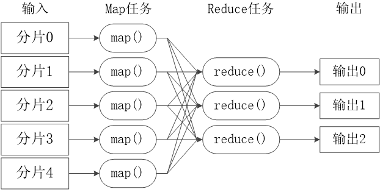
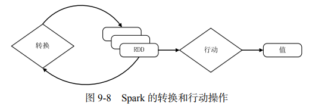

[TOC]

# 大数据复习

## 第七章 MapReduce

### 7.1 一些概念

#### 7.1.1 MapReduce模型简介

MapReduce将复杂的、运行于大规模集群上的并行计算过程高度地抽象到了两个函数：**Map** 和 **Reduce**

在MapReduce中，一个存储在分布式文件系统上的大规模数据集，会被切分成许多 **独立** 的小的数据块(这样独立的小数据块又称作 **分片spilt** )，这些分片可以被多个Map任务并行处理

MapReduce的设计理念是「计算向数据靠拢」，而不是「数据向计算靠拢」，这样可以减少因为数据移动产生的网络传输开销。

本着这样的理念，MapReduce框架会尽可能将Map程序 **就近** 安排在HDFS数据所在的节点运行，也就是 **将计算节点与存储节点放在一块运行** ，从而减少了节点间数据移动的开销

#### 7.1.2 Map 和 Reduce 函数

MapReduce 模型的核心是 Map 函数和 Reduce 函数

Map 函数和 Reduce 函数都是以<key,value>作为输入，按一定的映射规则转换成另一个或一批 <key,value> 进行输出

* Map函数的输入来源于分布式文件系统中的文件块，这些文件块的格式是任意的，可以是文档、二进制格式等待
* Map函数会将输入的元素转化成 <key, value> 形式的键值对。需要注意的是，这里的key不具有唯一性，可以生成相同key的多个键值对
* Reduce函数的作用就是将输入的一系列具有相同键的键值对以某种方式组合起来，输出处理后的键值对，结果会合并成一个文件

例如上图给出的例子，Map函数的输入是一个键值对，其中key表示行号，value表示行号对应的一行文本，经过Map函数处理后，会输出一系列键值对，其中key表示出现的字符，value表示出现的次数(都为1)，这些键值对是计算的中间结果

随后，经过一些操作后，将上述中间结果转化成 <k, List(v)> 的格式，这里的value值可以理解成一个列表，key仍然是出现的字符，value是该字符出现次数组成的列表，经过Reduce处理后，也就是把相同字符出现的次数都相加，最后输出键值对，表示字符以及对应的总次数

### 7.2 体系结构

MapReduce体系结构主要由四个部分组成，分别是：Client、JobTracker、TaskTracker以及Task

1. Client
   * 用户编写的MapReduce程序通过 Client 提交到 JobTracker 端
   * 用户可以借助 Client 提供的接口查看作业运行状态

2. JobTracker
   * JobTracker负责资源监控和作业调度
   * JobTracker监控所有的 TaskTracker 和 Job 的健康状况，一旦发现故障，就将相应的任务转移到其他的节点
   * JobTracker跟踪任务的执行进度与资源使用量等信息，并将这些信息告诉 TaskScheduler(任务调度器) ，该调度器会在资源空闲时，分配合适的任务去使用空闲资源 

3. TaskTracker
   * TaskTracker接收JobTracker发送过来的命令并执行相应的操作如启动新任务、杀死任务等
   * TaskTracker会周期性地通过「心跳」将本节点上 **资源的使用情况** 和 **任务的运行进度** 等汇报给JobTracker
   * TaskTracker使用「slot」等量划分本节点上的资源量(CPU、内存等)
  > 一个 Task 只有获得了一个「slot」才有机会运行，调度器的作用就是将各个TaskTracker上空闲的「slot」分配给相应的 Task使用。
  > slot 还分为 Map slot 和 Reduce slot，以供Map Task 和 Reduce Task 使用

4. Task
   * Task分为 Map Task 和 Reduce Task 两种，均由 TaskTracker 启动

### 7.3 工作流程

#### 7.3.1 工作流程概述

MapReduce 的输入和输出都需要借助分布文件系统，这些文件被分布存储在集群中的多个节点上

MapReduce工作的核心思想是「分而治之」，把一个大的数据集分割成多个独立的小的数据块，在多台机器上 **并行** 处理

工作流程概述：

* 首先，一个大的 MapReduce 作业会被拆分许多 Map 任务在多台机器上并行处理
  * 每个 Map 任务通常会在对应的数据节点上运行
  * 计算和数据放在一起，节省了数据传输的开销
* 当 Map 任务结束后，会生成许多 <key, value> 形式的中间结果
* 这些中间结果又被分发到多个 Reduce 任务并在多台机器上并行运行
* 需要注意的是 **具有相同key值的键值对 <key, value> 会被分到同一个 Reduce 任务**， Reduce 任务对这些中间结果进行汇总计算，得到最终结果，并输出到分布式文件系统中

需要指出：

* 不同的 Map 之间不会进行通信，不同的 Reduce 任务之间也不会进行数据交换
* 用户不能显示地从一台机器向另一台机器发送消息
* 所有的数据交换都是通过 MapReduce 自身的框架去实现的 

#### 7.3.2 MapReduce 各个执行阶段

上图展示了 MapReduce 工作流程中的各个执行阶段。下面根据这张图介绍 MapReduce 算法的执行过程

1. MapReduce 框架使用 InputFormat 模块做 Map 前的预处理(如验证输入格式是否符合输入定义)；然后，将输入文件切分成 **逻辑上** 的多个 InputSpilt(注意是逻辑上的切分，并没有对文件进行实际上的切割)，InputSpilt 记录了要处理数据的 **起始位置** 和 **长度**
2. 通过 RecordReader 处理 InputSpilt 中的具体记录，**加载数据并转换成 Map 任务可以处理的键值对**，然后输入给 Map 任务
3. Map任务根据定义好的映射规则，输出一系列的 <key, value> 作为中间结果
4. 对 Map 的输出进行分区(Portition)、排序(Sort)、合并(Combine)、归并(Merge)等操作，得到 <key, value-list> 形式的中间结果，再交给对应的 Reduce 进行处理，这样的过程称为 **Shuffle** 。
5. Reduce 将一系列 <key, value-list> 作为输入，根据用户定义的逻辑，将形式为 <key, value> 的最终结果输出给 OutputFormat 模块
6. OutputFormat模块在将最终结果写入到分布式文件系统之前，需要验证输出目录是否存在且输出结果的类型是否符合配置文件中的配置类型，如果都满足就正常输出

> 关于 Split ：HDFS是以固定大小的 block 为基本单位来存储数据，MapReduce 的基本处理单位就是 Split
> Map任务的数量：Hadoop会被每个分片 Split 创建一个 Map 任务，因此有多少 Split 就有多少 Map 任务
> Reduce任务的数量：最优的 Reduce 任务个数取决于集群中可用的 Reduce slot 数目；通常设置的 Reduce 任务个数要稍微少于可用的 Reduce slot 数目，预留一部分来处理系统运行时可能发生的错误

#### 7.3.3 Shuffle 过程详解

Shuffle 是 MapReduce 整个工作流程的核心环节

##### Shuffle过程简介

Shuffle, 是指对 Map任务的输出结果进行分区、排序、合并等一系列处理，然后交给 Reduce任务的过程。

Shuffle过程又分为 Map 端操作和 Reduce 端操作

1. 在 Map 端的 Shuffle 过程

Map 的输出结果会先写入到缓存中，待缓存已满后，就启动 **溢写** 操作，将缓存中的内容写入到磁盘中，并清空缓存

* 在启动溢写时，需要先把缓存中的数据进行分区，然后再对每个分区中的数据进行排序(Sort)和合并(Conbine)，之后才能写入磁盘文件
* 每次溢写操作都会产生一个新的磁盘文件，随着 Map 任务的执行，磁盘中就会存在多个溢写文件
* 在 Map 任务结束前，这些溢写文件会被归并(Merge)成一个大的磁盘文件，然后通知 Reduce 任务来 「领取」属于自己的处理数据

2. 在 Reduce 端的 Shuffle 过程

Reduce 从 Map端 的不同 Map 机器「领取」回属于自己的数据后，对这些数据进行归并(Merge)后再交给 Reduce 进行处理

##### Map 端的 Shuffle 过程

Map 端的 Shuffle 过程包含4个步骤，如上图所示

1. 输入数据和执行 Map 任务
   
   Map 任务的输入数据一般保存在分布式文件系统中

   Map 任务接收 <key, value> 作为输入数据后，根据定义的映射规则，将其转换成一批 <key, value> 进行输出

2. 写入缓存
   
   每个 Map 任务都会被分配一个缓存，Map 的输出并不是立即写入磁盘，而是首先写入缓存中。待缓存中的数据达到一定数量后，再一次性批量写入磁盘中，大大降低了寻址开销

3. 溢写(分区、排序与合并)
   
   * 提供的缓存容量有限，默认是100MB
   * 随着 Map 任务的执行，得到的中间结果会占满缓存。此时就要启动溢写(Spill)，将缓存中的内容一次性批量写入磁盘中
   * 需要设置一个溢写比例，使缓存中一直有可用的空间，以保证 Map 的结果能够不断地持续写入缓存中
     * 例如设置一个溢写比例为0.8，当缓存中数据占了80MB的空间时就启动溢写，剩下的20MB空间供 Map 结果的继续写入
   * 在溢写到磁盘之前，缓存中的数据首先会被分区(Partition)
     * 默认的分区方式是采用 Hash函数 对 key 进行哈希后，再用 Reduce 任务的数量进行取模即 hash(key) mod R，R表示Reduce任务数量
   * 对于每个分区中的键值对，根据key对它们进行排序(Sort)，**排序是 MapReduce 默认的操作**
     * 排序结束后，还有一个 **可选** 的合并(Conbine)操作，如果没有实现定义 Conbiner 函数，则不需要进行合并；如果用户事先定义了 Conbiner 函数，则进行合并，从而减少溢写到磁盘的数据量。需要注意的是 **Combiner 绝不能改变 Reduce任务最终的计算结果**
   * 经过分区、排序以及可能进行的合并操作以后，就可以将缓存中的键值对写入到磁盘中，并清空缓存。每次溢写操作都会产生一个新的溢写文件，且写入溢写文件中的所有键值对 **都是经过分区和排序**的

4. 文件归并
   
   在 Map 任务全部结束之前，系统会对所有溢写文件中的数据进行归并（Merge），生成一个大的溢写文件，这个大的溢写文件中的所有键值对也是经过分区和排序的

   文件归并时，如果溢写文件数量大于预定值（默认是3）则可以再次启动Combiner，少于3则不需要

经过上述 4 个步骤以后，Map 端的 Shuffle 过程全部完成，最终生成的一个大文件会被存放在本地磁盘上

JobTracker 会一直监测 Map 任务的执行，当监测到一个 Map 任务完成后，就会立即通知相关的 Reduce 任务来「领取」数据，然后开始 Reduce 端的 Shuffle 过程

> 补充：合并与归并的区别
> 两个键值对<“a”,1>和<“a”,1>，如果合并，会得到<“a”,2>，如果归并，会得到<“a”,<1,1>>

##### Reduce 端的 Shuffle 过程

Reduce 端的 Shuffle 过程非常简单，只需要从 Map 端读取 Map 结果，然后执行归并操作，最后输送给 Reduce 任务进行处理

1. 「领取」数据

Reduce 任务需要把保存在 Map 机器本地磁盘上的数据「领取」（Fetch）回来存放到自己所在机器的本地磁盘上

每个 Reduce 任务会不断地通过 RPC 向 JobTracker 询问 Map 任务是否已经完成，若已完成，则领取属于自己的数据

2. 归并数据

从 Map 端领回的数据会首先被存放在 Reduce 任务所在机器的缓存中，先归并，再合并，然后才写入磁盘中。

缓存被占满后，启动溢写操作将缓存中的数据写入磁盘中。磁盘上存在多个溢写文件，将多个溢写文件归并成一个或多个大文件，文件中的键值对是排序的

3. 把数据输入给 Reduce 任务

磁盘中经过多轮归并后得到的若干个大文件，不会继续归并成一个新的大文件，而是直接输入给 Reduce 任务

在数据很少的情形下，缓存可以存储所有数据，就不需要把数据溢写到磁盘，而是直接在内存中执行归并操作，然后直接输出给 Reduce 任务

### 7.4 WordCount实例

#### WordCount程序任务

* 输入：一个包含大量单词的文本文件
* 目标：统计文件中每个单词出现的次数
* 格式要求：输出格式为单词和频数占一行、单词和频数之间有间隔并且有序 (按照单词字母顺序排序)

#### 设计思路

* 首先，需要检查WordCount程序任务是否可以采用MapReduce来实现
  * 适合用 MapReduce 来处理的数据集需要满足一个前提条件：**待处理的数据集可以分解成许多小的数据集，而且每一个小数据集都可以完全并行地进行处理**
  * 在该程序任务中，不同单词之间的频数不存在相关性，彼此独立，因此可以把不同的单词分发给不同的机器进行并行处理
* 其次，确定MapReduce程序的设计思路
  * 把文件内容解析成许多个单词，然后把所有相同的单词聚集到一起，最后计算出每个单词出现的次数进行输出
* 最后，确定MapReduce程序的执行过程
  * 

## 第九章 Spark

### 概念与特点

### 9.2 生态系统

在实际应用中，大数据处理主要包括以下三个类型：

* **复杂的批量数据处理**：时间跨度通常在数十分钟到数小时之间
* **基于历史数据的交互式查询**：时间跨度通常在数十秒到数分钟之间
* **基于实时数据流的数据处理**：时间跨度通常在数百毫秒到数秒之间

Spark 生态系统已经成为伯克利数据分析软件栈 BDAS（Berkeley Data Analytics Stack）的重要组成部分。上图为BDAS的架构

从上图可以看出，**Spark 专注于数据的处理分析**，而数据的存储还是要借助于Hadoop 分布式文件系统 HDFS、Amazon S3等来实现

Spark 生态系统主要包含了 Spark Core、Spark SQL、Spark Streaming、MLlib 和 GraphX 等组件，各组件的具体功能如下：

* **Spark Core**：Spark Core 包含 Spark 的基本功能，如内存计算、任务调度、部署模式、故障恢复、存储管理等，**主要面向批数据处理**
* **Spark SQL**：Spark SQL 允许开发人员直接处理 RDD，同时也可查询 Hive、HBase 等外部数据源
* **Spark Streaming**：Spark Streaming 支持高吞吐量、可容错处理的**实时流数据处理**。其核心思路是将流数据分解成一系列短小的批处理作业，每个短小的批处理作业都可以使用 Spark Core 进行快速处理
* **MLlib（机器学习）**：MLlib 提供了常用机器学习算法的实现，包括聚类、分类、回归、协同过滤等
* **GraphX（图计算）**：GraphX 是 Spark 中用于图计算的 API，GraphX 性能良好，拥有丰富的功能和运算符，能在海量数据上自如地运行复杂的图算法

需要说明的是，无论是 Spark SQL、Spark Streaming、MLlib 还是 GraphX，都可以使用 Spark Core 的 API 处理问题，它们的方法几乎是通用的，处理的数据也可以共享，不同应用之间的数据可以无缝集成

### 与 MapReduce 的区别

### 9.3 运行架构

#### 9.3.1 基本概念

* RDD：弹性分布式数据集（Resilient Distributed Dataset）的英文缩写，是分布式内存的一个抽象概念，提供了一种高度受限的共享内存模型
* DAG：是 Directed Acyclic Graph（有向无环图）的英文缩写，反映 RDD 之间的依赖关系
* Executor：是运行在工作节点（Worker Node）上的一个进程，负责运行任务Task
* Application(应用)：用户编写的Spark应用程序
* Task(任务)：运行在 Executor 上的工作单元
* Job(作业)：一个Job包含多个RDD及作用于相应RDD上的各种操作
* Stage(阶段)：是作业Job的基本调度单位，一个作业Job会分为多组任务Task，每组任务Task被称为「阶段」Stage，或者也被称为「任务集」TaskSet

#### 9.3.2 架构设计

Spark运行架构如图所示

Spark运行架构包括集群资源管理器（Cluster Manager）、运行作业任务的工作节点（Worker Node）、每个应用的任务控制节点（Driver）和每个工作节点上负责具体任务的执行进程（Executor）。其中，集群资源管理器可以是 Spark 自带的资源管理器，也可以是 YARN 或Mesos 等资源管理框架

与Hadoop MapReduce计算框架相比，Spark所采用的Executor有两个优点：
* 一是利用多线程来执行具体的任务，减少任务的启动开销
* 二是Executor中有一个BlockManager存储模块，会将内存和磁盘共同作为存储设备，有效减少IO开销

上图展示了Spark中各种概念的相互关系

在Spark中，一个应用(Application)由一个任务控制节点(Driver)和若干作业(Job)组成，一个作业由若干个阶段(Stage)构成，一个阶段由多个任务(Task)组成

当执行一个应用时，任务控制节点会向集群管理器（Cluster Manager）申请资源，启动 Executor，并向 Executor 发送应用程序代码和文件，然后在 Executor 上执行任务，运行结束后执行结果会返回给任务控制节点，或者写到 HDFS 或者其他数据库中

#### 9.3.3 运行基本流程

Spark运行基本流程如下：

1. 当一个 Spark 应用被提交时，首先需要**为这个应用构建起基本的运行环境**，即**由任务控制节点（Driver）创建一个 SparkContext**，**由 SparkContext 负责和资源管理器（Cluster Manager）的通信以及进行资源的申请、任务的分配和监控等**。SparkContext 会向资源管理器注册并申请运行 Executor 的资源
2. **资源管理器为 Executor 分配资源，并启动 Executor 进程**
3. **SparkContext 根据 RDD 的依赖关系构建 DAG 图**，**DAG 图提交给 DAG 调度器（DAGScheduler）进行解析**，将 DAG 图分解成多个「阶段」（每个阶段都是一个任务集），并且计算出各个阶段之间的依赖关系，然后**把一个个「任务集」提交给底层的任务调度器（TaskScheduler）进行处理**；**Executor 向 SparkContext 申请任务Task**，**任务调度器将任务分发给 Executor 运行，同时SparkContext 将应用程序代码发放给 Executor**
4. **任务在 Executor 上运行，把执行结果反馈给任务调度器，然后反馈给 DAG 调度器，运行完毕后写入数据并释放所有资源**

总体而言，Spark 运行架构具有以下特点:

* 每个应用都有自己专属的 Executor 进程，并且该进程在应用运行期间一直驻留。Executor进程以**多线程**的方式运行任务
* Spark 运行过程与资源管理器无关，只要能够获取 Executor 进程并保持通信即可
* **Executor 上有一个 BlockManager 存储模块**，在处理迭代计算任务时，不需要把中间结果写入到 HDFS 等文件系统，而是直接放在这个存储系统上，后续有需要时就可以直接读取
* **任务采用了数据本地性和推测执行等优化机制**。数据本地性是尽量将计算移到数据所在的节点上进行，即「计算向数据靠拢」

#### 9.3.4 RDD的设计与运行原理

##### RDD概念

* 一个 RDD 就是一个**分布式对象集合**，本质上是一个**只读**的分区记录集合，每个 RDD 可以分成多个分区，每个分区就是一个数据集片段，并且一个 RDD 的不同分区可以被保存到集群中不同的节点上，从而可以在集群中的不同节点上进行并行计算
* RDD 提供了一种高度受限的**共享内存模型**，即 RDD 是**只读的记录分区的集合，不能直接修改**，只能基于稳定的物理存储中的数据集来创建 RDD 或者通过在其他 RDD 上执行确定的**转换**操作（如 map、join 和 groupBy）而创建得到新的 RDD
* RDD 提供了一组丰富的操作以支持常见的数据运算，分为 **「行动」（Action）** 和 **「转换」（Transformation）** 两种类型
  * 行动：用于**执行计算**并指定输出的形式
  * 转换：**指定 RDD 之间的相互依赖关系**
* 两类操作的主要区别是，转换操作（如 map、filter、groupBy、join 等）接受RDD 并返回 RDD(即输出RDD)，而行动操作（如 count、collect 等）接受 RDD 但是返回非 RDD（即输出一个值或结果）
* RDD 提供的转换接口都非常简单，都是类似 map、filter、groupBy、join 等**粗粒度的数据转换操作，而不是针对某个数据项的细粒度修改**.因此，**RDD 比较适合对于数据集中元素执行相同操作的批处理式应用**，而不适合用于需要异步、细粒度状态的应用，比如 Web 应用系统、增量式的网页爬虫等

RDD典型的执行过程如下：

1. RDD读入外部数据源进行创建
2. RDD经过一系列「转换」操作，每次转换都会产生一个新的RDD，以供下一个「转换」使用
3. **最后一个** RDD 经「行动」操作的处理，输出到外部数据源

上图简单展示了 RDD执行的过程

在 RDD 的执行过程，**真正的计算发生在「行动」操作**，而「行动」之前的所有「转换」操作，Spark只是记录了一些基础数据集和RDD的生成轨迹即**相互之间的依赖关系**，不会触发真正的计算

上图为 RDD 执行过程的一个实例

1. 通过外部数据源，从输入中**逻辑上**生成 A和C 两个 RDD
2. 中间经过一系列「转换」操作，**逻辑上**生成了 F，F仍然是一个 RDD
3. 当 F 进行「动作」操作时，Spark才会根据 RDD 之间的依赖关系生成 DAG(有向无环图)，并**从起点开始真正的计算**

> 注意，之所以强调 「逻辑上」，是因为这时并没有进行真正的计算，Spark只是记录了 **RDD之间的生成和依赖关系**

##### RDD之间的依赖关系：窄依赖、宽依赖

RDD之间的依赖关系分为**窄依赖**和**宽依赖**

上图展示了窄依赖和宽依赖的区别

窄依赖表现为一个父 RDD 的一个分区对应于一个子 RDD 中的一个分区，或多个父RDD的分区对应于一个子RDD的分区，例如图(a)中：

* 父RDD1中的分区1对应于子RDD中的分区4，父RDD3中的分区7对应于子RDD5中的分区11
* 父RDD6中的分区15对应于子RDD8中的分区21，同时父RDD7中的分区18对应于子RDD8中的分区11

宽依赖表现为一个父RDD的分区对应于子 RDD 中的多个分区，例如图(b)中：

* 父RDD9中的分区24同时对应了RDD12中的两个分区(分区27、28)

**总体而言，如果父 RDD 的一个分区只被一个子 RDD 的一个分区所使用就是窄依赖，否则就是宽依赖**

##### 阶段的划分

Spark 通过分析各个 RDD 的依赖关系生成了 DAG，再通过分析各个 RDD 中的分区之间的依赖关系来决定如何划分阶段

具体划分方法是：在 DAG 中进行反向解析，**遇到宽依赖就断开，遇到窄依赖就把当前的 RDD 加入到当前的阶段中**；将窄依赖尽量划分在同一个阶段中，可以实现流水线计算

上图为根据 RDD分区的依赖关系划分阶段

划分的过程为：

* 首先直接看到最后一个RDD G，从 G 往前倒退，反向分析
  * B 和 G之间是窄依赖，所以将 B 和 G 放在同一个阶段；从 B 往前倒退至 A，发现 A 和 B之间是宽依赖，所以断开，则 A 处于阶段1 Stage1
  * 然后，再看F和G，F 和 G之间是宽依赖，断开，它俩不在一个阶段中，从 F 开始反向分析之前的分区发现：
    * D 和 F是窄依赖，E 和 F是窄依赖，因此它们都在同一阶段
    * C 和 D是窄依赖，所以将 C加入到当前阶段
  * 最终，C、D、E、F都处于同一阶段Stage2；B、G同处于Stage3；A处于Stage1

## 第十章 流计算

### 10.1 流数据、流计算

#### 10.1.1 静态数据和流数据

数据总体上可分为静态数据和流数据

数据仓库系统中存放的大量**历史数据**就是静态数据，这些数据来自不同的数据源，借助数据挖掘和相关分析工具可以从这些静态数据中找到有价值的信息

流数据：数据以 **大量、快速、时变** 的流形式 **持续** 到达

流数据具有以下特征：

* **数据快速持续到达**，潜在大小也许是无穷无尽的
* 数据**来源众多，格式复杂**
* **数据量大，但并不十分关注存储**，一旦经过处理，要么被丢弃，要么被归档存储
* 注重数据的**整体价值**，不过分关注个别数据
* 数据顺序颠倒，或者不完整，系统无法控制将要处理的新到达的数据元素的顺序

#### 10.1.2 批量计算和实时计算

对静态数据和流数据的处理，对应着两种截然不同的计算模式：批量计算和实时计算

上图为数据的两种处理模型

批量计算以静态数据为对象，可以有充裕的时间对这些海量数据进行处理

流数据不适合采用批量计算，因为流数据不适合用传统的关系数据库建模

**流数据必须采用实时计算**，一般要求响应时间为秒级

流计算：针对流数据的实时计算

#### 10.1.3 流计算

上图为流计算示意图

流计算：**实时获取**来自不同数据源的海量数据，经过**实时分析**处理，获得有价值的信息

流计算秉承着「数据的价值随着时间的流逝而降低」的基本理念

对于一个流计算系统来说，它应达到如下需求：

* 高性能：处理大数据的基本要求，如每秒处理几十万条数据
* 海量式：支持TB级甚至是PB级的数据规模
* 实时性：保证较低的延迟时间，达到秒级别，甚至是毫秒级别
* 分布式：支持大数据的基本架构，必须能够平滑扩展
* 易用性：能够快速进行开发和部署
* 可靠性：能可靠地处理流数据

MapReduce 无法满足流计算系统的需求，**MapReduce 是专门面向静态数据的批量处理**的，其内部的各种实现机制都为批处理做了高度优化，因此 **不适合用于处理持续到达的动态数据**

### 10.2 流计算的处理流程

流计算的处理流程包括 **数据实时采集、数据实时计算和实时查询服务**

#### 10.2.1 概述

上图为传统数据处理流程示意图.

传统的数据处理流程，需要先采集数据，并存储在数据管理系统中，之后用户通过查询操作与数据管理系统进行交互，最后获得查询结果

传统的数据处理流程隐含了两个前提：

* 存储的数据是旧的。当用户进行查询时，存储的静态数据属于过去某个时刻的，可能已经失去了时效性
* 需要用户主动发出查询。用户主动发出查询以获得最终结果

上图为流数据处理流程示意图.

流数据处理流程一般包含三个阶段：数据实时采集、数据实时计算以及实时查询服务。下面分别对这三个阶段进行介绍

#### 10.2.2 数据实时采集

数据实时采集阶段通常采集多个数据源的海量数据，需要保证 **实时性、低延迟与稳定可靠**

数据采集系统的基本架构一般有三个部分，如下图

* Agent：主动采集数据，并把数据推送到Collector部分
* Collector：接收多个Agent的数据，并实现有序、可靠、高性能的转发
* Store：存储Collector转发过来的数据

> 对于流计算而言，一般在 Store 部分不进行数据的存储，而是将采集的数据直接发送给流计算平台进行实时计算

#### 10.2.3 数据实时计算

数据实时计算阶段是对采集到的数据进行**实时**的分析和计算

上图为数据实时计算流程示意图.

流处理系统**接收**数据采集系统不断发送过来的**实时数据**，**实时地进行分析计算，并反馈实时结果**

经流处理系统处理过的数据可视情况进行存储

#### 10.2.4 实时查询服务

流处理的第三个阶段是实时查询服务，经由流计算框架得出的结果可供用户进行实时查询

传统的数据处理流程，用户需要主动发出查询才能获得想要的结果。而在流处理流程中，**实时查询服务可以不断更新结果**，并将用户所需的结果**实时推送**给用户

流处理系统与传统的数据处理系统有如下不同：

* **面对的数据不同**：**流处理系统**处理的是**实时的数据**，而**传统的数据处理系统**处理的是预先存储好的**静态数据**
* **用户获取的结果不同**：用户通过流处理系统获取的是实时结果，而通过传统的数据处理系统，获取的是过去某一时刻的结果
* **用户获取结果的方式不同**：流处理系统无需用户主动发出查询，实时查询服务可以**主动将实时结果推送给用户**

### 10.3 开源流框架Storm

#### 10.3.1 概念与特点

Twitter Storm 是一个免费、开源的**分布式实时计算系统**，Storm 可以简单、高效、可靠地处理流数据，并支持多种编程语言

Storm 框架可以方便地与数据库系统进行整合，从而开发出强大的实时计算系统

Storm 具有如下主要特点：

* 整合性：Storm可方便地与队列系统和数据库系统进行整合
* 简易的API：Storm的API在使用上即简单又方便
* 可扩展性：Storm的并行特性使其可以运行在分布式集群中
* 容错性：Storm可自动进行故障节点的重启、任务的重新分配
* 可靠的消息处理：Storm保证每个消息都能完整处理
* 支持各种编程语言：Storm支持使用各种编程语言来定义任务
* 快速部署：Storm可以快速进行部署和使用
* 免费、开源：Storm是一款开源框架，可以免费使用

#### 10.3.2 Storm 的设计思想

##### 相关术语介绍

主要术语包括：Streams、Spouts、Bolts、Topology 和 Stream Groupings

1. Streams

Storm 将流数据 Streams 描述成一个**无限的 tuple 序列**。这些 tuple 序列会以**分布式**的方式**并行**地创建和处理

> * tuple 即元组，是元素的有序列表
> * 每一个 tuple 就是一个值列表，列表中的每个值都有对应的名称，且该值可以是任何类型：基本类型、字符类型、字节数组和其他可序列化的类型等

2. Spouts

Storm 认为每个 Stream 都有一个源头，并把这个源头抽象为 Spouts。Spouts 会从外部读取流数据并持续发出 Tuple

3. Bolts

Storm 将 Streams 的状态转换过程抽象为 Bolts

Bolt即可以处理Tuple，也可以将处理后的Tuple作为新的Streams发送给其他Bolt

对 Tuple 的处理逻辑都被封装在 Bolts 中，可执行过滤、聚合、查询等操作

4. Topology

Storm 将 Spouts 和 Bolts 组成的网络抽象成 Topology，它可以被提交到 Storm 集群执行

一个 Topology 就是一个流转换图，图中节点是一个 Spout 或 Bolt，图中的边则表示 Bolt 订阅了哪个 Stream

当Spout或者Bolt发送元组时，它会把元组发送到每个订阅了该Stream的Bolt上进行处理

Topology里面的每个处理组件（Spout或Bolt）都包含处理逻辑， 而组件之间的连接则表示数据流动的方向

Topology里面的每一个组件都是并行运行的

5. Stream Groupings

Storm 中的 Stream Groupings 用于告知 Topology 如何在两个组件间（如 Spout 和 Bolt 之间，或者不同的 Bolt 之间）进行 Tuple 的传送

箭头表示 Tuple 的流向，而圆圈则表示任务，每一个 Spout 和 Bolt 都可以有多个分布式任务，**一个任务在什么时候、以什么方式发送 Tuple 就是由 Stream Groupings 来决定的**

目前，Storm 中的 Stream Groupings 有如下 6 种方式：

* ShuffleGrouping：随机分组，随机分发Stream中的Tuple，保证每个Bolt的Task接收Tuple数量大致一致
* FieldsGrouping：按照字段分组，保证相同字段的Tuple分配到同一个Task中
* AllGrouping：广播发送，每一个Task都会收到所有的Tuple
* GlobalGrouping：全局分组，所有的Tuple都发送到同一个Task中
* NonGrouping：不分组，和ShuffleGrouping类似，当前Task的执行会和它的被订阅者在同一个线程中执行
* DirectGrouping：直接分组，直接指定由某个Task来执行Tuple的处理

##### Storm 的框架设计

Storm 运行在分布式集群中，其运行任务的方式与 Hadoop 类似：在 Hadoop 上运行的是 MapReduce 作业，而在 Storm 上运行的是「Topology」

两者的任务大不相同，其中主要的不同是：一个 MapReduce 作业最终会完成计算并结束运行，而一个 Topology 将**持续**处理消息（直到人
为终止）

Storm集群采用「Master—Worker」的节点方式：

* Master 节点：运行名为「Nimbus」的后台程序（类似Hadoop中的「JobTracker」），**负责在集群范围内分发代码、为Worker分配任务和监测故障**
* Worker 节点：运行名为「Supervisor」的后台程序，负责监听分配给它所在机器的工作，即**根据Nimbus分配的任务来决定启动或停止Worker进程**，一个Worker节点上同时运行若干个Worker进程

Storm使用Zookeeper来作为**分布式协调组件**，**负责Nimbus和多个Supervisor之间的所有协调工作**。**借助于Zookeeper**，若Nimbus进程或Supervisor进程意外终止，重启时也能读取、恢复之前的状态并继续工作，**使得Storm极其稳定**

> Master 节点并没有直接和 Worker 节点通信，而是借助 Zookeeper 将状态信息存放在 Zookeeper中或本地磁盘中，以便节点故障时进行快速恢复

* Worker进程：**每个worker进程都属于一个特定的Topology**，每个Supervisor节点的worker可以有多个，每个worker对Topology中的每个组件（Spout或 Bolt）运行一个或者多个executor线程来提供task的运行服务
* Executor进程：executor是产生于worker进程内部的线程，会执行**同一个组件**的一个或者多个task
* Task：**实际的数据处理由task完成**，在Topology的生命周期中，每个组件的task数目是不会发生变化的，而executor的数目却不一定。executor数目小于等于task的数目，默认情况下，二者是相等的

> 每台Supervisor上运行着若干worker进程
> 每个worker进程中运行着若干Executor线程
> 每个Executor线程里运行着若干相同的Task
