# 第四章 指令系统

[TOC]

---

## 4.1 指令格式

### 4.1.1 操作码与地址码的基本概念

含义：一条指令就是机器语言中的一个语句，用来表示一串有意义的二进制代码。

结构：一条指令通常会包括两个字段：**操作码**字段和**地址码**字段。

* 操作码：指出这条指令的功能，也就是这条指令是「干什么」的
* 地址码：有些操作码是需要指明操作对象的，这时就需要地址码来给出这些对象的地址，也就是「对谁进行操作」

以上的结构是一个抽象的概念，并没有指明指令内部中操作码和地址码具体会分配到几个二进制位，下面给出一个具体的例子：
> 比如我们给出一个四地址指令：
> | OP | $A_1$ | $A_2$ | $A_3$ (结果) | $A_4$ (下址) |
> 该指令执行的操作是：将A1地址的内容与A2地址的内容进行一个OP操作，将结果存在A3给出的地址里，然后根据A4给出的地址去获取下一个指令的地址
> 含义：($A_1$) OP ($A_2$) $\rightarrow$ $A_3$, $A_4$ = 下一个执行指令的地址
> 加了括号表明是地址指向的内容，而不是地址间进行操作或运算
> 假设指令字长为32位，操作码占8位，4个地址码分别各占6位，同时设存储字长为32位即4B：
> | 00000000 | 000001 | 000010 | 000011 | 000100 |
> * $A_i$ 可以直接表示 $2^6$ 个不同的位置
> * 一条指令的执行：**取指令**访存1次，**取两个操作数**访存2次，**将结果存回**访存1次，共4次。

如果我们将指令和数据的排列方式改变一下，指令放在一块儿，数据放在一块儿，这样我们就可以不用在指令中给出下一个指令的地址，而是设计一个程序计数器PC，每次取出当前指令后，自动到下一个地址去取指令就可以了。

根据一条指令中有几个操作数地址，可以将该指令称为**几操作数指令**或**几地址指令**。

各种不同操作数的指令格式如下图.

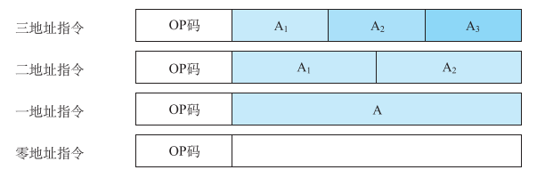

**三地址指令**：

| OP | $A_1$ | $A_2$ | $A_3$ (结果) |

含义：($A_1$) OP ($A_2$) $\rightarrow$ $A_3$

**二地址指令**：

| OP | $A_1$ (目的操作数) | $A_2$ (源操作数) |

二地址指令常被称为**双操作数指令**

含义：($A_1$) OP ($A_2$) $\rightarrow$ $A_1$

> 在二地址指令中，根据操作数的物理位置，又可以归结为三种不同的类型：
> * 存储器-存储器(SS)型：访问内存的指令格式，这种指令操作时都是涉及**内存单元**，即参与操作的数都放在内存单元中
> * 寄存器-寄存器(RR)型：访问寄存器的指令格式，这种指令操作时都是涉及**寄存器**，执行过程中需要多个通用寄存器或个别专用寄存器
> * 寄存器-存储器(RS)型：执行这类指令时，既要访问内存单元，又要访问寄存器

**一地址指令**：

| OP | $A_1$ |

含义：

1. OP($A_1$) $\rightarrow$ $A_1$ ，如加1、减一、取反、求补等
2. (ACC) OP ($A_1$) $\rightarrow$ ACC, 隐含约定的目的地址

**零地址指令**

| OP |

零地址指令中只有操作码，没有地址码。

含义：

1. 不需要操作数，如空操作、停机、关中断等操作
2. 堆栈计算机，两个操作数隐含放在栈顶和次栈顶，结果压回栈顶

### 4.1.2 指令字长度

1.什么是指令字

表示一条指令的机器字，就称为指令字，通常简称指令。

2.什么是指令字长度

一个指令字中二进制位的个数，称为指令字长度。

以机器字长度为衡量单位，可以有如下的指令分类.

* 单字长指令：指令字长度等于机器字长度的指令
* 半字长指令：指令字长度等于半个机器字长度的指令
* 双字长指令：指令字长度等于两个机器字长度的指令

3.什么是机器字长

计算机可以直接处理的二进制数据的位数

4.定长与变长

定长指令字结构：在减少地址码个数的过程中，整个指令的字长没有发生变化。如四地址变化到三地址指令

变长指令字结构：在减少地址码个数的过程中，指令的字长发生了改变。如一地址变化到零地址指令

定长操作码：n位操作码对应会有 $2^n$ 种不同的操作码，就指令功能而言，就可以有 $2^n$ 条指令

扩展操作码：操作码的长度是可变的。这里的扩展操作码只是变长操作码中的一种策略

5.扩展操作码(需要掌握)

假设某等长指令字结构机器的指令长度为16位，由4位操作码字段和3个4位地址码字段组成

| 操作码(4bit) | 地址码(4bit) | 地址码(4bit) | 地址码(4bit) |
| :----------: | :----------: | :----------: | :----------: |
|      OP      |    $A_1$     |    $A_2$     |    $A_3$     |

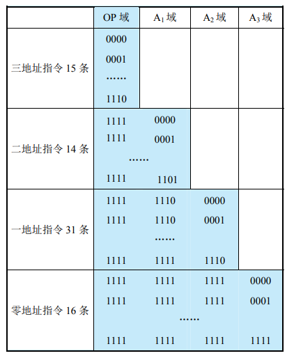

三地址指令为15条：编码空间为「0000 ~ 1110」，剩下1111留给下一层扩展

> 解释：高四位表示操作码，但由于只有15条，因此「1111」不属于三地址指令中的操作码，剩下的低12位表示地址码

二地址指令为14条：由上一层留下了「1111」作为扩展，因此，编码空间为「1111 0000 ~ 1111 1101」

> 解释：高四位为「1111」时，再加上 $A_1$ 域的14种组合就代表了不同的二地址指令，剩下的低8位正常表示地址码

一地址指令为31条：编码空间有「1111 1110 0000 ~ 1111 1110 1111」和 「1111 1111 0000 ~ 1111 1111 1110」

> 解释：上一层留下两个前缀作为扩展分别是 「1111 1110」和 「1111 1111」，因此只有 $A_3$ 域表示地址码

零地址指令为16条：编码空间为 「1111 1111 1111 0000 ~ 1111 1111 1111 1111」

> 零地址没有地址码字段，上一层只留下了「1111 1111 1111」这个前缀，搭配低4位构成不同的指令

在设计扩展操作码指令格式时，需要注意以下两点.
* 不允许短码是长码的前缀，即短操作码不能与长操作码的前面部分相同。例如二地址指令的高四位不能与三地址指令操作码字段中任何组合相同
* 各指令的操作码不能重复
* 一般情况下，会给使用频率较高的指令，分配较短的指令码
* 以上都可以参考哈夫曼编码

## 4.2 寻址方式

### 4.2.1 指令寻址

1. 什么是指令寻址
   定位下一条将要执行指令的地址。一般情况下都是由程序计数器PC给出下一条执行指令的地址

2. 指令寻址方式
   * 顺序寻址方式：按顺序从程序计数器PC中取出指令，也就是取完第一条之后再接着取第二条、第三条、...
   * 跳跃寻址方式：由转移指令给出下一条指令的地址，而不是像顺序寻址一样按部就班地按地址在内存中的顺序

### 4.2.2 操作数寻址

#### 1.基本概念

有效地址(EA)：操作数的**实际**访存地址。该地址指向所要获取数据的存储单元。

形式地址(A)：形式地址需要经过某种方式才能最终转化成有效地址。也就是形式地址指向的存储单元中的内容并不是所要获取的操作数，需要将该存储单元中的内容经过某种变换才能找到有效地址。又称为**偏移量**

操作数的寻址方式：形成操作数的有效地址的方法

在之后的叙述中，我们用 D 来表示操作数，EA 表示有效地址，A 表示形式地址

#### 2.基本的寻址方式

1. 立即寻址
   
   解释：在指令的地址字段给出操作数本身，这种寻址方式叫作**立即寻址**

   特点：由于直接在指令中给出了操作数，因此节省了**访问内存**这一步骤

   图示：
   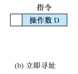

2. 直接寻址
   
   解释：在指令的地址字段直接给出操作数所在的内存地址。即该地址就是有效地址 EA = A

   特点：指令中的形式地址就是有效地址即「A = EA」，不需要经过额外的变换

   图示：
   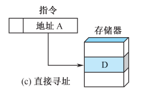

3. 间接寻址
   
   解释：间接寻址是相对于直接寻址的，即指令的地址字段给出的形式地址A不是操作数的有效地址EA，而是根据形式地址A指向的存储单元里的内容去再次寻找操作数。而间接寻址可以有多次，比如一次寻址、二次寻址、...
   > 例如：假设是一次寻址，那么地址字段给出的形式地址A，A指向的存储单元里的内容是「**地址并且是有效地址**」，而不是像之前一样是操作数，该有效地址指向的存储单元里的内容才是我们想要的操作数。这是在一次寻址的情况下，如果是多次寻址，那还要接着继续寻找，直到有特殊的标志表明当前地址就是有效地址。
   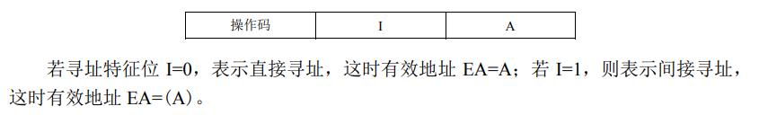
   增设一个寻址特征位，如果I = 1则说明还需要继续寻址，当I = 0时则说明不用继续，当前地址就是有效地址
   
   图示：
   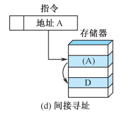

4. 寄存器寻址
   
   解释：操作数不放在内存中，而是放在CPU中的通用寄存器时，可以采用寄存器寻址

   特点：此时指令的地址字段给出的既不是操作数也不是内存地址，而是寄存器编号(即 EA = R)。该编号对应的寄存器里存着操作数

   图示：
   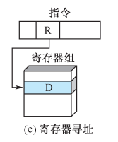

5. 寄存器间接寻址

   解释：此时寄存器中的内容不是操作数，而是操作数的地址

   特点：EA = (R)   

   图示：
   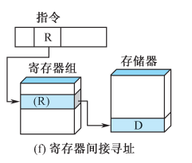

6. 隐含寻址
   
   解释：不是明显地给出操作数的地址，而是将操作数的地址隐含在指令中

   图示：
   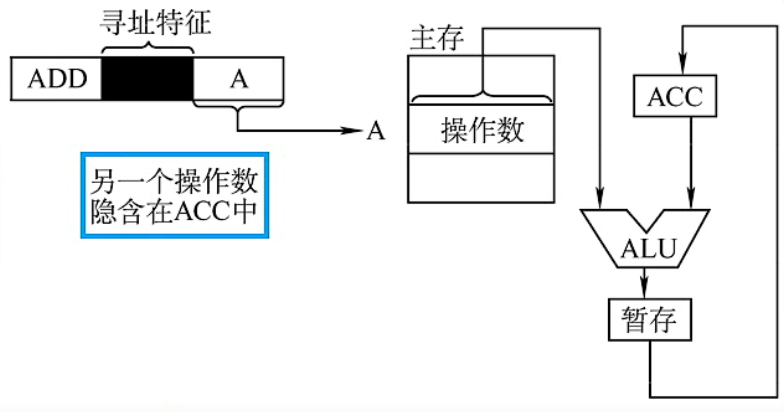

   > 该指令的含义是，将地址A指向的内存单元中的操作数与累加寄存器ACC中的内容相加，然后再存回ACC中。在指令的操作码字段就说明了另一个操作数隐含在累加寄存器ACC中

7. 偏移寻址
   
   三种常用的偏移寻址是基址寻址、变址寻址和相对寻址

   * 基址寻址
     * 解释：将CPU中的基址寄存器(BR)的内容与形式地址A相加，得到有效地址即 **EA = (BR) + A**
     * 图示：采用专用寄存器BR作为基址寄存器不用在指令中显示地指出寄存器的名字，而通用寄存器作为基址寄存器则要在指令中指出寄存器的编号
       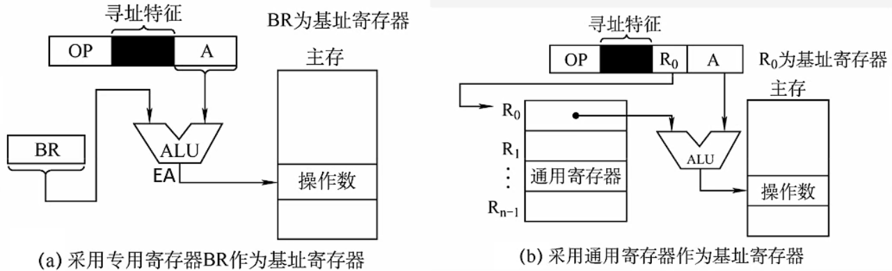
     * 注意：基址寄存器是**面向操作系统**的，也就是不论是专用寄存器还是通用寄存器作为基址寄存器，用户都无法改变基址寄存器中的内容，其**内容由操作系统或管理程序决定**。也就是基址寄存器的内容不变(作为基地址)，形式地址可变(作为偏移量)
     * 优点：可以扩大寻址范围、有利于多道程序设计、可用于编制浮动程序
      > 扩大寻址范围：基址寄存器的位数大于形式地址的位数，而有效地址 EA 的位数与最大的位数保持一致
        有利于多道程序设计：用户不必考虑自己的程序位于主存中的哪一块区域
        可用于编制浮动程序：和上述一样，由于用户不用顾及程序最终放在主存中的哪一块区域，不必在编写程序时给出操作数在内存中的实际地址，可以在运行程序时由操作系统分配空闲的内存空间
   * 变址寻址
     * 解释：有效地址 EA 等于形式地址 A 与变址寄存器 IX 的内容相加之和即 **EA = (IX) + A** 其中 IX 可以是专用寄存器也可以是通用寄存器
     * 图示：
      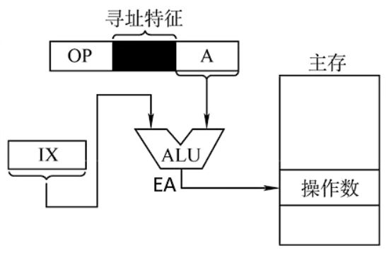
     * 注意：变址寄存器是**面向用户**的，在程序执行过程中，变址寄存器的内容是可以被用户改变的(作为偏移量)，形式地址 A 不变(作为基地址)，这里的改变一般是指类似于**自增**的操作。可以看到刚好和基址寻址是反过来的
     * 优点：扩大寻址范围、适合编制循环程序
      > 扩大寻址范围：与上述原理类似
        适合编制循环程序：一般可用于处理数组，设定形式地址A为数组的首地址，不断改变变址寄存器 IX 中的内容，以达到下标自增遍历数组的效果
   * 相对寻址
     * 解释：操作数有效地址的形成是程序计数器PC的内容加上形式地址A即 **EA = (PC) + A** 其中 A 表示**相对于当前指令地址**的偏移量，可正可负，补码表示
     * 图示：
      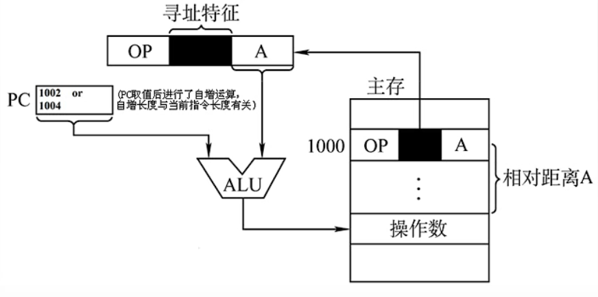
     * 优点：操作数的地址不是固定的，随着PC值的变化而变化，并且与指令地址总是相差一个固定值，因此便于程序浮动
      > 相对寻址更强调广泛应用于**转移指令**

8. 堆栈寻址

   堆栈有寄存器堆栈和存储器堆栈两种形式，都是以**先进后出**的原理存储数据。但不论是哪一种形式，数据的存取都与栈顶有关系，因此就需要一个显示或隐式的堆栈指示器(寄存器)

   图示：
   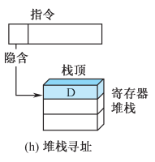

## 4.3 CISC 和 RISC

CISC 和 RISC是两种设计思路不同的指令系统

|                    |               CISC               |                             RISC                             |
| :----------------: | :------------------------------: | :----------------------------------------------------------: |
|        全称        | Complex Instruction Set Computer |               Reduced Instruction Set Computer               |
|      设计思路      |    一条指令完成一个复杂的功能    | 一条指令完成一个基本「动作」，多条指令的组合完成一个复杂功能 |
|        代表        | x86架构，如笔记本电脑、台式机等  |                   ARM架构，如手机、平板等                    |
|      指令系统      |            复杂、庞大            |                          简单、轻便                          |
|      指令数目      |          一般大于200条           |                        一般小于100条                         |
| 各种指令的执行时间 |             相差较大             |                绝大多数在一个周期内就可以完成                |
|   通用寄存器数量   |               较少               |                              多                              |

