# 第五章 中央处理器

## 5.1 CPU的功能和结构

> * CPU需要具有哪些功能？
> * 对应这些功能需要具有怎样的结构？

### 5.1.1 CPU的功能

1. CPU具有的功能
   * 指令控制：完成取指令、分析指令和执行指令的操作，即对程序的顺序控制
   * 操作控制：一条指令功能的完成往往需要一系列操作信号的组合来实现。CPU负责产生并管理这些操作信号，并将这些操作信号发送到对应的部件，从而控制部件完成指令要求的动作、响应等
   * 时间控制：就具体的一条指令而言，其内部一系列的操作信号需要加以时间控制；对宏观上的所有指令系统而言，时间控制需要安排每条指令执行的先后顺序
   * 数据加工：对数据进行算术运算和逻辑运算。完成数据的加工处理，是CPU的根本任务
   * 中断处理：对计算机运行过程中出现的**异常情况**或**特殊请求**进行处理

2. 功能分摊

    运算器和控制器是CPU的两大核心部件。上述列出的五个功能自然也就要分摊到这两个部件上

    运算器：顾名思义，需要对数据进行加工

    控制器：协调并控制计算机各部件执行程序的指令序列，协调和指挥整个计算机系统的运行。基本功能包括取指令、分析指令和执行指令

    * 取指令：**自动**形成指令地址；**自动**发出取指令的命令
    * 分析指令：指令由操作码和地址码两部分组成。因此分析指令就是对操作码译码(分析当前指令要完成的操作)、产生操作数的有效地址(获取操作对象)
    * 执行指令：根据上一步得到的「操作命令」和「操作数地址」，形成操作信号的控制序列，并控制相关部件(存储器、运算器和I/O设备等)完成相应的操作
    * 中断处理：管理总线和输入输出；处理异常情况和特殊请求

### 5.1.2 CPU的结构

根据运算器和控制器的功能分析其应具有怎样的结构

#### 运算器的结构

算术逻辑单元：运算器的核心是算术逻辑运算单元(ALU),其主要功能就是进行算术或逻辑运算。其特点是它是一个组合逻辑电路，一旦输入信号确定后，就会产生相应的输出信号

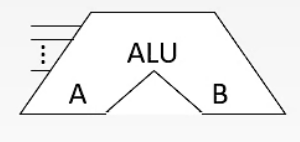

通用寄存器组：运算器还需要提供一些通用的寄存器，以存储操作数、运算过程中产生的中间结果以及各种地址信息

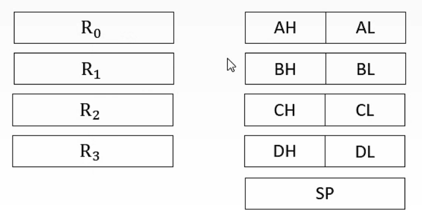

ALU与通用寄存器之间的连接：ALU与寄存器之间可以传输数据

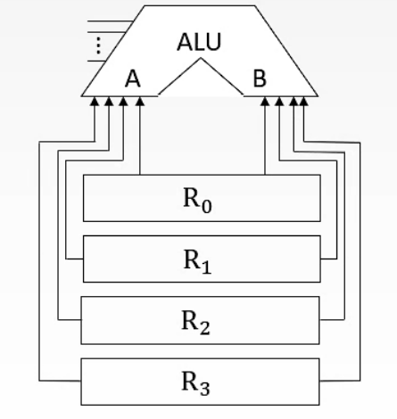

专用数据通路方式：根据指令执行过程中数据和地址的流动方向来安排连接线路。也就是如果 $R_0$ 需要给ALU传输数据，则两者之间就要有连线

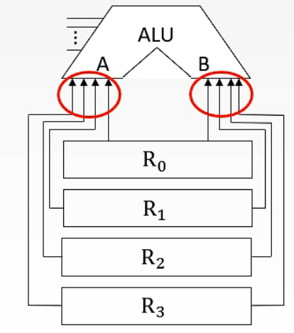

可以看到，如果直接用导线连接，相当于通用寄存器组同时且一直向ALU传输数据，这样ALU就无法判断当前需要处理的是哪一个数据。

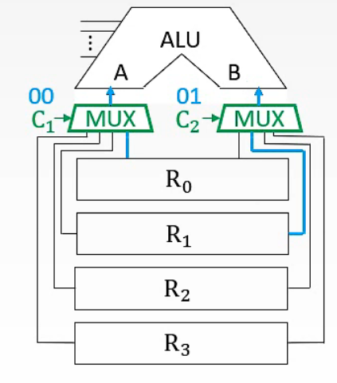

一个解决办法是使用多路选择器，如图所示，其电路符号是「MUX」，其通过控制信号 $C_1$ 和 $C_2$ 来选择当前哪个寄存器将数据传送给ALU。图中的例子是 $C_1$ 为00，则 $R_0$ 寄存器中的数据送入A，$C_2$ 为01，则寄存器 $R_1$ 中的数据送给B

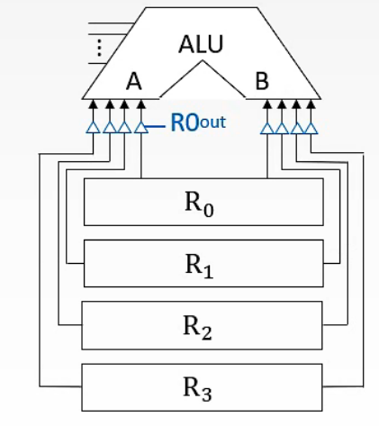

另外一个解决方法是采用三态门，如图所示，图中的一个小三角就表示一个三态门。每个三态门都有一个类似于 $R0_{out}$ 的信号控制

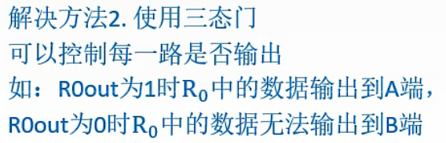

专用数据通路方式的优缺点：由于每个寄存器都有专门的线路连接到ALU，因此性能较高，基本不存在数据冲突的现象；但也正是因为有专门的线路，因此结构复杂、硬件量大、不容易实现

CPU内部单总线方式：将所有寄存器的输入端和输出端都连接到一条公共的总线上

* 当 $R0_{in}$ 有效时，其他部件可以通过绿色的线将数据写入寄存器中
* 输出端采用了三态门的设计，当 $R0_{out}$ 有效时，寄存器可以通过蓝色的线将数据放入总线中

CPU内部单总线方式优缺点：结构简单(每个寄存器与总线之间只需要有一组相互连接的线路即可)，容易实现；但数据传输容易出现较多数据冲突的现象，性能较低 (例如将寄存器R0中的数据送给R1时，另外两个寄存器R2和R3就不能工作，必须等该过程结束后才可以)

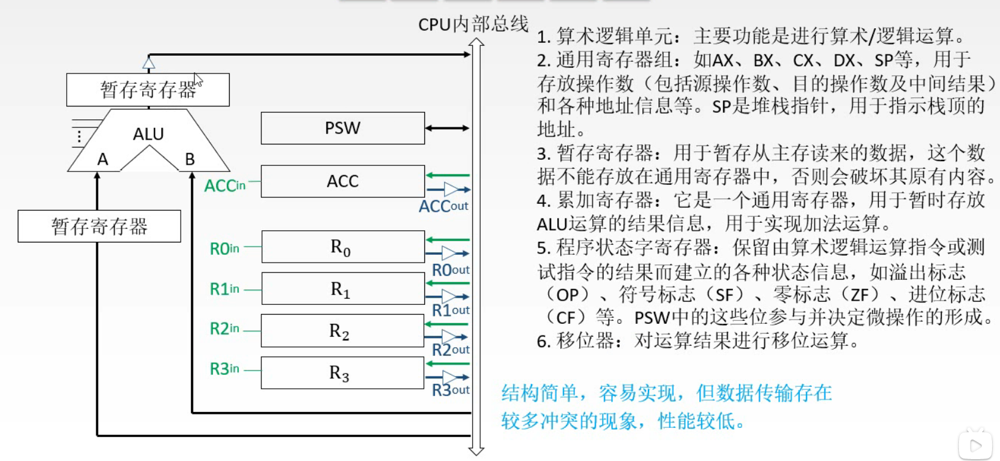

* ALU也需要和CPU内部总线进行交流，因此我们可以分别连接两条线到A、B端，将其输出结果也通过一条线连接到CPU内部总线
  * 如果直接用两条线将CPU内部总线与ALU的输入端A、B相连，无法判断数据应该流入哪个输入端，因此可以在某条线路中加一个暂存寄存器，暂存寄存器可以用于暂存从主存送来的数据，该数据不能放在通用寄存器中，也就避免了将寄存器中原有的数据覆盖的情况
  * 同样，可以在输出端加一个暂存寄存器，并用一个三态门进行控制。在适当的时刻将其送入CPU内部总线，避免了破坏寄存器中原有数据的情况
  * 暂存寄存器除了可以用来暂存从主存中送来的数据外，还可以有移位、累加等功能即移位寄存器、累加寄存器，但累加寄存器一般会另外与CPU内部总线相连，如图所示。累加寄存器用来暂时存放ALU的运算结果
* 程序状态字寄存器(PSWR)：运算器工作时，在工作过程中产生的一些结论可以记录下来，比如本次运算是否溢出、是正数还是负数、是否为0等状态，如溢出标志(OP)、符号标志(SF)、零标志(ZF)、进位标志(CF)等。这些标志位通常分别由1位触发器保存。该寄存器是一个按位寻址的寄存器，也就是可以直接给出这些二进制位的地址
* 移位器：对运算结果进行移位计算
* 计数器：控制乘除运算的操作步数

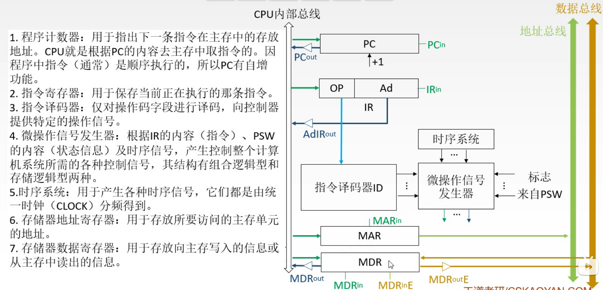

* 程序计数器：需要获取指令后，CPU才能开始相关的工作。因此我们需要一个可以指出下一条指令在主存中的地址的寄存器，即**程序计数器**。CPU根据程序计数器(PC)中的内容取指令。并且要求程序计数器有**自增**的功能
* 指令寄存器：有了指令地址，通过CPU内总线将其送到指令寄存器中进行保存。指令又分为操作码和地址码，这两部分内容是要送到不同地方的。当我们需要获取操作对象时，只有地址码部分需要传回CPU内总线，再由总线传到相应的位置；操作码则是送入指令译码器中
* 指令译码器：接收操作码字段并进行译码，翻译成一系列控制信号，但并不是直接传给对应的部件(因为不同的部件有不同的执行顺序)
* 微操作信号发生器：接收指令译码器产生的初步信息，根据所要完成的任务以及时序系统提供的时间信号，还有目前整个系统所处的状态(来自程序状态字寄存器的标志信息)，整合上述所有信号来产生相应的控制信号。可以看到其输出端有绿线和蓝线，所以前面这些基本的控制信号都是由它发出的，以及一些发送到其他部件的信号
* 时序系统：用于产生各种时序信号
* 存储器地址寄存器：因为指令是可以来自存储器的，所以还需要两个特殊的寄存器即**存储器地址寄存器**和**存储器数据寄存器**。存储器地址寄存器用于存储所要访问的主存单元的地址。该寄存器接收来自程序计数器的指令地址信息，再通过外部的**地址总线**与主存进行交流
* 存储器数据寄存器：用于存放向主存中写入的信息或从主存中读出的信息。主存中提供的指令和数据是会先放到存储器数据寄存器当中的。该寄存器即与CPU内总线相连，又与数据总线相连，因此可以把需要的数据从主存中取出，也可以把内部的一些数据放到数据总线中

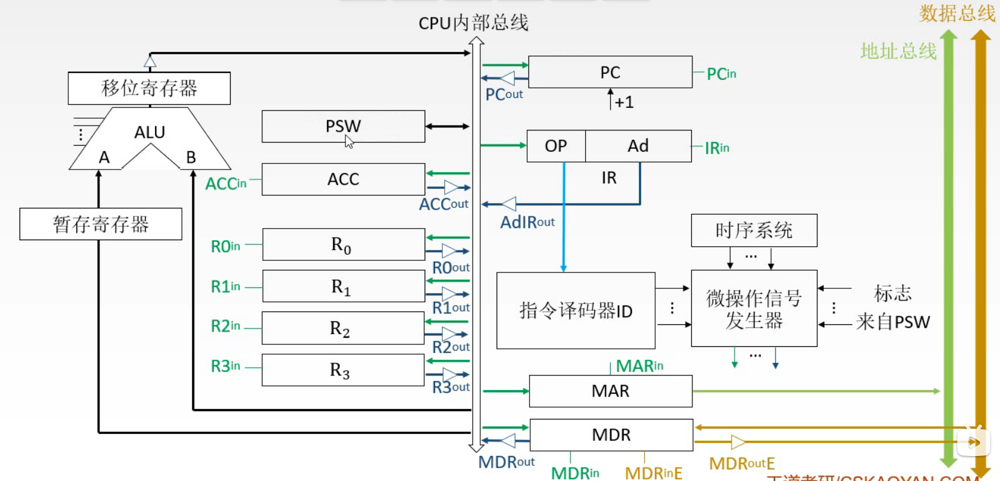

## 5.2 指令的执行过程

## 5.3 数据通路的功能与基本结构

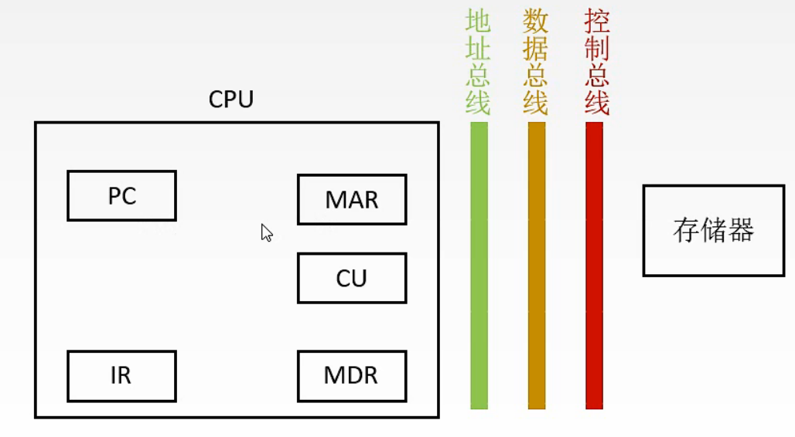

上图是CPU与主存之间进行交流的一个简化模型。CPU内部主要关注的是各部件之间数据是怎样流动的，而在外部主要关注CPU是如何借助地址总线、数据总线和控制总线与主存间进行数据交换

> 一些基本概念
> * 数据通路：数据在各功能部件之间的传送路径
> * 数据通路的基本结构：第1、2可以归为一种即CPU内部有一条或多条公共的通路；而需要进行数据交流的部件之间有专门的连线则为专用数据通路方式
>   * CPU内部单总线方式
>   * CPU内部多总线方式
>   * 专用数据通路方式
> * 类似于 M(MAR) 或 MEM(MAR) 这样的表示方式可以理解为函数，其含义是 主存地址为 MAR 对应的存储单元中的内容

### 5.3.1 CPU内部单总线

以CPU内部单总线方式为例进行分析。下图为CPU内部的连接结构

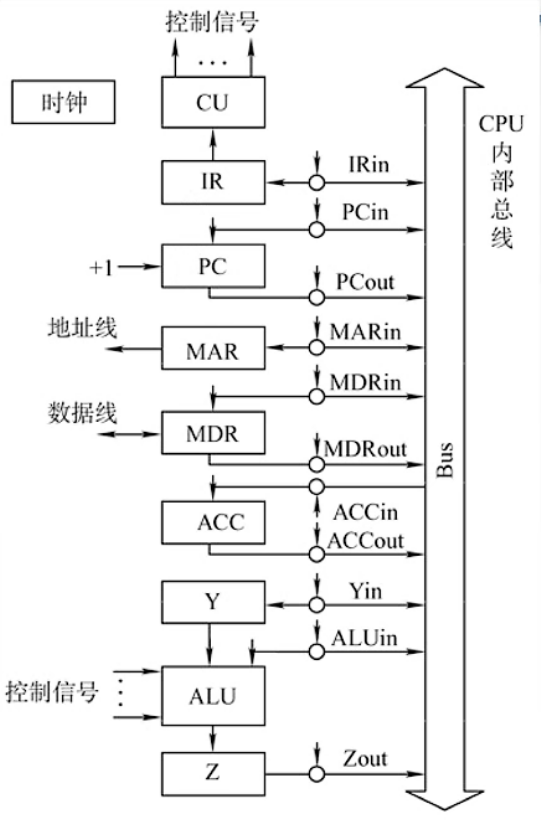

可以观察到，在CPU内部，各部件都直接与公共的通路CPU内部总线(英文为Bus)相连，而各部件之间没有专门的线路进行连接。需要注意的是各部件与CPU内部总线相连的线路中，都有相应的控制信号来控制线路的通断(下标为 out 表示能否向外传输信息，下标为 in 表示能否向部件内写入信息)

存储器地址寄存器(MAR)借助地址线与主存进行地址传送

存储器数据寄存器(MDR)借助数据线与主存进行数据交换

图中的Y和Z相当于暂存器

内部总线与系统总线的区别：

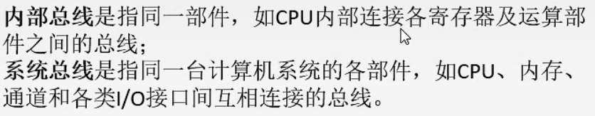

如上图，内部总线顾名思义，是指**某一个部件内部**连接各器件如寄存器、运算部件之间的总线；而系统总线相对于内部总线则是宏观意义上，即整台计算机系统中各部件(CPU、内存、I/O接口等)进行信息交换而相互连接的总线

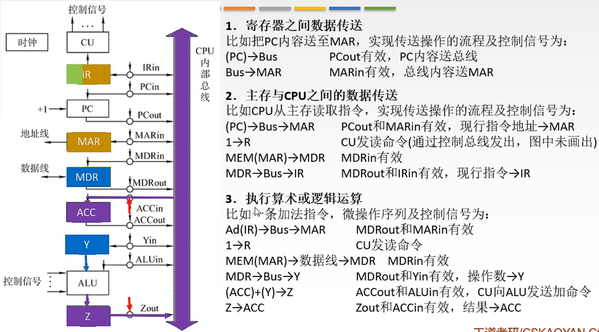

如图所示，数据通路的建立可分为三类：寄存器之间的数据传送、主存与CPU之间的数据传送以及执行算术或逻辑运算三类

1. 寄存器之间的数据传送
   例如将PC中的内容传送至MAR中，实现这一操作的流程以及需要用到的控制信号为：

   (PC) → Bus   ；控制信号 $PC_{out}$ 有效，将程序计数器PC中的地址送到CPU内部总线上
   Bus → MAR    ；控制信号 $MAR_{in}$ 有效，将总线上的内容写入存储器地址寄存器MAR中

2. 主存与CPU之间的数据传送
   例如CPU从主存中读取指令，相应的操作流程与控制信号为：
  (PC) → Bus → MAR ；$PC_{out}$ 和 $MAR_{in}$ 有效，将指令的地址先送入MAR中
  1 → R ；CU发出读命令即令 R = 1
  MEM(MAR) → MDR ；$MDR_{inE}$ 有效，将地址指向的指令送到存储器数据寄存器中 (该控制信号图中为标明，随便命名一个与图中的区分)
  MDR → IR ；$MDR_{out}$ 和 $IR_{in}$ 有效，将指令送到指令寄存器IR中

3. 执行算术或逻辑运算
   比如一条加法指令，微操作序列以及控制信号为：

   假设我们前面从主存中读取的指令就是一条加法指令，取指令的过程如前面两点所示，所以现在假设指令就在指令寄存器IR中

   Ad(IR) → Bus → MAR ；$MDR_{out}$ 和 $MAR_{in}$ 有效，将指令中的地址码字段提取出来并送到存储器地址寄存器中，因为指令同时存储在IR和MDR中，所以控制信号也可以是 $MDR_{out}$

   1 → R；CU发出读命令即令 R = 1

   MEM(MAR) → MDR ；$MDR_{inE}$ 有效，将地址指向的指令送到存储器数据寄存器中

   MDR → Bus → Y ；$MDR_{out}$ 和 $Y_{in}$ 有效，将数据送入暂存器Y中

   (ACC) + (Y) → Z ；$ACC_{out}$ 和 $ALU_{in}$ 有效，将累加寄存器ACC中的数送入ALU中后，进行加法运算

   (Z) → ACC ；$Z_{out}$ 和 $ACC_{in}$ 有效，将运算结果送回累加寄存器ACC中

例题：

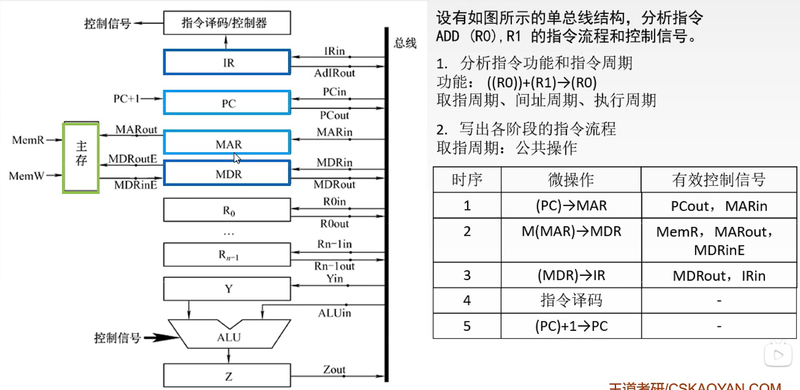

这类分析指令流程和控制信号的题，做题规律是：

* 先分析指令功能和指令周期
  * 在本题中，该指令的功能是 $((R_0))$ + $(R_1)$ → $(R_0)$ 也就是将寄存器R1中的数和寄存器R0中的地址所指向的数相加，再存回寄存器R0中地址所指向的存储单元
* 根据提供的指令来分析指令周期
  * 在本题中，源操作数的寻址方式是寄存器寻址，而目的操作数的寻址方式是寄存器间接寻址，因此除了取指周期和执行周期外，还多了一个间址周期，中断周期在这类题中一般不会出现
* 然后就是写出各阶段的指令流程：这部分可以写明操作步骤是第几步、对应的微操作是什么以及列出需要用到的控制信号
  * 时序也就是第几步
  * 微操作
  * 有效的控制信号

例题解答：

- 取指周期
  
  | 时序 | 微操作        | 有效控制信号                  |
  | ---- | ------------- | ----------------------------- |
  | 1    | (PC) → MAR    | $PC_{out}$ 和 $MAR_{in}$      |
  | 2    | M(MAR) → MDR  | $MAR_{out}$ 、 MemR 和 MDRinE |
  | 3    | (MDR) → IR    | MDRout 和 IRin                |
  | 4    | 指令译码      | -                             |
  | 5    | (PC) + 1 → PC | -                             |

  实际上第5步可以整合到第2步中，因为在第2步就已经可以更新程序计数器中的指令地址 

  如图所示.

  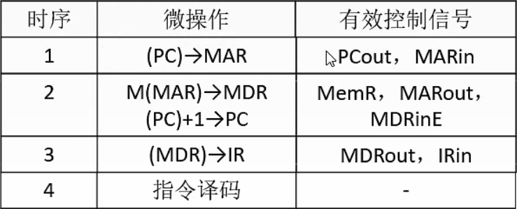

- 间址周期：完成取数操作，被加数在主存中，加数在寄存器R1中
  
  | 时序 | 微操作       | 有效控制信号                  |
  | ---- | ------------ | ----------------------------- |
  | 1    | (R0) → MAR   | $R0_{out}$ 和 $MAR_{in}$      |
  | 2    | M(MAR) → MDR | $MAR_{out}$ 、 MemR 和 MDRinE |
  | 3    | (MDR) → Y    | MDRout 和 Yin                 |

- 执行周期
  
  | 时序 | 微操作         | 有效控制信号                           |
  | ---- | -------------- | -------------------------------------- |
  | 1    | (Y) + (R1) → Z | R1out 和 ALUin，CU向ALU发出ADD控制信号 |
  | 2    | (Z) → MDR      | Zout 和 MDRin                             |
  | 3    | (MDR) → M(MAR) | MDRoutE 和 MemW 以及 MARout            |

### 5.3.2 专用数据通路

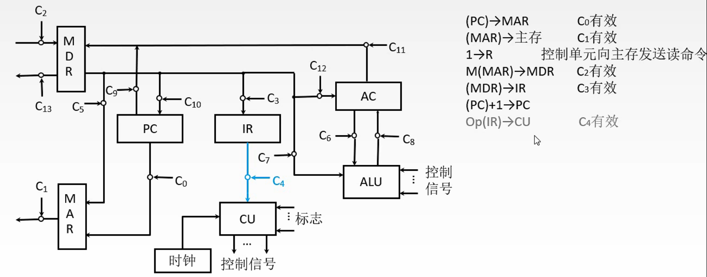

专用数据通路中需要交流的各部件之间有专门的线路连接，其指令流程与CPU内总线基本一样

需要注意的是图中灰色的指令，因为一般我们默认指令寄存器中的指令会自动进行译码，而在图中由于标出了从IR到CU的线路，所以可以写明将IR中指令的操作码送入CU中进行相关译码

## 5.4 控制器的功能和工作原理

## 5.5 指令的流水线

