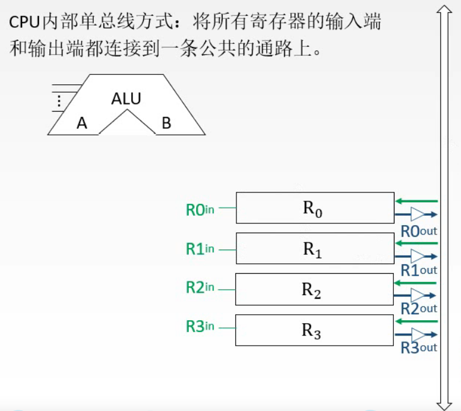
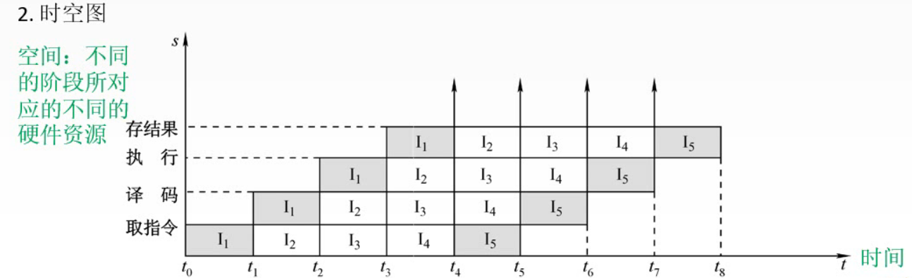
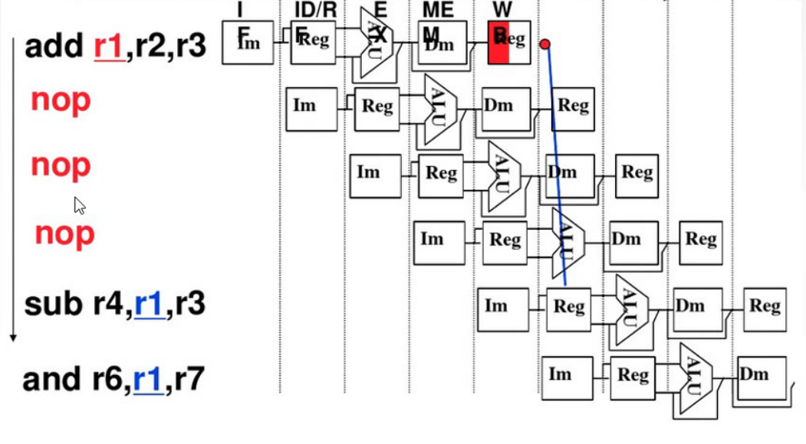

# 第五章 中央处理器

## 5.1 CPU的功能和结构

> * CPU需要具有哪些功能？
> * 对应这些功能需要具有怎样的结构？

### 5.1.1 CPU的功能

1. CPU具有的功能
   * 指令控制：完成取指令、分析指令和执行指令的操作，即对程序的顺序控制
   * 操作控制：一条指令功能的完成往往需要一系列操作信号的组合来实现。CPU负责产生并管理这些操作信号，并将这些操作信号发送到对应的部件，从而控制部件完成指令要求的动作、响应等
   * 时间控制：就具体的一条指令而言，其内部一系列的操作信号需要加以时间控制；对宏观上的所有指令系统而言，时间控制需要安排每条指令执行的先后顺序
   * 数据加工：对数据进行算术运算和逻辑运算。完成数据的加工处理，是CPU的根本任务
   * 中断处理：对计算机运行过程中出现的**异常情况**或**特殊请求**进行处理

2. 功能分摊

    运算器和控制器是CPU的两大核心部件。上述列出的五个功能自然也就要分摊到这两个部件上

    运算器：顾名思义，需要对数据进行加工

    控制器：协调并控制计算机各部件执行程序的指令序列，协调和指挥整个计算机系统的运行。基本功能包括取指令、分析指令和执行指令

    * 取指令：**自动**形成指令地址；**自动**发出取指令的命令
    * 分析指令：指令由操作码和地址码两部分组成。因此分析指令就是对操作码译码(分析当前指令要完成的操作)、产生操作数的有效地址(获取操作对象)
    * 执行指令：根据上一步得到的「操作命令」和「操作数地址」，形成操作信号的控制序列，并控制相关部件(存储器、运算器和I/O设备等)完成相应的操作
    * 中断处理：管理总线和输入输出；处理异常情况和特殊请求

### 5.1.2 CPU的结构

根据运算器和控制器的功能分析其应具有怎样的结构

#### 运算器的结构

算术逻辑单元：运算器的核心是算术逻辑运算单元(ALU),其主要功能就是进行算术或逻辑运算。其特点是它是一个组合逻辑电路，一旦输入信号确定后，就会产生相应的输出信号

通用寄存器组：运算器还需要提供一些通用的寄存器，以存储操作数、运算过程中产生的中间结果以及各种地址信息

ALU与通用寄存器之间的连接：ALU与寄存器之间可以传输数据

专用数据通路方式：根据指令执行过程中数据和地址的流动方向来安排连接线路。也就是如果 $R_0$ 需要给ALU传输数据，则两者之间就要有连线

可以看到，如果直接用导线连接，相当于通用寄存器组同时且一直向ALU传输数据，这样ALU就无法判断当前需要处理的是哪一个数据。

一个解决办法是使用多路选择器，如图所示，其电路符号是「MUX」，其通过控制信号 $C_1$ 和 $C_2$ 来选择当前哪个寄存器将数据传送给ALU。图中的例子是 $C_1$ 为00，则 $R_0$ 寄存器中的数据送入A，$C_2$ 为01，则寄存器 $R_1$ 中的数据送给B

另外一个解决方法是采用三态门，如图所示，图中的一个小三角就表示一个三态门。每个三态门都有一个类似于 $R0_{out}$ 的信号控制

专用数据通路方式的优缺点：由于每个寄存器都有专门的线路连接到ALU，因此性能较高，基本不存在数据冲突的现象；但也正是因为有专门的线路，因此结构复杂、硬件量大、不容易实现

CPU内部单总线方式：将所有寄存器的输入端和输出端都连接到一条公共的总线上

* 当 $R0_{in}$ 有效时，其他部件可以通过绿色的线将数据写入寄存器中
* 输出端采用了三态门的设计，当 $R0_{out}$ 有效时，寄存器可以通过蓝色的线将数据放入总线中

CPU内部单总线方式优缺点：结构简单(每个寄存器与总线之间只需要有一组相互连接的线路即可)，容易实现；但数据传输容易出现较多数据冲突的现象，性能较低 (例如将寄存器R0中的数据送给R1时，另外两个寄存器R2和R3就不能工作，必须等该过程结束后才可以)

* ALU也需要和CPU内部总线进行交流，因此我们可以分别连接两条线到A、B端，将其输出结果也通过一条线连接到CPU内部总线
  * 如果直接用两条线将CPU内部总线与ALU的输入端A、B相连，无法判断数据应该流入哪个输入端，因此可以在某条线路中加一个暂存寄存器，暂存寄存器可以用于暂存从主存送来的数据，该数据不能放在通用寄存器中，也就避免了将寄存器中原有的数据覆盖的情况
  * 同样，可以在输出端加一个暂存寄存器，并用一个三态门进行控制。在适当的时刻将其送入CPU内部总线，避免了破坏寄存器中原有数据的情况
  * 暂存寄存器除了可以用来暂存从主存中送来的数据外，还可以有移位、累加等功能即移位寄存器、累加寄存器，但累加寄存器一般会另外与CPU内部总线相连，如图所示。累加寄存器用来暂时存放ALU的运算结果
* 程序状态字寄存器(PSWR)：运算器工作时，在工作过程中产生的一些结论可以记录下来，比如本次运算是否溢出、是正数还是负数、是否为0等状态，如溢出标志(OP)、符号标志(SF)、零标志(ZF)、进位标志(CF)等。这些标志位通常分别由1位触发器保存。该寄存器是一个按位寻址的寄存器，也就是可以直接给出这些二进制位的地址
* 移位器：对运算结果进行移位计算
* 计数器：控制乘除运算的操作步数

* 程序计数器：需要获取指令后，CPU才能开始相关的工作。因此我们需要一个可以指出下一条指令在主存中的地址的寄存器，即**程序计数器**。CPU根据程序计数器(PC)中的内容取指令。并且要求程序计数器有**自增**的功能
* 指令寄存器：有了指令地址，通过CPU内总线将其送到指令寄存器中进行保存。指令又分为操作码和地址码，这两部分内容是要送到不同地方的。当我们需要获取操作对象时，只有地址码部分需要传回CPU内总线，再由总线传到相应的位置；操作码则是送入指令译码器中
* 指令译码器：接收操作码字段并进行译码，翻译成一系列控制信号，但并不是直接传给对应的部件(因为不同的部件有不同的执行顺序)
* 微操作信号发生器：接收指令译码器产生的初步信息，根据所要完成的任务以及时序系统提供的时间信号，还有目前整个系统所处的状态(来自程序状态字寄存器的标志信息)，整合上述所有信号来产生相应的控制信号。可以看到其输出端有绿线和蓝线，所以前面这些基本的控制信号都是由它发出的，以及一些发送到其他部件的信号
* 时序系统：用于产生各种时序信号
* 存储器地址寄存器：因为指令是可以来自存储器的，所以还需要两个特殊的寄存器即**存储器地址寄存器**和**存储器数据寄存器**。存储器地址寄存器用于存储所要访问的主存单元的地址。该寄存器接收来自程序计数器的指令地址信息，再通过外部的**地址总线**与主存进行交流
* 存储器数据寄存器：用于存放向主存中写入的信息或从主存中读出的信息。主存中提供的指令和数据是会先放到存储器数据寄存器当中的。该寄存器即与CPU内总线相连，又与数据总线相连，因此可以把需要的数据从主存中取出，也可以把内部的一些数据放到数据总线中

## 5.2 指令的执行过程

## 5.3 数据通路的功能与基本结构

上图是CPU与主存之间进行交流的一个简化模型。CPU内部主要关注的是各部件之间数据是怎样流动的，而在外部主要关注CPU是如何借助地址总线、数据总线和控制总线与主存间进行数据交换

> 一些基本概念
> * 数据通路：数据在各功能部件之间的传送路径
> * 数据通路的基本结构：第1、2可以归为一种即CPU内部有一条或多条公共的通路；而需要进行数据交流的部件之间有专门的连线则为专用数据通路方式
>   * CPU内部单总线方式
>   * CPU内部多总线方式
>   * 专用数据通路方式
> * 类似于 M(MAR) 或 MEM(MAR) 这样的表示方式可以理解为函数，其含义是 主存地址为 MAR 对应的存储单元中的内容

### 5.3.1 CPU内部单总线

以CPU内部单总线方式为例进行分析。下图为CPU内部的连接结构

可以观察到，在CPU内部，各部件都直接与公共的通路CPU内部总线(英文为Bus)相连，而各部件之间没有专门的线路进行连接。需要注意的是各部件与CPU内部总线相连的线路中，都有相应的控制信号来控制线路的通断(下标为 out 表示能否向外传输信息，下标为 in 表示能否向部件内写入信息)

存储器地址寄存器(MAR)借助地址线与主存进行地址传送

存储器数据寄存器(MDR)借助数据线与主存进行数据交换

图中的Y和Z相当于暂存器

内部总线与系统总线的区别：

如上图，内部总线顾名思义，是指**某一个部件内部**连接各器件如寄存器、运算部件之间的总线；而系统总线相对于内部总线则是宏观意义上，即整台计算机系统中各部件(CPU、内存、I/O接口等)进行信息交换而相互连接的总线

如图所示，数据通路的建立可分为三类：寄存器之间的数据传送、主存与CPU之间的数据传送以及执行算术或逻辑运算三类

1. 寄存器之间的数据传送
   例如将PC中的内容传送至MAR中，实现这一操作的流程以及需要用到的控制信号为：

   (PC) → Bus   ；控制信号 $PC_{out}$ 有效，将程序计数器PC中的地址送到CPU内部总线上
   Bus → MAR    ；控制信号 $MAR_{in}$ 有效，将总线上的内容写入存储器地址寄存器MAR中

2. 主存与CPU之间的数据传送
   例如CPU从主存中读取指令，相应的操作流程与控制信号为：
  (PC) → Bus → MAR ；$PC_{out}$ 和 $MAR_{in}$ 有效，将指令的地址先送入MAR中
  1 → R ；CU发出读命令即令 R = 1
  MEM(MAR) → MDR ；$MDR_{inE}$ 有效，将地址指向的指令送到存储器数据寄存器中 (该控制信号图中为标明，随便命名一个与图中的区分)
  MDR → IR ；$MDR_{out}$ 和 $IR_{in}$ 有效，将指令送到指令寄存器IR中

3. 执行算术或逻辑运算
   比如一条加法指令，微操作序列以及控制信号为：

   假设我们前面从主存中读取的指令就是一条加法指令，取指令的过程如前面两点所示，所以现在假设指令就在指令寄存器IR中

   Ad(IR) → Bus → MAR ；$MDR_{out}$ 和 $MAR_{in}$ 有效，将指令中的地址码字段提取出来并送到存储器地址寄存器中，因为指令同时存储在IR和MDR中，所以控制信号也可以是 $MDR_{out}$

   1 → R；CU发出读命令即令 R = 1

   MEM(MAR) → MDR ；$MDR_{inE}$ 有效，将地址指向的指令送到存储器数据寄存器中

   MDR → Bus → Y ；$MDR_{out}$ 和 $Y_{in}$ 有效，将数据送入暂存器Y中

   (ACC) + (Y) → Z ；$ACC_{out}$ 和 $ALU_{in}$ 有效，将累加寄存器ACC中的数送入ALU中后，进行加法运算

   (Z) → ACC ；$Z_{out}$ 和 $ACC_{in}$ 有效，将运算结果送回累加寄存器ACC中

例题：

这类分析指令流程和控制信号的题，做题规律是：

* 先分析指令功能和指令周期
  * 在本题中，该指令的功能是 $((R_0))$ + $(R_1)$ → $(R_0)$ 也就是将寄存器R1中的数和寄存器R0中的地址所指向的数相加，再存回寄存器R0中地址所指向的存储单元
* 根据提供的指令来分析指令周期
  * 在本题中，源操作数的寻址方式是寄存器寻址，而目的操作数的寻址方式是寄存器间接寻址，因此除了取指周期和执行周期外，还多了一个间址周期，中断周期在这类题中一般不会出现
* 然后就是写出各阶段的指令流程：这部分可以写明操作步骤是第几步、对应的微操作是什么以及列出需要用到的控制信号
  * 时序也就是第几步
  * 微操作
  * 有效的控制信号

例题解答：

- 取指周期
  
  | 时序 | 微操作        | 有效控制信号                  |
  | ---- | ------------- | ----------------------------- |
  | 1    | (PC) → MAR    | $PC_{out}$ 和 $MAR_{in}$      |
  | 2    | M(MAR) → MDR  | $MAR_{out}$ 、 MemR 和 MDRinE |
  | 3    | (MDR) → IR    | MDRout 和 IRin                |
  | 4    | 指令译码      | -                             |
  | 5    | (PC) + 1 → PC | -                             |

  实际上第5步可以整合到第2步中，因为在第2步就已经可以更新程序计数器中的指令地址 

  如图所示.

  

- 间址周期：完成取数操作，被加数在主存中，加数在寄存器R1中
  
  | 时序 | 微操作       | 有效控制信号                  |
  | ---- | ------------ | ----------------------------- |
  | 1    | (R0) → MAR   | $R0_{out}$ 和 $MAR_{in}$      |
  | 2    | M(MAR) → MDR | $MAR_{out}$ 、 MemR 和 MDRinE |
  | 3    | (MDR) → Y    | MDRout 和 Yin                 |

- 执行周期
  
  | 时序 | 微操作         | 有效控制信号                           |
  | ---- | -------------- | -------------------------------------- |
  | 1    | (Y) + (R1) → Z | R1out 和 ALUin，CU向ALU发出ADD控制信号 |
  | 2    | (Z) → MDR      | Zout 和 MDRin                             |
  | 3    | (MDR) → M(MAR) | MDRoutE 和 MemW 以及 MARout            |

### 5.3.2 专用数据通路

专用数据通路中需要交流的各部件之间有专门的线路连接，其指令流程与CPU内总线基本一样

需要注意的是图中灰色的指令，因为一般我们默认指令寄存器中的指令会自动进行译码，而在图中由于标出了从IR到CU的线路，所以可以写明将IR中指令的操作码送入CU中进行相关译码

## 5.4 控制器的功能和工作原理

### 5.4.1 硬布线

### 5.4.2 微程序

#### 微程序控制原理

事先把「微操作控制信号」存储在一个专门的存储器(控制存储器)中，将每一个机器指令编写成「微程序」，这些微程序可以存储在控制存储器中，当需要的时候，再一条一条读出微程序中的微指令，从而产生各种操作控制信号

1. 微程序的基本思想

区分两个概念，微操作和微命令：微命令相当于控制信号，微操作是接收信号后进行的相关操作

* 微命令：控制部件通过控制线向执行部件发送各种控制信号，通常这些控制信号就称为 **微命令**
* 微操作：执行部件接收到相应的控制信号后，所进行的操作就叫做 **微操作**

相容性和相斥性：

* 相容性微操作：可以同时或在同一个CPU周期内可以并行执行的微操作
* 相斥性微操作：不能同时或不能在同一个CPU周期内并行执行的微操作

上图为相容性微命令和互斥性微命令

2. 微指令和微程序

上图的微操作命令为微命令

微指令：在一个CPU周期中，一组实现一定功能的微命令的组合，构成一条 **微指令**

一条机器指令可以由一系列微命令组成，根据是否相容可以再将这些微命令组织成若干微指令，这些微指令就构成了一个微程序。一条机器指令对应一个微程序

上图展示了微指令的基本格式。可以看到主要分为 **操作控制** 和 **顺序控制** 两部分(也可以称为 微操作码和微地址码)

* 操作控制部分用来发出相应的控制信号，以管理和指挥全机的工作
* 顺序控制部分用来决定产生下一个微指令的地址

可以看到，在例子中，操作控制字段有17位，顺序控制字段有6位

操作控制字段中的每一位都对应一个微命令(控制信号)。当某位为1时，表示发出该微命令，而为0时表示不发出微命令

由于一条机器指令的功能是由多条微指令组成的序列来实现的，而这个微指令序列就称为 **微程序** 。因此，当执行一条微指令时，必须指明下一条微指令的地址，以便当前微指令执行完毕后，取出下一条微指令

顺序控制字段由6位组成，高二位表示是否需要进行判别测试，低4位给出了直接微地址

* 当第18、19位均为0时：表示不进行判别测试，根据低四位给出的地址取出微指令即可
* 当第18或19位为1时：表示进行 $P_1$ 或 $P_2$ 进行判别测试，根据判别测试的结果进行地址的修改(可以理解为汇编中根据状态位是否进行相应的跳转)

3. 微程序控制器的基本结构

上图为微程序控制器的基本框架

各部分的功能都已在图中标明。CMDR为微指令寄存器，顺序逻辑可以理解为地址转移逻辑，可以根据当前状态指明或修改下一条微指令的地址

其主要流程为：机器指令的操作码字段传入微地址形成部件后，产生一个初始的微地址，根据当前的顺序逻辑进行，CMAR微地址寄存器接收到微地址后，将其传入地址译码器中，产生相应的控制信号访问控制存储器中相应的存储单元，控制存储器将对应的微指令送入微指令寄存器CMDR中，产生送至CPU和系统总线的控制信号，并根据下地址和当前状态继续后面的过程

取指周期的微程序一般都会设计成公共的，因为指令的取值周期执行的各种操作都是一致的

4. 微指令的格式

微指令主要分为水平型微指令和垂直型微指令。混合型微指令了解就好

上图说明了水平型微指令和垂直型微指令的定义，并分析了各自的优缺点

5. 微指令的编码

微指令的编码方式，是指如何对微指令的控制字段进行编码，来表示相应的控制信号。编码的目标是在保证速度的情况下，尽量缩短微指令字长(一般这两个目标是相互矛盾的)

通常有以下三种方法：

* 直接编码方式
  
  

  * 特点：操作控制字段中的每一位就直接表示了一个微命令
  * 优点：简单、直观、其输出直接用于控制
  * 缺点：微指令字长较长，使控制存储器容量较大

* 字段直接编码方式
  
  

  * 特点：将操作控制字段分成若干「段」，每段经过译码后才能发出相应的控制信号
  * 分段原则：
    * 互斥性的微命令需要分在同一「段」内，以保证它们不会同时执行；相容性微命令分在不同的「段」中，这样它们才可以同时进行
    * 每个「段」中的信息位不宜过多，否则会增加译码的复杂度与时间
    * 一般每个「段」需要预留一个状态，来表示本「段」不发出任何微命令，通常用 000 表示不进行操作
  * 优点：缩短微指令字长
  * 缺点：相较于直接编码方式来说其执行速度稍慢，因为增加了译码电路
  * 图中例子说明：用 001 表示 (PC) → MAR 用 111 表示 1 → R 用 010 表示 (PC) + 1 → PC 在之前的设计中，(PC) → MAR和1 → R是可以同时执行的，所它们放在不同的「段」中，经过译码后发出相应的控制信号；而(PC) + 1 → PC和(PC) → MAR不能同时进行，所以它们放在同一「段」中并用不同的编码来表示

* 字段间接编码方式

  

  多个字段经过译码之后才能产生相应的控制信号

  

6. 微指令的地址形成方式

上图展示了几种不同的微地址形成方式。其中，**断定方式**需要重点掌握

#### 补充概念

微指令周期：读出微指令的时间加上执行该条微指令的时间，就是**微指令周期**

#### 微程序控制单元的设计

上图为微程序控制单元的设计步骤

上图为取指周期的节拍安排

($T_1$ 和 $T_3$)取出本条微指令的下地址后送入CMAR中以读取下一条微指令

($T_5$)由机器指令的操作码部分来决定如何转入下一个周期

### 硬布线和微程序的比较

## 5.5 指令的流水线

### 5.5.1 指令流水线的概念及性能指标

#### 指令流水的定义

一条指令的执行过程可以分成多个阶段，如图所示分成了取指、分析和执行三个阶段，分成这三个阶段是因为**每个阶段用到的硬件不一样**

这样，当一系列指令在计算机中运行时，就可以有不同的安排方式

上图为 **顺序执行方式**。顺序执行方式的特点是只有一条指令执行完后(即经历完取指、分析、执行三个阶段)，才可以继续执行下一条指令

* 优点：控制简单、硬件代价小
* 缺点：执行指令的速度较慢，各功能部件的利用率低，因为在任意时刻，处理机中只有一条指令正在执行

总耗时计算：1条指令有三个阶段，每个阶段的时间都相等且都为 $t$ ，则1条指令的总运行时间为 $3t$ , 总共有 $n$ 条指令

因此总耗时为： $n \times  3t = 3nt$

而我们知道，取指、分析、执行这三个阶段所用到的功能部件是不同的，如果按照顺序执行的方式，在某一阶段进行时，另外两个阶段所使用到的功能部件会处于空闲状态，因此如果充分利用这些空闲部件，可以提高执行效率

如图所示为**一次重叠执行方式**

* 特点：当前指令处于执行阶段时，可以同时运行下一条指令。也就是当前指令处于执行阶段时，下一条指令同时开始取指阶段
* 优点：程序的执行时间缩短，功能部件的利用率提高
* 缺点：硬件开销较大，控制过程相较于顺序执行更复杂

总耗时计算：观察图中规律，只有第一条指令的运行时间为 $3t$ , 后面每隔 $2t$ 时间就有一条指令完成

因此总耗时为： $3t + (n - 1) \times 2t = (2n + 1)t$

如图所示为**二次重叠执行方式**

* 特点：当上一条指令取指结束后，下一条指令紧接着进行取指
* 优点：指令执行时间进一步缩短，功能部件利用率进一步提高

可以看到，这是一种理想的指令执行方式，因为几乎在每个时刻，处理机当中同时有3条指令正在运行，也就是各阶段的功能部件都在被利用

总耗时计算：只有第1条指令运行耗时为 $3t$ ，后面每个 $t$ 时间就有1条指令完成

因此，总耗时： $3t + (n - 1) \times t = (n + 2)t$

#### 流水线的表示方法

上图是流水线的表示方法之一：**指令执行过程图**

可以看到，横轴表示时间 $t$ ，纵轴表示指令序列，每一个指令占据一个特定的高度，并且依次往上叠加

上图是另外一种指令流水线的表示方法：**时空图**

横轴仍然表示时间，纵轴则表示空间，这里的空间是指**硬件资源**，也就是**不同阶段所对应的不同的硬件资源**，有几个阶段，纵轴方向上就有几个格子，比如图中是四个阶段，取指令阶段就对应第一个高度，译码阶段对应第二个，依次类推

两种不同表示方法的区别：指令执行过程图中随着指令的叠加，会越来越高；而时空图由于纵轴为硬件资源，所以在确定了指令有几个阶段后，纵轴的高度也就固定了

如何理解时空图？指令进入不同阶段是呈**阶梯状**的

例如：指令 $I_1$ : 

$t_0$ ~ $t_1$ 阶段是取指令阶段，所以占据第1个高度的格子

$t_1$ ~ $t_2$ 阶段是译码阶段，所以占据第2个高度的格子

$t_2$ ~ $t_3$ 阶段是执行阶段，所以占据第3个高度的格子

后面依次类推

同时，时空图能够直观地观察到任何时刻不同的硬件资源的使用情况

时空图主要用来分析流水线的性能

#### 流水线的性能指标

下面对三个性能指标的分析都是在理想情况下：各阶段花费的时间相同；每个阶段结束后能立即进入下一个阶段

##### 吞吐率

定义：单位时间内流水线完成任务的数量

图中，将1条指令的运行分为 $k$ 个阶段，每个阶段的耗时均为 $\Delta t$ , 因此根据前面的总时长计算思路，只有第1条指令需要耗费 $k\Delta t$ ，之后每隔 $\Delta t$ 时间就有一个指令完成，所以剩余耗时为 $(n - 1) \Delta t$

因此得出总耗时 $T_k = (k + n - 1) \Delta t$

**TP 表示吞吐率**

装入时间：第1条指令开始执行到该指令完成的时间间隔

排空时间：最后1条指令开始运行到该指令完成的时间间隔

可以看到，除了这两个时间段，也就是中间这部分，流水线处于一个理想的工作状态：此时不同阶段的各功能部件都在被利用

##### 加速比

定义：不使用流水线所用的时间(即顺序执行的时间)与使用流水线所用的时间之比

根据前面的思路已经算出了顺序执行方式的时间与采用流水线时的执行时间

**加速比用 $S$ 表示**。要注意的是这里计算的加速比是在理想情况下的顺序执行的时间和流水线执行的时间

##### 效率

**效率用 $E$ 表示**

红色框部分就是 n个任务所占时空区的有效面积，其相当于 n条指令顺序执行的时间

蓝色框部分就是 时空区的总面积

> 红色框的面积如何理解：
>
> 有效面积实际上就是由每条指令的k个方格组成，1条指令占有k个方格，单条指令对应的面积实际上就是其单独运行时的执行时间，所以可以把有效面积的求解对应上指令顺序执行时所占用的有效面积
>
> 蓝色框部分为总面积，就是横坐标上的长度与纵坐标上的长度相乘，横坐标为流水线执行总耗时 $T_k$ ，纵坐标为 k 个阶段

### 5.5.2 影响流水线的因素及分类

#### 影响流水线的因素

##### 结构相关(资源冲突)

定义：多条指令在同一时刻争用同一资源而形成的冲突称为**结构相关**

如图所示，指令Load和指令3Instr3在同一时刻都需要用到存储器Mem，因此产生了冲突。此时指令Load需要将结果存入存储器，而指令3Instr3需要从存储器中取出指令

需要了解**定义**和相应的**解决办法**

解决办法主要从两方面理解：时间维度和空间维度即**时间上错开**和**空间上错开**。要么是将多个指令需要用到同一资源的阶段错开，要么就是将所争用的同一资源错开，使用不同的资源，如图中取指是用指令存储器，存储结果时使用数据存储器

##### 数据相关(数据冲突)

定义：在一个程序中，某一指令的运行必须等待其前一条指令运行结束后才可以开始运行的情况，这两条指令即为**数据相关**

如图所示，根据指令序列的顺序可以看出，后4条指令必须要等第1条指令运行完毕后(至少运算结果存回寄存器r1后)才可以进行。如果从各指令执行阶段来看，可以发现，指令2、3、4在第2阶段需要寄存器r1的数据，而此时第1条指令还没有将运算结果存入寄存器r1，因此这3条指令还不能运行

解决方法之一就是将后续指令根据情况延迟它们的时钟周期，分为**硬件阻塞**和**软件插入「NOP」**两种办法

在寄存器r1的数据还未产生前，在后续指令的相关阶段插入一些暂停阶段，直到运算结果存入寄存器r1

软件插入则是通过在指令序列中插入一些空指令，直到寄存器r1中的数据可以被后续相关指令所使用
