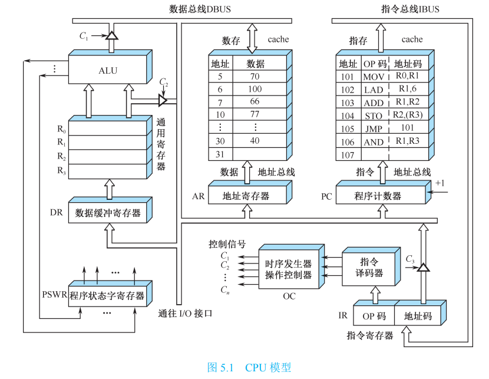
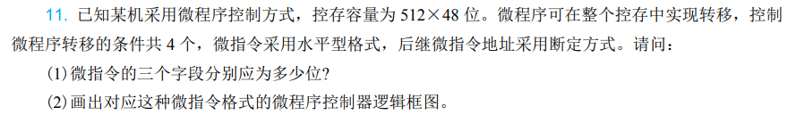
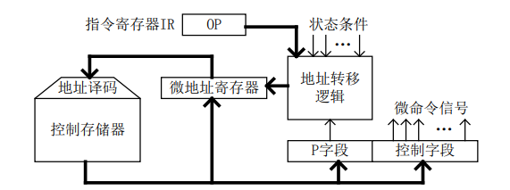
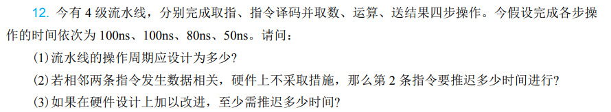
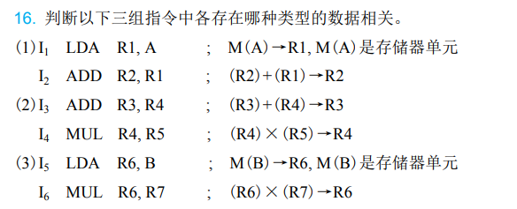
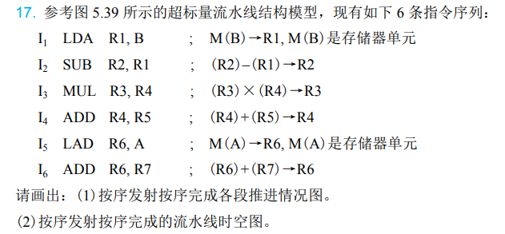
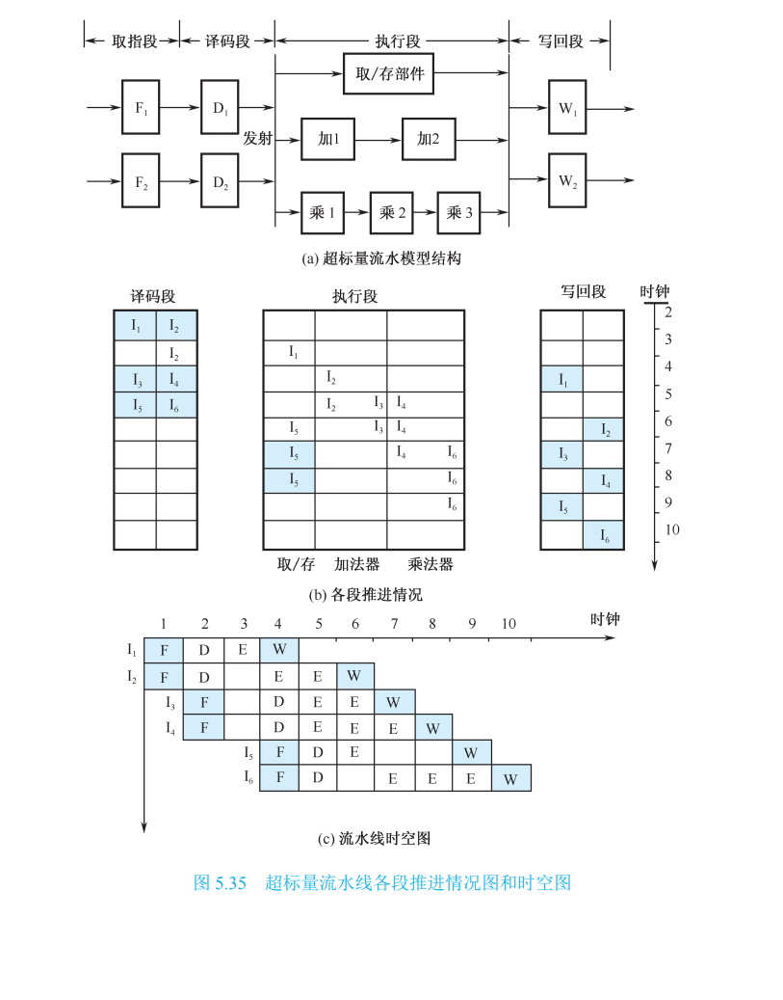

# 第五章作业

1.如题

参见图 5.1 的数据通路，画出取数指令「LAD (R3), R0」的指令周期流程图，其含义是将(R3)为地址数存单元的内容取至寄存器 R0 中，标出各微操作控制信号序列。下图为图5.1

2.如图

(1) 

设判别测试字段中每一位对应一个判别标志，由题可知，存在4个转移条件，因此判别测试字段有4位

由题可知，控存容量 $512 = 2 ^ 9$ , 由于需要满足微程序在整个控存中转移，所以下地址字段有9位

剩余的 $48 - 4 - 9 = 35$ 位组成操作控制字段

(2) 该微程序控制器的逻辑框图如下：

其主要流程为：指令寄存器中所存储的指令的操作码字段传入地址转移逻辑，地址转移逻辑以操作码字段、各种状态条件以及判别测试字段所给的判别标志作为输入，其输出修改微地址寄存器的适当位数，或生成新地址，或实现分支转移。微地址寄存器中的地址经过地址译码后，产生相应的控制信号访问控制存储器中相应的存储单元，控制存储器将对应的微指令送入微指令寄存器CMDR中，CMDR由判别测试字段和控制字段组成。

3.如图

流水线的操作周期应按各步操作的最大时间来考虑，即流水线的时钟周期为：$\tau = \max \left\{ \tau_i \right\} = 100 ns $ 

遇到数据相关时，就暂定第2条指令的执行，直到前面的指令结果已经产生，因此，第2条指令要推迟2个时钟周期

如果在硬件设计上加以改进如采用专用通路技术，就可以使流水线不需要停顿

4.如图

(1) 写后读 RAW. $I_1$指令的应先将存储单元中的内容写入R1，然后指令 $I_2$ 再读出R1中的内容。由于$I_2$指令进入流水线，变成$I_1$指令在写入R1之前指令$I_2$就已经读出了R1的内容，发生写后读相关

(2) 读后写 WAR

(3) 写后写 WAW

> * 第一条指令是读操作，第二条指令是写操作，那么只可能发生读后写（WAR）相关
> * 第一条指令是写操作，第二条指令是读操作，那么只可能发生写后读（RAW）相关
> * 第一条指令是写操作，第二条指令也是写操作，那么只可能发生写后写（WAW）相关

5.如图

