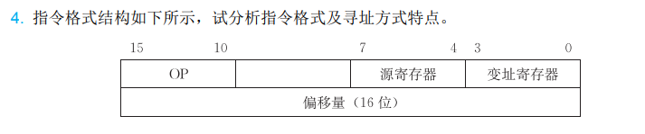
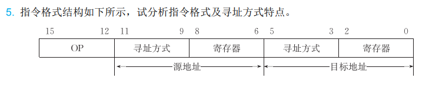
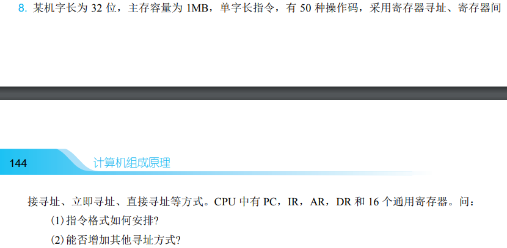
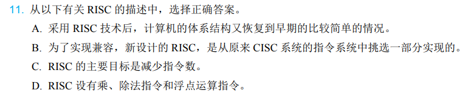
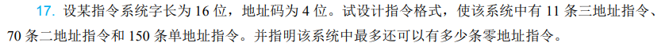

# 第四章作业

1.如图



* 二地址指令。因为有两个地址码字段(操作数地址)
* 操作码字段可以指定 $2^6 = 64$ 种操作。因为操作码字段有6位
* RS型指令。因为一个操作数在源寄存器($16 = 2^4$)中，另一个操作数在存储器中(由变址寄存器和偏移量决定)
* 寻址方式为变址寻址。即有效地址为变址寄存器($16 = 2^4$)中的内容加上偏移量

2.如图



* 二地址指令。因为有两个操作数地址
* 操作码字段可以指定 $2^4 = 16$ 种操作。因为操作码字段有4位
* RR型指令格式。两个操作数均在寄存器中
* 有 $2^3 = 8$ 种寻址方式

> 第1、2题中这种询问「指令格式及寻址方式特点」的题，规律如下.
> 1. 操作码字段
> * 根据**操作码字段有几位**，说明操作码字段可以有多少种不同的操作。如操作码字段有n位，则操作码字段可以指定 $2^n$ 种操作
> 2. 地址码字段
> * 根据地址码字段给出了**几个操作数地址**来判断是几地址指令：三地址、二地址、一地址、零地址指令
> * 根据操作数存放的位置判断是什么类型：寄存器-存储器(RS)型、寄存器寄存器(RR)型、存储器存储器(SS)型指令
> 3. **指令字长度与机器字长的关系**：单字长、双字长、半字长指令等。这种需要看题目具体说明，有时题目会给出「某16位机」「某机字长32位」字样，如果没给则不用说明指令字长度与机器字长的关系

3.如图

.png)

① 直接寻址。因为形式地址等于有效地址即 $D = E$ 
② 相对寻址。因为有效地址等于程序计数器PC中的内容加上形式地址D
③ 变址寻址。因为有效地址等于变址寄存器中的内容加上形式地址D
④ 基址寻址。因为有效地址等于基址寄存器中的内容加上形式地址D
⑤ 间接寻址。因为形式地址指向的存储单元中的内容才是有效地址，形式地址本身并不是有效地址
⑥ 基址间接寻址。因为有效地址是基址寄存器加上形式地址后指向的存储单元中的内容

4.如图



(1)以单字长一地址指令为例：

| OP(6) | X(2) | D(24) |
| ----- | ---- | ----- |

如上述所示，操作码字段OP分配6位；X表示寻址模式，分配2位，可以有 $2^2 = 4$ 种不同的寻址方式，剩余的 $32 - 6 - 2 = 24$ 位全部给地址字段D，D表示形式地址

* X = 00，寄存器寻址，形式地址中实际上只需要采用4位来选择相应的通用寄存器
* X = 01，寄存器间接寻址，实际只需要采用4位来选择通用寄存器，E = (R)
* X = 10，立即寻址，地址码字段给出24位立即数
* X = 11，直接寻址，地址码字段给出24位地址，E = D

(2)可以增加其他寻址方式。若X分配三位，即寻址模式字段有3位，则可以选择更多的寻址方式。例如：
* 间接寻址。E = (D)
* 相对寻址。E = PC + D
* ...

5.如图



答案：C

RISC的目标为减少指令种类和简化指令功能，提高指令的执行速度

6.如图


``` armasm
add r5,r1,r2;  将r1寄存器中的内容与r2寄存器中的内容相加，并将结果存入r5寄存器
add r6,r3,r4;  将r3与r4相加，结果存入r6寄存器
sub r0,r5,r6;  r5减去r6的结果存入r0寄存器
```

7.如图



| 相关说明                                                                                   | 指令格式   | 扩展操作码或地址码 |           |           |           |
| ------------------------------------------------------------------------------------------ | ---------- | ------------------ | --------- | --------- | --------- |
| 11条三地址指令：<br>共 $2^4 = 16$ 种状态，<br>给下层留出 $16 -11 = 5$ 种                   | 三地址指令 | 0000-1010          | $A_1$     | $A_2$     | $A_3$     |
| 70条二地址指令：<br> 共 $5 \times 2^4 = 80$ 种状态，<br> 给下层留出 $80 - 70 = 10$ 种      | 双地址指令 | 1011-1110          | 0000-1111 | $A_1$     | $A_2$     |
| ^                                                                                          | ^          | 1111               | 0000-0101 | $A_1$     | $A_2$     |
| 150条单地址指令：<br> 共 $10 \times 2^4 = 160$ 种状态，<br> 给下层留出 $160 - 150 = 10$ 种 | 单地址指令 | 1111               | 0110-1110 | 0000-1111 | $A_1$     |
| ^                                                                                          | ^          | 1111               | 1111      | 0000-0101 | $A_1$     |
| 最多有$10 \times 2^4 = 160$ 种状态                                                         | 零地址指令 | 1111               | 1111      | 0110-1111 | 0000-1111 |

> 考察扩展操作码的内容。上述表格中，最左边一栏是有关指令种类的计算，如果地址长度为n，上一层留出了m种状态，那么下一层可以扩展出 $m \times 2^n$ 种状态。题目中说了「地址码为4位」，因此在本题中，n = 4