# 第六章 分类(Classification)

## 6.3 决策界限(Decision Boundary)

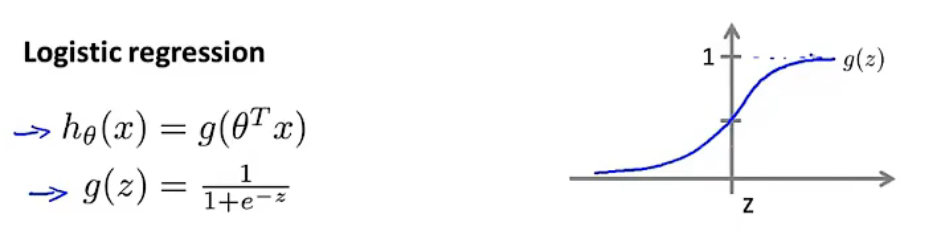

该假设函数的输出是给定 $x$ 和 $\theta$ ，$y = 1$ 的概率即 $p(y = 1 | x ;\theta)$

因此，我们可以这样预测：

$y = 1$ , 当 $h_\theta(x) \ge 0.5$

$y = 0$ , 当 $h_\theta(x) < 0.5$

由上述函数图像可知：
* 当 $z = 0 $ , $g(z) = 0.5$
* 当 $z > 0 $ , $ g(z) > 0.5 $
* 当 $ z < 0 $ , $ g(z) < 0.5 $

又 $z = \theta ^{\mathrm{T}} x$ , 因此 

$\theta ^{\mathrm{T}} x \ge  0$, 预测 $ y = 1 $

$\theta ^{\mathrm{T}} x < 0 $, 预测 $y = 0 $

假设我们有一个模型如下.

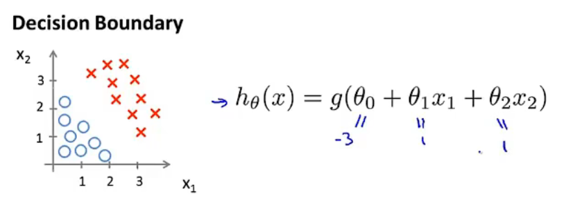

该模型已经拟合好参数为 $\theta_0 = -3$, $\theta_1 = 1$, $\theta_2 = 1$ 

当 $-3+x_1+x_2 \ge 0$, 即 $x_1+x_2 \ge 3$ 时，模型预测输出为 $y = 1$

因此，我们可以在图上作出这样一条线：$x_1+x_2=3$, 这就是该模型的分界线也就是**决策边界(decision boundary)**，分界线右上的平面预测 $y = 1$, 分界线左下的平面预测 $y = 0$

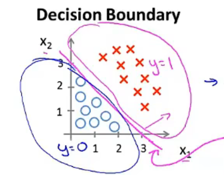

## 6.4 代价函数

本节内容主要是有关如何拟合Logistic回归模型的参数 $\theta$ 。具体来说就是定义用来拟合参数的代价函数(又叫优化目标)

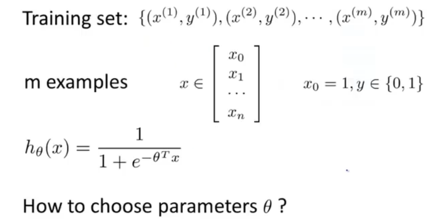

上图就是监督学习问题中Logistic回归模型的拟合问题：

* 有一个训练集 Training set ，里面有 m 个训练样本
* 每个样本用一个 n+1 维向量来表示，和之前一样，$x_0 = 1$ 即第0个特征一直为1
* 由于这是一个分类问题，因此所有的标签 $y$ 要么为0，要么为1即 $y \in \left\{ 0, 1 \right\} $
* 假设函数为：$\displaystyle h_\theta(x) = \frac{1}{1 + e^{-\theta^T x}}$

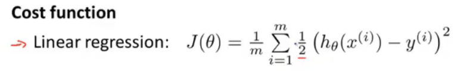

上图是在学习线性回归时，拟合参数所采用的代价函数。而在Logistic回归模型中，我们用另一种形式来代替这个平方误差项，如下图.

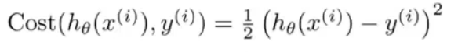

为了简化上述等式，我们可以先将上标去掉，如下图.

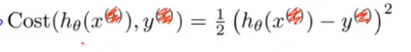

现在，我们可以这样理解这个代价函数，当预测的输出值是 $h_\theta(x)$ 而实际标签是 $y$ 的情况下，学习算法所付出的代价。但是如果我们直接将等式右边这个代价函数应用到Logistic回归模型中，其并不能很好的工作。因为它会变成参数 $\theta$ 的非凸函数 (Logistic回归模型中的 $h$ 函数是非线性的)

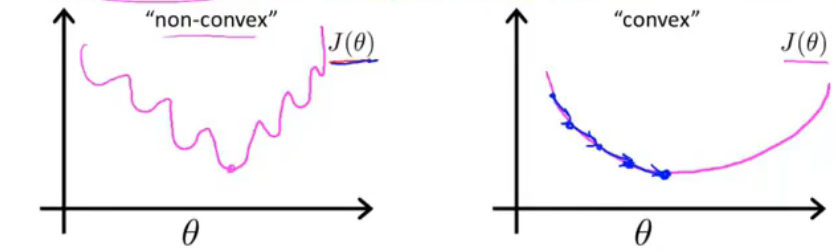

可以知道，上述左图中 $J(\theta)$ 有很多的局部最优值也就是它是一个非凸函数，如果我们将梯度下降法用在该函数上，我们无法保证其能收敛到全局最小值

我们更希望代价函数 $J(\theta)$ 是一个凸函数，也就是上述右图。这样在对它使用梯度下降法时可以保证收敛到全局最小值

因此，我们就需要寻找另外一个不同的代价函数，它是凸函数，使得我们可以使用很好的算法来保证收敛到全局最小值

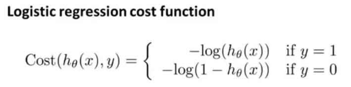

上图就是我们要用在Logistic回归的代价函数。

$$ Cost(h_\theta(x), y) = \begin{cases}
   -\log(h_\theta(x)) & if \  y = 1\\
   -\log(1 - h_\theta(x)) & if \  y = 0
\end{cases}
$$

* 当标签 $y = 1$ 时，代价函数为上边这个式子
* 当标签 $y = 0$ 时，代价函数为下边这个式子

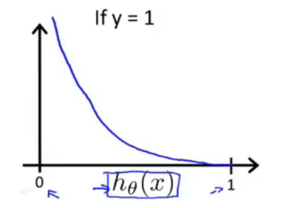  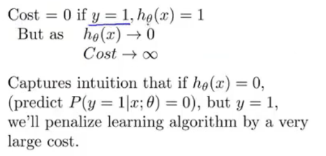

可以看到横坐标为 $h_\theta(x)$ ，该代价函数($y = 1$ 时)所具有的性质：

* 当预测输出值 $h_\theta(x) = 1$ 且标签恰好为 $y = 1$ 时，代价为0
* 随着预测输出值 $h_\theta(x)$ 趋向于0时，代价函数的值激增且趋于 $\infty$
* 直观来看就是，当 $h_\theta(x) = 0$ 也就是假设函数认为输出 $y = 1$ 的概率为0，但标签值为 $y = 1$ ,这时将用一个巨大的代价来惩罚这个学习算法

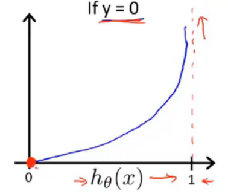

该代价函数($y = 0$ 时)所具有的性质：

* 当预测输出值 $h_\theta(x) = 0$ 且标签恰好为 $y = 0$ 时，代价为0
* 随着预测输出值 $h_\theta(x)$ 趋向于1时，代价函数的值激增且趋于 $\infty$