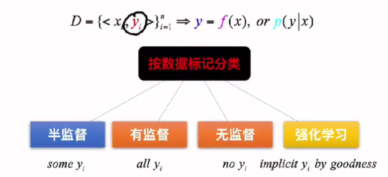
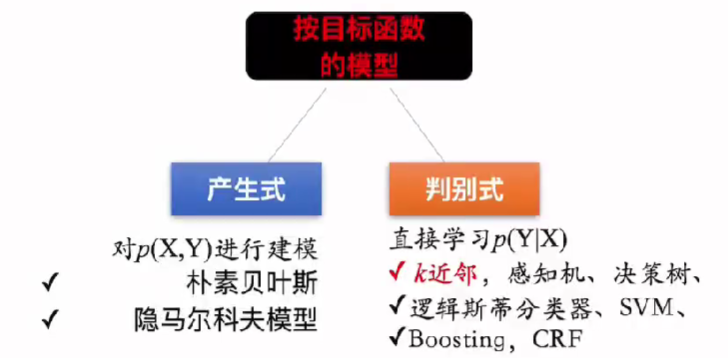

# 机器学习总复习(按复习要点)

## 机器学习基础

### lambda的解释

「ML = lambda」

机器学习 - Machine Learning

机器学习中的「机器」实际上就是 **函数**。这个函数有许多待求解的参数，提供的输入与这些参数相互作用后，就会产生输出

什么是学习？ **造机器，调参数**。确定函数的「形状」之后再进行调参，也就是在调参数之前需要明白这个机器大致长什么样子

**Machine Learning = Lambda**

机器=函数，学习=参数求解。

**机器学习 = Lambda**

**L = Loss， A = Algorithm， M = Model，BD = BigData，A = Application**

首先，有一个大的数据集 Big Data, 数学描述语言实际上它就是一个矩阵；模型 Model 实际上就是一个函数，该函数的作用是将 $x$ 映射到 $y$ ，模型中有许多未知的参数需要调整；预测值与真实值之间存在一定的误差，这时我们有一个部件叫 Loss 损失函数，该损失函数是关于这个模型参数的一个函数，用来评估预测值与真实值之间的误差；因此，有了这个损失函数Loss之后，还需要设计一套算法 Algorithm ，根据前面的误差，依据这套算法去调整模型的参数；然后我们再把输入样本送入模型中，比较输出的预测值与真实值之间的差距，当这个差距缩小到一定程度时，我们的算法就会停止。把上述这样的过程称之为训练Training，训练完毕之后就可以拿这个模型去做应用Application，应用后又可以获得一批新的数据，再将这些数据去训练原有模型，使其更适合当下的应用

机器学习的三要素：模型、算法与策略(又叫Loss)

### 机器学习的类型：有监督学习、无监督学习、强化学习

按数据标记可以分为有监督学习、无监督学习、半监督学习和强化学习。也就是根据样本对应的标签 $y$ 进行分类

* 根据是否有标签 $y$ , 可以分为有监督学习和无监督学习，有监督学习中的所有样本都具有对应的标签，而无监督学习的样本没有对应的标签，需要从无标签的数据集中发现隐藏的结构。半监督学习是数据集中只有部分样本具有对应的标签
* 强化学习则是需要经过很多步骤之后最终才会得到一个标签 $y$ ，根据这个最终的结果如何将其均匀地分配给前面的每个步骤

> 维基百科对强化学习的解释：
> 强化学习强调如何基于环境而行动，以取得最大化的预期利益。与监督学习不同的是，强化学习不需要带标签的输入输出对，同时也无需对非最优解的精确地纠正

### 产生式、判别式

按模型来分类，有产生式模型和判别式模型

产生式模型是对 $X$ 和 $Y$ 之间的整个空间进行建模，比如朴素贝叶斯

通常会把 $X$ 和 $Y$ 之间的关系拆解成两个进行建模：一个是标签空间的建模 $p(y)$ , 以及在给定标签的情况下 $x$ 的建模 $p(x | y)$

判别式模型则直接给出了 $X$ 的分布，也就是给定 $x$ 的情况下， $y$ 的分布 $p(y | x)$ 

产生式模型通常都是一个概率模型，但判别式模型不一定是概率模型，可以是概率模型，也可以是非概率的

## 线性回归

## 线性分类

## 无监督学习

## 强化学习

## EM算法

