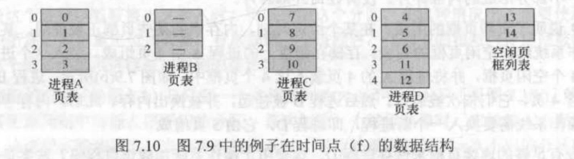

# 操作系统总复习

## 第七章 内存管理

### 内存管理需求

#### 1. 重定位

程序员无法事先知道在某个程序执行期间，内存中哪些程序已经驻留了。并且，在程序的执行过程中，因为某些原因需要将程序从内存中换出到磁盘中，在某些时刻将程序重新换入到内存中与之前不同的位置，因此需要将进程 **重定位**

进程的寻址需求：

* 进程控制信息
* 执行栈的位置
* 开始程序的入口点
* 处理程序的内部访问
  * 跳转指令
  * 数据访问指令
  * 把程序代码中的内存访问转换为实际的物理内存地址，并反映程序当前在内存中的位置

### 内存分区

大多数内存管理方案都假定操作系统占据内存中某些固定的部分，而剩余内存提供给多个用户进程使用

#### 固定分区

固定分区有两种选择，一种是等大小分区，另一种是非等大小分区

1. 等大小分区
   
   小于或等于分区大小的任何进程都可以装入到任何可用分区中；若所有分区已满，并且没有进程处于就绪态或运行态，则操作系统可以换出一个进程的所有分区，并装入另一进程使得处理器有事可做

   难点：
   * 程序太大而不能放入一个分区中。
   * 主存利用率低。即使是一个很小的程序，都需要占用整个分区，容易产生内部碎片

   > 内部碎片：由于装入的数据块大小 小于 分区的大小，导致 **分区内部** 产生空间浪费，这种现象称为 **内部碎片**

2. 非等大小分区
   
   使用大小不等的分区方案可以缓解上述的难点，但不能完全解决。

   

3. 放置算法
   
   * 等大小分区：因为所有分区的大小都相等，所以使用哪个可用分区都是可以的。
   * 非等大小分区：基本原理就是为每个进程分配足够容纳它的最小分区
     * 每个分区都维护一个调度队列：每个分区都需要维护一个调度队列，以保存从这个分区换出的进程
     * 为所有进程都只提供一个队列：当需要把一个进程装入内存时，选择可以容纳该进程的最小分区。若所有分区都被占据，则必须进行交换。一般有效考虑换出能容纳新进程的最小分区中的进程或者考虑诸如优先级之类的因素

4. 固定分区的缺点
   
   * 由于分区固定，限制了系统中活动进程的数目：分区数量在系统生成阶段已经确定
   * 由于小作业的存在，无法有效地利用空间：分区大小在系统生成阶段事先设置

#### 动态分区

对于动态分区来说，分区的长度和数量是可变的。进程装入内存时，系统会给它分配一块与其容量 **完全相等** 的内存空间

但随着分配过程的进行，容易在内存中形成许多小的「空洞」，内存利用率降低。这种现象称为 **外部碎片**

> 外部碎片：在所有 **分区外部** 的存储空间变成了越来越多的碎片，与前面的内部碎片正好相对应

克服外部碎片可以采用一种叫做「压缩」的技术，即操作系统不时地移动进程，使得进程占有的空间 **连续** ，并使所有剩余空闲的空间 **连成一片**

* 示例中使用了64MB的内存，最初，只有操作系统占用了8M的空间(a)
* 随后，大小分别为20M、14M、18M的进程被装入内存中(b)(c)(d)。然而这样在末尾产生的「空洞」对于进程4(大小为8M)来说太小了
* 在某时刻，内存中没有一个就绪进程，将进程2换出(e) ，此时内存中已有足够的空间容纳下进程4，装入进程4(f)，但由于进程4的大小 小于 进程2，因此又形成了一个小的「空洞」
* 在某时刻，将进程1换出(g) ，此时进程2可用，将进程2装入内存(h)

放置算法：

当内存中存在多个空闲块时，操作系统必须要为进程确定分配哪个空闲块

可供考虑的放置算法有：最佳适配算法(Best-fit)、首次适配算法(first-fit)和下次适配算法(Next-fit)。三种算法在内存中都选择大于等于进程大小的空闲块

三者的差别在于，最佳适配选择与要求大小最接近的空闲块；首次适配从头开始扫描内存，选择第一块可以满足要求的空闲块；下次适配从上次放置的位置开始扫描内存，选择下一个足够大小的空闲块

1. 最佳适配算法

* 选择与请求大小最接近的空闲块
* 性能最差：因为每次都需要从头扫描一遍内存才可以确定分配哪个块
* 由于每次选择的都是与请求大小最接近的空闲块，因此使得剩下的碎片更小
* 内存压缩需要经常执行

2. 首次适配算法

* 从头开始扫描内存，选择第一个满足要求的可用块
* 通常是最快和最好的
* 使得内存前端出现很多小的空闲区，并且每次查找都需要经过这些小的空闲区

3. 下次适配算法(又叫邻近适配算法)

* 从上次放置的位置开始扫描内存，选择下一个大小足够的空闲区
* 通常比首次适配算法差
* 常常导致在内存的末尾部分进行空间分配
* 使得位于内存末尾的最大空闲块很快被分裂成多个小块
* 需要内存压缩以在末尾获得较大的内存块

上图给出了经过多次放置和换出操作后的内存配置示例。图(a)中，在大小为22MB的空闲块中创建了14MB的分区。图(b)展示了为满足16MB大小的分配请求，使用三种不同放置算法(最佳适配算法、首次适配算法和下次适配算法)的区别：

* 首次适配算法选择了22MB的可用块，形成了6MB的碎片
* 最佳适配算法选择了18MB的可用块，形成了2MB的碎片
* 下次适配算法选择了末尾36MB的可用块，形成了20MB的碎片

#### 固定分区和动态分区的缺陷

固定分区限制了活动进程的数目，并且内存空间利用率低(当可用分区大小与进程大小很不匹配时)

动态分区的维护需要进行压缩，增加开销

### 分页和分段

#### 分页

##### 基本概念介绍

内存被划分为较小的固定大小、相等的块，同时进程也被分成同样大小的块

进程中的块被称为页，内存中的块被称为帧或者页框(frame)

那么进程中的块可以分配到内存中称为页框的可用块

操作系统需要为每个进程维护一个页表(pagetable)。页表给出了该进程的每页所对应页框的位置。在程序中，每个逻辑地址包括一个页号和在该页中的偏移量

上图说明了页和页框的用法。

存储在磁盘上的进程A由4页组成。装入这个进程时，操作系统査找4个空闲页框，并将进程A的4页装入这4个页框中，如图7.9(b)所示。进程B包含3页，进程C包含4页，它们依次被装入。然后进程B被挂起，并被换出内存。此后，内存中的所有进程被阻塞，操作系统需要换入一个新进程，即进程D,它由5页组成。进程D的5页被装入页框4、5、6、11和12

进程A的页表中标明了每一页对应内存中的帧号，进程B由于被换出内存，所以此时无内容。进程C、D仍然表明了对应的帧号。举个例子，进程C页表中的第0页对应内存中帧号7，第1页对应帧号8，第2页对应帧号9，依此类推

##### 分页与固定分区的区别

分区小、一个程序可以占用多个分区、分区不需要连续

#### 分段

##### 基本概念介绍

所有程序的所有段的长度不需要相同

和分页技术一样，采用分段技术时的逻辑地址也由两部分组成：段号和偏移量

有最大段长度限制

分段类似于动态分区，消除了内部碎片，但会产生外部碎片，但外部碎片很小

#### 逻辑地址向物理地址的转换计算

图(b)：

假设地址为16位，每个页的大小为1KB即1024字节。如图所示，(a)给出了一个相对地址1502，其二进制形式为 0000010111011110

而我们知道每个页的大小为1024字节，也就是 $2^{10}$ ,占10位，那么偏移量占10位，剩下 $16 - 10 = 6$ 位就是页号占的位数，所以一个程序最多有 $2^6 = 64$ 页组成

页号1 (000001) 中的偏移量 478 (011101111) 可以产生同样的16位数的逻辑地址  **直接把页号和偏移量拼接在一起即可**

图(c)：

假设16位地址中最左侧n位用来表示段号，最右侧m位表示偏移量

在图(c)的例子，假设 n = 4，m = 12，因此，最大段长度为 $2^{12} = 4096$ 字节

上图展示了分页和分段逻辑地址转换为物理地址

在前面的例子中，我们知道逻辑地址为0000010111011110,其页号为1,偏移量为478

假设该页对应驻留在内存中的页框6，二进制形式为000110，则直接将 000110 与偏移量011101111 相拼接即可

> 从上述过程可知，逻辑地址转换为物理地址实际就是要：
> * 先把逻辑地址中，哪些部分表示偏移量，哪些部分表示进程页表中的页号分清
> * 然后，再根据页号到进程页表寻找对应的内存页框或内存帧号
> * 最后将内存页框与偏移量相拼接即可

分段的地址转换步骤与分页类似：

* 提取段号，即左边 n 位
* 根据这个段号，在进程段表中找到对应的该段的起始物理地址。该例子中的「基」就是起始物理地址
* 最右侧 m 位表示偏移量，将偏移量与段长度进行比较，若偏移量大于段长度，则该地址无效。在该例中「长度」就是不同段的长度限制
* 最后计算物理地址：起始物理地址 + 偏移量。与分页直接拼接的方式不同，分段需要相加求和

### 伙伴系统

整个空间被看作一个大小为 $2^K$ 的块

若请求的大小满足 $2^{U - 1} < s \le  2^U$ , 则分配整个空间。否则，该块分裂成两个大小相等的「伙伴」。该过程一直持续到产生大于等于s的最小块，并分配给该请求

下图为伙伴系统示例

如图所示，给出了一个初始大小为1M的块

* 第1个请求为100K.需要一个128K的可用块。最初的块被分为两个大小都为512K的伙伴，第一个伙伴又分裂成两个256K的伙伴。其中的第一个又划分为两个128K的伙伴并将其中一个分配给A
* 下一个请求为240K.需要一个256K的可用块，因为这样的可用块已经存在，所以直接分配即可
* 按照这样的原理继续这样的 **分裂** 和 **合并** 的过程
* 注意，当释放E时，两个128K的伙伴合并成一个256K的块，这个256K的块与其伙伴又合并成512K的块

下图展示了伙伴系统的数据结构实例

### 逻辑地址向物理地址的转换方式

#### 区分几种地址类型

逻辑地址：与当前数据在内存中的物理分配地址无关的访问地址；在执行对内存的访问前，需要将其转化成物理地址

相对地址：相对于某些已知点的地址

物理地址：在内存中的绝对地址或实际位置

#### 地址转换方法

了解几个概念：

* 基址寄存器：指明程序在内存中的起始地址
* 界限寄存器：指明程序的终止位置
* 当程序被加载或换入时，必须设置这两个寄存器即基址寄存器和界限寄存器

地址转换：

实际物理地址 = 基地址 + 相对地址

将所得结果与界限寄存器中的值进行比较，如果这个结果在界限范围内，继续执行该指令；否则，产生中断
