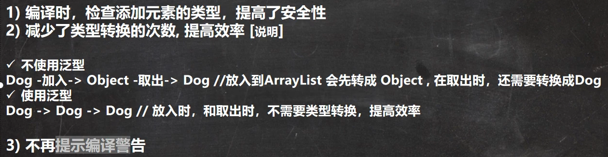

# Java学习笔记

## 1 基础阶段

### 0 面试题

#### 1 Java语言有哪些特点?

1. 简单易学；
2. 跨平台
3. 安全性
4. 高效性
5. 面向对象（封装、继承、多态）
6. 可靠性
7. 解释与编译并存
8. 强大的生态

#### 2 什么是字节码?采用字节码的好处是什么? ^[源于JavaGuide]

在Java中，JVM能理解的代码就是字节码（即后缀为 `.class` 的文件），该文件不面向任何特定的处理器，只面向虚拟机。通过字节码，解决了传统解释型语言执行效率低的问题，同时又兼顾了可移植性


### 1.1 Java文件的编译与运行

Java文件的运行过程：

1. 编写。编写Java源文件
2. 编译。在控制台中使用命令 `javac 源文件名.java` 编译源文件，编译后生成一个**源文件名.class**字节码文件
3. 运行。在控制台中使用命令 `java 源文件名` 运行class文件，注意在该步骤中不需要加入class文件后缀

### 1.2 变量与运算符

长整型(long)数值有一个后缀 `l` 或 `L`

float型数值有一个后缀 `f` 或 `F`

取余运算中，如果有负数参与，则结果与被模数的符号保持一致:

结合赋值: `+=` `-=` `*=` `/*` `%=` 存在这样一种情况，运算得到的值与左侧操作数类型不同时，会发生强制转换

```Java
int x = 3;

x += 3.5; // 相当于 x = (int)(x + 3.5),该行语句不会发生报错
```

逻辑运算符 & 和 && 的区别：

一旦遇到false的情况，&&不会继续判断剩余的情况，直接返回false，而 & 仍会继续判断

### 1.3 流程控制

#### 使用Scanner类从键盘获取输入：

1. 引入相关的包: `import java.util.Scanner;` 
2. 声明一个Scanner对象：`Scanner sc = new Scanner(System.in);`
3. 根据输入的数据类型调用相应的类：
   
   ```java
    import java.util.Scanner;
    Scanner sc = new Scanner(System.in);

    int numInt = sc.nextInt();
    double numDouble = sc.nextDouble();
    String name = sc.next();
    char c = sc.next().charAt(0);// 输入一个字符
   ```

需要注意的是，Scanner类并没有定义读取字符的方法，因此当我们需要读取一个字符时，可以这么做 `sc.next().charAt(0)`

#### 如何获取一个随机数?

1. 使用Math类中的random()方法
2. 获取某个范围内的整数：`int num = (int)(min + Math.random() * (max - min + 1));`

#### break语句

在多层循环的嵌套中，break语句可以通过 `break 标签名` 来退出指定的循环，但在开发中不推荐这么使用

### 1.4 数组

#### 使用方式1-动态初始化

可以这样定义数组：


完成数据的输入并用数组存放：

```Java
import java.util.Scanner;

public class Main {
    public static void main(String[] args) {
        double[] scores = new double[5];

        Scanner input = new Scanner(System.in);
        for (int i = 0; i < scores.length; i++) {
            System.out.println("请输入第" + i + "个数:");
            scores[i] = input.nextDouble();
        }

        for (int i = 0; i < scores.length; i++) {
            System.out.println("输出:");
            System.out.println("scores[" + i + "] = " + scores[i]);
        }

    }

}
```

#### 使用方式2-先声明再分配

```Java
int[] nums; // 先声明数组nums
nums = new int[5]; // 再动态分配空间
```

#### 使用方式3-静态初始化


## 2 面向对象编程

### 2.1 基础


类是抽象的、概念的

对象是具体的、实际的

#### 属性与成员变量


属性和成员变量是一样的，属性可以是基本数据类型，也可以是引用类型如数组、对象


属性的定义多了一个**访问修饰符**，用来控制属性的访问范围，访问修饰符有4种：

* public
* protected
* 默认
* private

#### 创建对象


#### 类与对象的内存分配机制


内存结构分析：

* 栈：一般是用来存放基本数据类型如局部变量
* 堆：存放对象
* 方法区：常量池（常量例如字符串）、加载类信息（属性信息、方法信息）

创建对象的流程分析：

1. 首先，加载类信息（属性信息和方法信息）
2. 为相应的类在堆中分配空间并进行默认初始化
3. 把地址赋给指定的对象
4. 进行指定初始化

#### 成员方法的细节说明


一个方法最多有一个返回值，如果需要返回多个结果，可以考虑使用数组（注意此时的方法类型也要定义为数组类型）


形参：形式参数，方法定义时的参数

实参：实际参数，调用方法时的参数


不能在方法中再定义方法


在同一个类中的方法可以**直接调用**，即不需要先创建对象再进行调用


跨类的方法调用需要使用对象名调用，并且还与所要调用方法的访问修饰符有关

``` Java
public class Main {
    public static void main(String[] args) {
       A a1 = new A();
       a1.m1();
    }

}

class A {
    public void m1(){
        System.out.println("A类中的方法m1()被调用！");
        B b1 = new B();
        b1.hi();
        System.out.println("A类中的方法m1()继续执行....");
    }
}

class B {
    public void hi(){
        System.out.println("B类中的方法hi()被调用！");
    }
}
```

上面这段程序的输出结果如下：


#### 重载

##### 1 理解

在Java中，同一个类允许存在多个**同名**的方法，但要求**形参列表不一致**

重载案例：

```Java
public class Main {
    public static void main(String[] args) {
       MyCalculator mc = new MyCalculator();
       System.out.println(mc.calculate(2, 4));
       System.out.println(mc.calculate(2, 3.2));
       System.out.println(mc.calculate(3.4, 3));
       System.out.println(mc.calculate(3, 2, 1));
    }

}

class MyCalculator {
    public int calculate(int n1, int n2){
        System.out.println("public int calculate(int n1, int n2)被运行...");
        return n1 + n2;
    }

    public double calculate(int n1, double n2){
        System.out.println("public double calculate(int n1, double n1)被运行...");
        return n1 + n2;
    }

    public double calculate(double n1, int n2){
        System.out.println("public double calculate(double n1, int n2)被运行...");
        return n1 + n2;
    }

    public int calculate(int n1, int n2, int n3){
        System.out.println("public int calculate(int n1, int n2, int n3)被运行...");
        return n1 + n2 + n3;
    }
}
```

上述程序输出结果如下：


##### 细节说明

重载要求：

1. 方法名必须相同
2. 形参列表必须不同。形参**类型**、**个数**或**顺序**，至少有一样不同（仅参数名不同不是重载）
3. 返回类型无要求

> 注意，如果方法名相同，形参类型、个数、顺序也相同，但返回类型不同，也**不构成重载**，此时编译器会认为方法重复定义

#### 作用域


* 全局变量：也就是属性（成员变量），作用域为**整个类体**，该类中的成员方法可以直接使用属性。不赋值也可以直接使用，此时被认定为默认值
* 局部变量：一般是在成员方法中定义的变量，作用域仅**局限于方法内**，并且局部变量**必须赋值后才可以使用**

##### 细节说明


全局变量：可以被本类使用，也可以被其他类（通过对象调用的方法）使用。且全局变量可以加修饰符

局部变量：只能在方法类使用且不可以加修饰符

``` Java
public class Main {
    public static void main(String[] args) {
       A a = new A();
       B b = new B();
       b.bTest1();
       b.bTest2(a);
    }

}

class B {
    public void bTest1(){
        A a1 = new A();
        System.out.println("在其他类(B)中使用类A的全局变量age = " + a1.age);
    }
    public void bTest2(A a2){
        System.out.println("通过对象传递在其他类(B)中使用类A的全局变量age = " + a2.age);
    }
}

class A {
    public int age = 15;

    public void aTest(){
        System.out.println("在本类(A)中使用全局变量 age = " + age);
    }
}
```

 上述程序的运行结果：

 

 #### 构造方法/构造器

 构造方法是类的一种特殊方法，其作用是完成对新对象的初始化。构造方法的特点如下：

 * 方法名和类名相同
 * 无返回值
 * 在创建对象时，由**系统自动调用该类的构造方法**完成对象的**初始化**

构造方法示例如下：

```Java
public class Main {
    public static void main(String[] args) {
        Person p1 = new Person("Jack", 50);
        System.out.println("p1的信息如下: ");
        System.out.println("p1的name = " + p1.name);
        System.out.println("p1的age = " + p1.age);
    }

}

class Person {
    String name;
    int age;

    public Person(String pName, int pAge) {
        System.out.println("构造方法被调用....完成对象的初始化！");
        name = pName;
        age = pAge;
    }
}
```

运行结果如下：


##### 细节

一个类可以定义多个不同的构造器即**构造器重载**

如果程序员没有定义构造器，则**系统会自动生成默认的无参构造器**(默认构造器)，例如 `Person() {}`

但是，一旦定义了构造器，默认构造器就被**覆盖**了，就不能再使用默认的无参构造器（也就是不能再使用 `Person p1 = new Person();`），除非**显示**定义默认构造器

### 2.2 面向对象编程(中级)

#### 2.2.1 包


不能用数字开头不单单是整个包名的开头，而是每个以小圆点分隔开的段的开头

#### 2.2.2 访问修饰符


只有**默认**和**public**才能修饰类

#### 2.2.3 封装(重要)

##### (1) 理解

为什么要封装？

* 封装可以隐藏实现细节
* 可以对数据进行验证，保证安全合理

##### (2) 封装的步骤


1. 将属性私有化(private)
2. 定义一个公共的(public)方法`public void set()`对属性进行判断和赋值
3. 定义一个公共的方法`public 数据类型 get()`用于获取属性值

#### 2.2.4 继承(重要)

##### (1) 理解

继承可以实现**代码复用**，如果多个类存在相同的属性和方法时，可以从这些类中抽象出**父类**，在父类中定义共用的属性和方法

基本语法：

```Java
class 子类 extends 父类 {

}
```

##### (2) 细节

子类继承了父类的所有属性和方法，但是父类的私有属性和私有方法**不能在子类中直接访问**，需要通过父类提供的公共方法来访问


#### 2.2.5 多态(重要)

重载和重写体现了方法的多态

多态的前提是两个对象(类)存在**继承**关系

##### (1) 对象的多态


##### (2) 向上转型


可以调用父类的所有成员（需遵守访问权限），但不能调用子类的特有成员。最终运行效果看子类的具体实现，如果子类没有就往上寻找父类的

### 2.3 面向对象编程(高级)

#### 2.3.1 单例设计模式

##### (1) 理解

什么是单例设计模式？

类的单例设计模式，是指采用一定的方法，在整个软件系统中，**对某个类只能存在一个对象实例**，并且该类只提供一个获取其对象实例的方法

单例模式有两种：饿汉式和懒汉式

##### (2) 饿汉式单例模式的实现

步骤如下：

1. 构造器私有化
2. 在类的内部创建对象
3. 向外暴露一个静态的公共方法(getInstance)

代码实现如下：

```Java
package com.training.single_;

public class SingleTon01 {
    public static void main(String[] args) {
        GirlFriend instance = GirlFriend.getInstance();
        System.out.println(instance);
    }
}

class GirlFriend {
    private String name;

    //2.类的内部创建对象,为了能够在静态方法返回gf对象,需要将其修饰为static
    private static GirlFriend gf = new GirlFriend("小红");

    // 1.构造器私有化
    private GirlFriend(String name) {
        this.name = name;
    }

    // 3.向外暴露一个公共(静态)方法,返回gf对象
    public static GirlFriend getInstance(){
        return gf;
    }

    @Override
    public String toString() {
        return "GirlFriend{" +
                "name='" + name + '\'' +
                '}';
    }
}
```

为什么对外暴露的公共方法要用static修饰？

如果不用static修饰，那如果要在main函数中调用该方法，就得先new一个对象，但这与我们要求的不能在main方法中创建对象相违背，因此需要用static来修饰，这样main方法中就可以调用`getInstance()`方法来获取gf对象

另外，饿汉式可能会造成创建了对象但并没有使用的情况

##### (3) 懒汉式单例模式实现

不说了，都在代码里了

```Java 
package com.training.single_;

public class SingleTon02 {
    public static void main(String[] args) {
        Cat instance = Cat.getInstance();
        System.out.println(instance);
    }
}

class Cat {
    private String name;
    private static Cat cat1;

    /*步骤
    * 1.构造器私有化
    * 2.在类内部创建对象
    * 3.提供一个public的static方法，返回Cat对象
    * 4.懒汉式：只有当用户使用了getInstance()才返回Cat对象，后面再次调用还是会返回上次创建
    * 的对象，从而保证了单例
    * */
    private Cat(String name) {
        this.name = name;
    }

    public static Cat getInstance(){
        if(cat1 == null){
            cat1 = new Cat("喵喵喵");
            return cat1;
        }
        return cat1;
    }

    @Override
    public String toString() {
        return "Cat{" +
                "name='" + name + '\'' +
                '}';
    }
}
```

饿汉式和懒汉式最主要的区别在于**二者创建对象的时机不同**，饿汉式是在**类加载时**就创建了对象，懒汉式则是在**使用时**才创建

#### 2.3.2 final关键字


##### (1) 细节


#### 2.3.3 抽象类

##### (1) 理解

父类方法不确定性问题：父类中某些方法不能确定时，可以用abstract关键字来修饰该方法，这个方法就是**抽象方法**，用abstract修饰的类就叫做**抽象类**

> 注意：如果一个类中包含了抽象方法，则该类必须用abstract来修饰
> 一般来说，抽象类会被继承，由其子类实现抽象方法

##### (2) 细节


为什么抽象方法不能使用private、final和static来修饰？

* 因为抽象方法需要在子类中实现，如果用private修饰抽象方法，子类根本没有机会去实现该方法
* final的使用场景是不希望子类重写方法，所以子类又没有机会去实现方法
* static也是类似的原因，因此究其根本就是这三个都与**重写**相违背

#### 2.3.4 接口

##### (1) 理解


##### (2) 细节


##### (3) 接口的多态特性

## 3 枚举类   

## 4 异常

## 5 集合

### 5.1 集合的框架体系


### 5.2 Collection方法


### 5.3 迭代器遍历

```Java
public class CollectionIterator {
    public static void main(String[] args) {
        Collection coll = new ArrayList();
        coll.add(new Book("三国演义", "罗贯中", 15.8));
        coll.add(new Book("红楼梦", "曹雪芹", 19.8));
        coll.add(new Book("西游记", "吴承恩", 20.8));

        //System.out.println("coll=" + coll);
        Iterator iterator = coll.iterator();//先得到coll对应的迭代器
        while (iterator.hasNext()){//判断是否还有数据
            //返回下一个元素，类型为object
            Object obj = iterator.next();
            System.out.println(obj);
        }
    }
}
```


下面展示了如何用迭代器遍历和for增强遍历

```Java
public class CollectionExer {
    public static void main(String[] args) {
        List list = new ArrayList();
        list.add(new Dog("大黄", 8));
        list.add(new Dog("中黄", 5));
        list.add(new Dog("小黄", 2));

        //迭代器遍历
        System.out.println("使用迭代器=====");
        Iterator iterator = list.iterator();
        while (iterator.hasNext()){
            Object obj  = iterator.next();
            System.out.println(obj);
        }

        //for增强遍历
        System.out.println("使用for增强=====");
        for(Object dog : list){
            System.out.println("dog=" + dog);
        }
    }
}
```

### 5.4 List常用方法和细节


其中方法 `subList(int fromIndex, int toIndex)` 返回的是**集合**，并且范围是 [fromIndex, toIndex) 是一个**左闭右开**区间

#### 5.4.1 List的三种遍历方式


注意，这三种方式都适用于ArrayList, LinkedList, Vector

#### 5.1.2 ArrayList细节


### 5.5 Map接口

#### 5.5.1 特点


#### 5.5.2 Map接口常用方法


#### 5.5.3 Map接口遍历方法(重点关注，需要好好品品)


下面展示了通过`keySet()`获取所有键

```Java
public class MapFor {
    public static void main(String[] args) {
        Map map = new HashMap();
        map.put("邓超", "孙俪");
        map.put("鹿晗", "关晓彤");
        map.put("zzz", null);

        System.out.println("-----第一种：增强for-----");
        Set keySet = map.keySet();
        for(Object key : keySet){
            System.out.println(key + "->" + map.get(key));
        }

        System.out.println("------第二种：迭代器-----");
        Iterator iterator = keySet.iterator();
        while (iterator.hasNext()) {
            Object key =  iterator.next();
            System.out.println(key + "->" + map.get(key));

        }
    }
}
```


下面是两种典型遍历方式的完整代码

```Java
package com.training.map_;

import java.util.HashMap;
import java.util.Iterator;
import java.util.Map;
import java.util.Set;

public class MapExer {
    public static void main(String[] args) {
        Map map = new HashMap();
        map.put(1, new Employee("mary", 15000, 1));
        map.put(2, new Employee("kevin", 5000, 2));
        map.put(3, new Employee("mike", 25000, 3));

        System.out.println("第一种遍历：增强for----");
        Set keySet = map.keySet();//keySet()
        for(Object key : keySet){
            Employee emp = (Employee) map.get(key);//获取value并向下转型
            if(emp.getSalary() > 18000){
                System.out.println(emp);
            }
        }

        System.out.println("----使用entrySet----");
        Set entrySet = map.entrySet();
        Iterator iterator = entrySet.iterator();
        while(iterator.hasNext()){
            Map.Entry entry = (Map.Entry) iterator.next();
            Employee emp = (Employee) entry.getValue();
            if(emp.getSalary() > 18000){
                System.out.println(emp);
            }
        }

    }
}

class Employee {
    private String name;
    private double salary;
    private int id;

    public Employee(String name, double salary, int id) {
        this.name = name;
        this.salary = salary;
        this.id = id;
    }

    public String getName() {
        return name;
    }

    public void setName(String name) {
        this.name = name;
    }

    public double getSalary() {
        return salary;
    }

    public void setSalary(double salary) {
        this.salary = salary;
    }

    public int getId() {
        return id;
    }

    public void setId(int id) {
        this.id = id;
    }

    @Override
    public String toString() {
        return "Employee{" +
                "name='" + name + '\'' +
                ", salary=" + salary +
                ", id=" + id +
                '}';
    }
}
```

## 6 泛型

### 6.1 理解



### 6.2 细节


注意，E 具体的数据类型在定义对象的时候就已经确定，也就是在编译期间已经确定具体的数据类型


注意，在实际开发中更推荐 `List<Integer> list = new ArrayList<>();` 