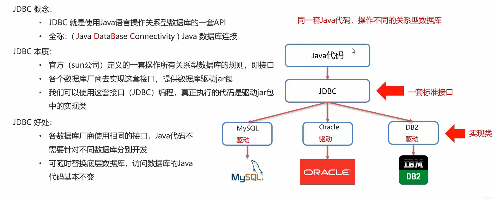
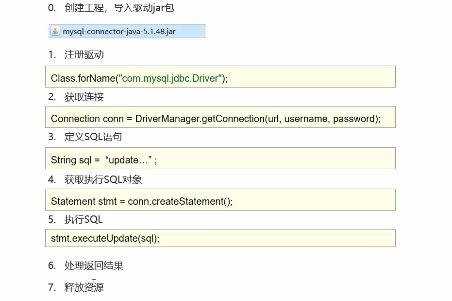
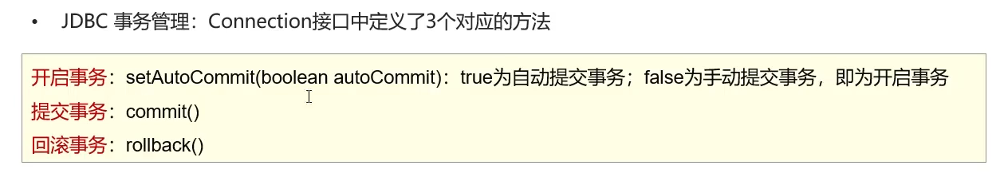
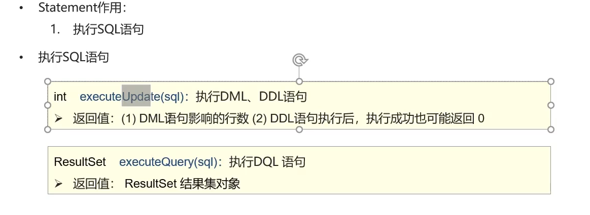
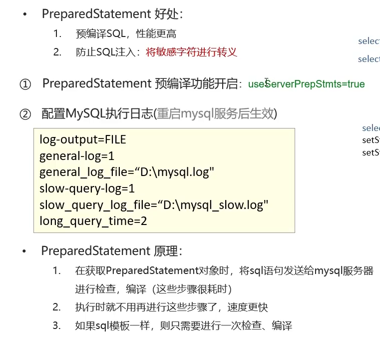
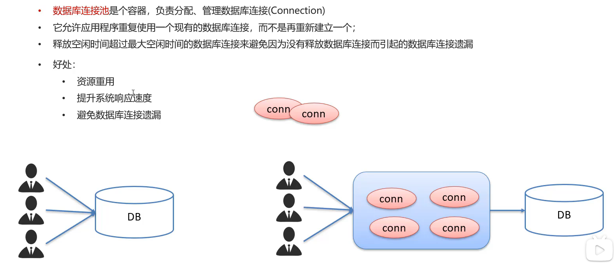

# JavaWeb

## 1 数据库

### 1.1 数据库设计

#### 1.1.1 表关系

表关系分为：一对一、一对多（多对一）、多对多

#### 1.1.2 表关系的实现

实现方式就是在多的那一方建立外键，指向一的那方的主键

实现方式为**建立第三张中间表**，并且该表至少包含两个外键，分别关联双方的**主键**

## 2 JDBC

### 2.1 简介

1. 什么是JDBC？
   
   JDBC是使用Java语言操作关系型数据库的一套API，**本质**就是定义的可以操作不同关系数据库而**无需关注其底层细节**的**接口**

### 2.2 快速入门案例

该案例想要更新数据库db1中表account的数据，步骤同上

### 2.3 API介绍

#### 2.3.1 DriverManager

主要是两个作用：

1. 加载驱动
2. 创建数据库连接对象

#### 2.3.2 Connection

两个作用：

1. 获取执行SQL的对象
2. 管理事务

#### 2.3.3 Statement

#### 2.3.4 ResultSet

#### 2.3.5 prepareStatement

### 2.4 数据库连接池

