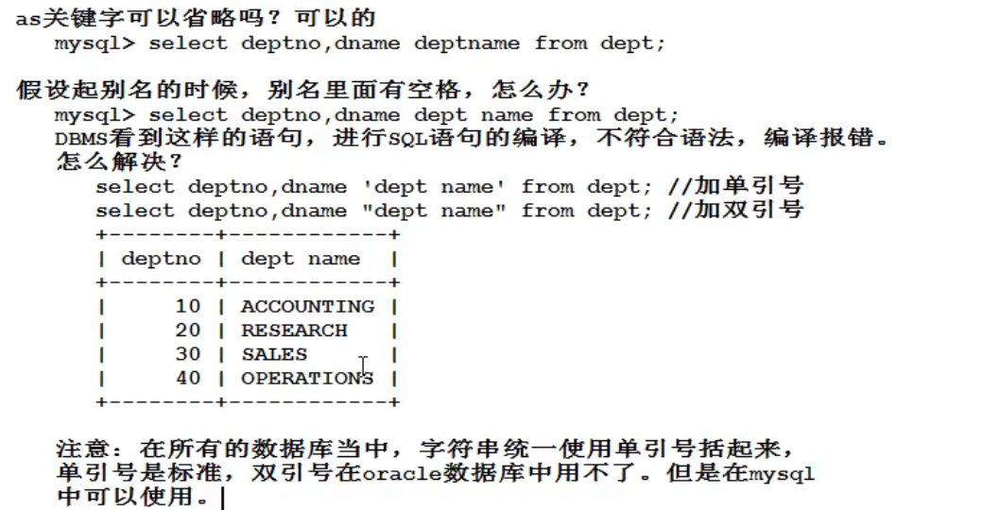
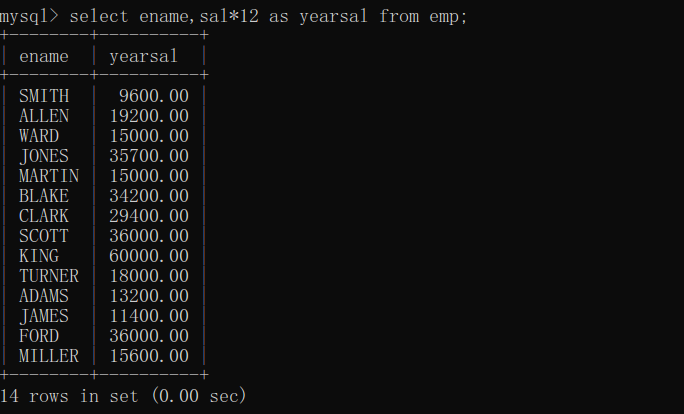
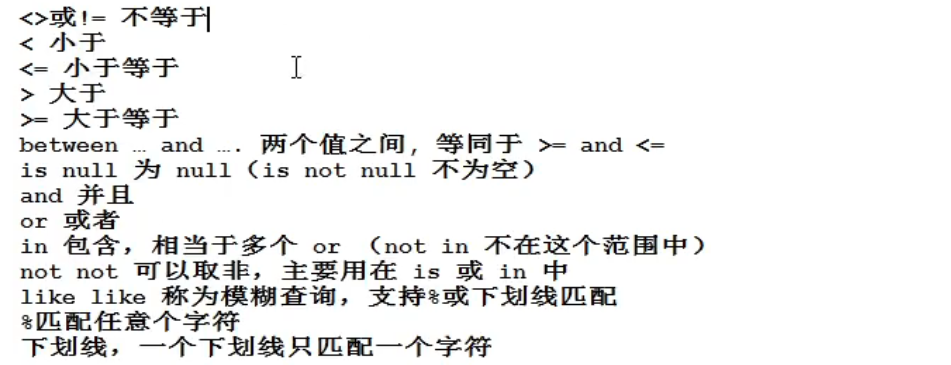
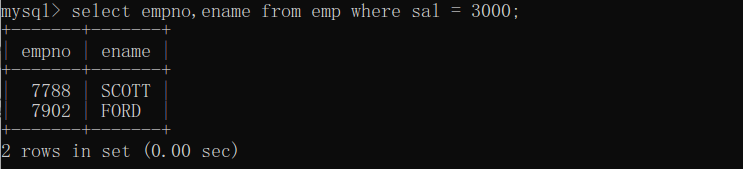

# MySQL学习

## 1 基础知识

### 1.1 常用命令

注意，MySQL不见分号 ; 不执行

可以输入`\c`终止命令的输入


#### 本地登录

在终端中登录（隐式）：

`mysql -uroot -p`

然后再输入密码

#### 退出MySQL

`exit`

#### 查看MySQL中有哪些数据库

`show databases;`

注意，以分号结尾

#### 选择使用数据库

`use name;`

name是要使用的数据库名称

#### 创建数据库

`create database name;`

name是要创建的数据库名称

#### 查看某个数据库下的表

`show tables;`

#### 查看表中的数据

`select * from tablename;`  -  查看名为tablename的表的所有数据

`desc tablename;` - 查看名为tablename的表的结构

#### 查看当前使用的数据库

`select database();`


### 1.2 数据库中最基本的单元：表

数据库当中以表的形式表示数据，因为表比较直观

任何一张表都有**行**和**列**

行(row):称为**记录**/数据

列(column):称为**字段**

每一个字段都有：字段名、数据类型和约束等属性

### 1.3 SQL语句分类

DQL:数据查询语言，带有`select`关键字的都是查询语句

DML:数据操作语言，对**表中**的数据进行增删改。例如`insert` `delete` `update`

DDL:数据定义语言，主要是对表的**结构**进行操作，`create` `drop` `alter`

TCL:事务控制语言

DCL:数据控制语言

### 1.3 查询

#### 1.3.1 简单查询

##### (1) 查询一个字段

命令: `select 字段名 from 表名;`

##### (2) 查询多个字段

用逗号 "," 隔开

命令: `select 字段名1,字段名2 from 表名;`

##### (3) 查询所有字段

可以把所有字段名都打上

或者使用命令`select * from tablename;` 但这种方式效率低、可读性差，不建议在开发中使用

##### (4) 给查询的列起别名

可以使用 `as` 关键字

命令: `select 字段名 as 别名 from 表名;`

注意，只是将查询的结果显示为修改的别名，并没有实际修改表中的字段名

**select语句不会进行修改操作**



##### (5) 列参与计算

字段可以使用数学表达式



#### 1.3.2 条件查询

查询符合条件的数据

```MySQL
select
    字段名1,字段名2,...,字段名n
from
    表名
where
    条件;
```



注意，在数据库当中，查询是否为空时不能使用 `=` 而要使用 `is null` 或者 `is not null`

查询工资为3000的员工编号和员工名：



### 1.4 排序

#### 1.4.1 默认是升序

例子如下，order by 后面跟的是根据什么排序

命令: 

```MySQL
select
    字段名1,字段名2,...,字段名n
from
    表名
order by
    sal;
```

#### 1.4.2 指定降序、指定升序

指定降序：

```MySQL
select
    字段名1,字段名2,...,字段名n
from
    表名
order by
    sal desc;
```

指定升序：

```MySQL
select
    字段名1,字段名2,...,字段名n
from
    表名
order by
    sal asc;
```

#### 1.4.3 按照多个字段排序

```MySQL
select
    字段名1,字段名2,...,字段名n
from
    表名
order by
    sal asc, ename asc;
```

意思是如果sal一样，再根据ename进行排序（在前面的起主导，只有前面的都相等了再根据后面的来排序）

#### 1.4.4 综合案例1


