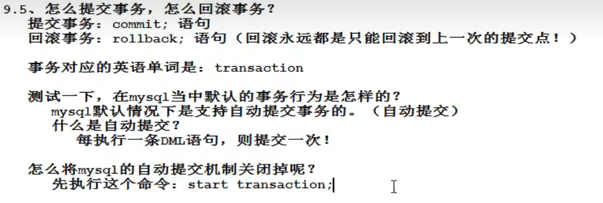

# MySQL学习

## 1 基础知识

### 1.1 常用命令

注意，MySQL不见分号 ; 不执行

可以输入`\c`终止命令的输入


#### 本地登录

在终端中登录（隐式）：

`mysql -uroot -p`

然后再输入密码

#### 退出MySQL

`exit`

#### 查看MySQL中有哪些数据库

`show databases;`

注意，以分号结尾

#### 选择使用数据库

`use name;`

name是要使用的数据库名称

#### 创建数据库

`create database name;`

name是要创建的数据库名称

#### 查看某个数据库下的表

`show tables;`

#### 查看表中的数据

`select * from tablename;`  -  查看名为tablename的表的所有数据

`desc tablename;` - 查看名为tablename的表的结构

#### 查看当前使用的数据库

`select database();`


### 1.2 数据库中最基本的单元：表

数据库当中以表的形式表示数据，因为表比较直观

任何一张表都有**行**和**列**

行(row):称为**记录**/数据

列(column):称为**字段**

每一个字段都有：字段名、数据类型和约束等属性

### 1.3 SQL语句分类

DQL:数据查询语言，带有`select`关键字的都是查询语句

DML:数据操作语言，对**表中**的数据进行增删改。例如`insert` `delete` `update`

DDL:数据定义语言，主要是对表的**结构**进行操作，`create` `drop` `alter`

TCL:事务控制语言

DCL:数据控制语言

### 1.3 查询

#### 1.3.1 简单查询

##### (1) 查询一个字段

命令: `select 字段名 from 表名;`

##### (2) 查询多个字段

用逗号 "," 隔开

命令: `select 字段名1,字段名2 from 表名;`

##### (3) 查询所有字段

可以把所有字段名都打上

或者使用命令`select * from tablename;` 但这种方式效率低、可读性差，不建议在开发中使用

##### (4) 给查询的列起别名

可以使用 `as` 关键字

命令: `select 字段名 as 别名 from 表名;`

注意，只是将查询的结果显示为修改的别名，并没有实际修改表中的字段名

**select语句不会进行修改操作**


##### (5) 列参与计算

字段可以使用数学表达式


#### 1.3.2 条件查询

查询符合条件的数据

```MySQL
select
    字段名1,字段名2,...,字段名n
from
    表名
where
    条件;
```


注意，在数据库当中，查询是否为空时不能使用 `=` 而要使用 `is null` 或者 `is not null`

查询工资为3000的员工编号和员工名：


#### 1.3.3 模糊查询


% 匹配任意多个字符

_ 匹配任意一个字符

### 1.4 排序

#### 1.4.1 默认是升序

例子如下，order by 后面跟的是根据什么排序

命令: 

```MySQL
select
    字段名1,字段名2,...,字段名n
from
    表名
order by
    sal;
```

#### 1.4.2 指定降序、指定升序

指定降序：

```MySQL
select
    字段名1,字段名2,...,字段名n
from
    表名
order by
    sal desc;
```

指定升序：

```MySQL
select
    字段名1,字段名2,...,字段名n
from
    表名
order by
    sal asc;
```

#### 1.4.3 按照多个字段排序

```MySQL
select
    字段名1,字段名2,...,字段名n
from
    表名
order by
    sal asc, ename asc;
```

意思是如果sal一样，再根据ename进行排序（在前面的起主导，只有前面的都相等了再根据后面的来排序）

#### 1.4.4 综合案例1


### 1.5 单行处理函数


单行处理函数：一个输入对应一个输出

多行处理函数：多个输入对应多个输出

### 1.6 分组函数/多行处理函数

分组函数在使用时必须先进行分组才能使用，若没有对数据进行分组，则整张表默认为一组


注意：

1. 分组函数自动忽略NULL

### 1.6 连接查询

在一张表中查询数据，称为**单表查询**

多张表联合起来的**跨表查询数据**，称为**连接查询**

连接查询时需要加条件，只有满足条件的才会筛选出来，否则就会产生笛卡尔积现象


#### 1.6.1 内连接

##### (1) 等值连接

案例：查询每个员工的部门，要求显示员工名和对应的部门名

-> 将emp e 和 dept d 两张表进行连接，条件是 e.deptno = d.deptno

SQL92语法：

```mysql
select
    e.ename,d.dname
from
    emp e,dept d
 where e.deptno = d.deptno;
```

SQL99语法：

```MySQL
select
    e.ename,d.dname
from
    emp e
join
    dept d
 on 
    e.deptno = d.deptno;
```

##### (2) 非等值连接

```mysql
select
    e.ename,e.sal,s.grade
from
    emp e join salgrade s
on
    e.sal between s.losal and s.hisal;
```

条件不是一个等值关系，称为非等值连接

##### (3) 自连接

把一张表看作两张表

```MySQL
select a.ename as '员工名',b.ename as '领导名'
from emp a join emp b
on a.mgr = b.empno;
```

#### 1.6.2 外连接

内连接是将和条件完全匹配的数据显示出来

```MySQL
select
    e.ename,d.dname
from
    emp e
right join
    dept d
 on 
    e.deptno = d.deptno;
```


右外连接相当于把右边集合的所有数据和交集都显示出来。例如上述案例就是在部门表中有一个OPERATIONS部门其下并没有员工，但仍然可以将其显示出来，且员工名为NULL


### 1.7 limit

limit把查询结果集中的一部分取出来，常用于分页查询

#### 1.7.1 limit用法


### 1.8 表

#### 1.8.1 建表的语法格式

`create table 表名(字段名1 数据类型,字段名2 数据类型,字段名3 数据类型);`

```
create table 表名(
    字段名1 数据类型,
    字段名2 数据类型,
    字段名3 数据类型
);
```

创建一个学生表，包含学号、姓名、性别、年龄、邮箱

```MySQL
create table t_stu(
    stu_num int,
    name varchar(32),
    gender char(1),
    age int(3),
    email varchar(255)
);
```


#### 1.8.2 数据类型

常用的数据类型：

* varchar：可变字符串，会根据传入的数据**动态分配**空间
* char：定长字符串，分配**固定**的空间来存储数据，可能会造成空间浪费
* int：整型
* bigint：长整型，相当于 long
* float：单精度浮点型
* double：双精度浮点型
* date：短日期
* datetime：长日期
* clob(Character large object)：字符大对象，最多可以存储4G的字符串。通常用来存储一篇文章、一个说明。超过255个字符的数据都要用字符大对象来存储
* blob(binary large object)：二进制大对象。用来存储图片、声音、视频等流媒体数据 

#### 1.8.3 删除表

`drop table tablename` 删除表名为tablename的表，但如果该表不存在会报错

`drop table if exists tablename` 

#### 1.8.4 插入数据-insert语句

`insert into tablename(字段名1,字段名2,字段名3) values(值1,值2,值3);`

字段名和值要一一对应

```MySQL
insert into t_stu(stu_num,name,gender,age,email) values(1,'zhangsan','f',18,'zhangsan@1145.com');
insert into t_stu(stu_num,name,gender,age,email) values(2,'lisi','m',20,'lisi@11415');
```

insert语句如果没有给字段赋值，默认为NULL

insert语句一旦执行成功，表中就会多一条记录

也可以在建表时为字段指定默认值：

```MySQL
create table t_stu(
    stu_num int,
    name varchar(32),
    gender char(1) default 'm',
    age int(3),
    email varchar(255)
);
```

#### 1.8.5 插入日期


`insert into t_user(id,name,birth) values(1, 'zhangsan', str_to_date('01-10-1999','%d-%m-%y'));`

str_to_date() 语法格式：str_to_date('字符串日期','日期格式')


#### 1.8.6 date 和 datetime


#### 1.8.7 更新update语句


`update tablename set 字段名1=值1,字段名2=值2,... where 条件;`

#### 1.8.8 删除语句delete


### 1.9 主键

#### 1.9.1 主键概述


主键是一条记录的**唯一标识**

主键的特征：not null and unique 即主键值不能为NULL且不能重复

#### 1.9.2 主键约束

一个字段做主键叫做**单一主键**

多个字段联合起来做主键叫做**复合主键**


但在实际开发中不建议使用复合主键

建议使用单一主键

### 1.10 事务（重要）

#### 1.10.1 概述


一个事务就是一个**完整的业务逻辑**，是最小的工作单元，**不可再分**

只有DML语句才有事务这一概念，其他语句和事务无关

因为 insert delete update 这三个语句涉及到对数据库表中的数据进行增删改

#### 1.10.2 事务是如何实现的？


说白了提交事务就是前面的DML语句全都生效，而回滚事务就是前面的DML语句全都失效

#### 1.10.3 提交事务和回滚事务



提交事务: `commit;`

回滚事务: `rollback;`

#### 1.10.4 事务的特性


##### (1) 事务的隔离性


事务和事务间有4个级别：

* 读未提交
* 读已提交
* 可重复读
* 序列化


##### (2) 事务隔离级别演示

MySQL8.0+：

1. 查看系统当前隔离级别: `select @@global.transaction_isolation;`

### 1.11 索引

#### 1.11.1 索引的实现原理


#### 1.11.2 索引的创建和删除


#### 1.11.3 索引的分类

