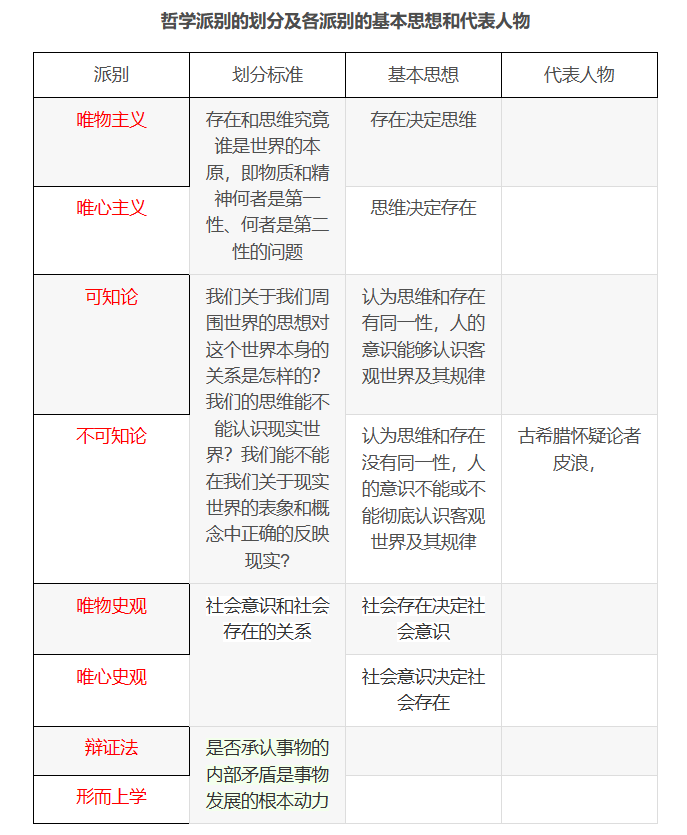

# 马原复习

## 马克思主义哲学部分(第一章 - 第三章)

### 1、哲学的基本问题 (第一章)

**哲学的基本问题**：存在和思维、物质和精神的关系问题

哲学基本问题主要包括两方面内容：一是存在和思维、物质和意识谁为本原的问题，即何者为第一性的问题，对这一问题的回答可以划分唯物主义和唯心主义；二是存在和思维、物质和意识是否具有同一性的问题，对这一问题的不同回答，产生了可知论和不可知论的理论分野

### 2、物质与意识的辩证关系(第一章)

* **物质决定意识**。物质对意识的决定作用表现在意识的起源和本质上。

  * 从意识的起源来看，一方面意识是自然界长期发展的产物。另一方面，意识也是社会历史发展的产物

  * 从意识的本质来看，意识是人脑一种特殊物质的机能和属性，是客观世界的主观映像。意识是物质的产物，但又不是物质本身

* **意识对物质具有反作用**。物质决定意识，意识对物质具有反作用。意识的能动作用主要体现在：
    * **意识具有目的性和计划性**。人会根据一定的目的和要求去确定反映，从而表现出主体的选择性
    * **意识具有创造性**。人在思维中可以构造一个现实所没有的观念世界
    * **意识具有指导实践改造客观世界的作用**。以形成的观念为指导，通过实践变为客观事实
    * **意识具有调控人的行为和生理活动的作用**。意识能够对人的行为选择和健康状况产生重要影响

* 主观能动性和客观规律性的辩证统一
  * 尊重客观规律是正确发挥主观能动性的前提。
  * 只有充分发挥主观能动性，才能正确认识和利用客观规律。
  * 正确发挥人的主观能动性，有以下三个方面的前提和条件：第一，从实际出发是正确发挥人的主观能动性的前提；第二，实践是正确发挥人的主观能动性的根本途径；第三，正确发挥人的主观能动性，还要依赖一定的物质条件和物质手段

* 意识与人工智能
  * 第一，人类意识是知情意的统一体，而人工智能只是对人类理性智能的模拟与扩展，不具备人类意识形式
  * 第二，社会性是人的意识所固有的本质属性，而人工智能不可能真正具备人类的社会属性
  * 第三，人类的自然语言是思维的物质外壳和意识的现实形式，人工智能难以完全理解自然语言

### 3、实践与认识的辩证关系（实践决定认识、实践与认识的辩证运动）科学实践观

#### 实践与认识的辩证关系

##### 实践对认识的决定性作用

实践对认识的决定作用表现在以下四个方面：

* **实践是认识的来源**。认识的内容是在实践活动的基础上产生和发展的
* **实践是认识发展的动力**。实践的需要推动认识的产生和发展，推动认识在深度和广度上不断发展；实践为认识的发展提供了手段和条件
* **实践是认识的目的**。人们通过实践获得认识，认识的最终目的是为实践服务，指导实践，以满足生活和生产的需要
* **实践是检验认识真理性的唯一标准**。认识是否具有真理性，只有在实践中才能得到验证

##### 实践与认识的辩证运动及其规律

实践与认识的辩证运动，是一个由**感性认识到理性认识**，又**由理性认识到实践**的飞跃

**从实践到认识，再从认识到实践，实现了人们认识具体事物的辩证运动过程**。经历了这两次飞跃，实践与认识的运动「既完成了，又没有完成」

说它「完成了」，是**针对具体事物的认识**而言，在由认识到实践飞跃的阶段，**实现了预想的目的**，**预定的计划、思想在实践中变为事实**，那么就算完成了

说它「又没有完成」，是**针对实践和认识运动过程的向前推移、向前发展**而言。人们的实践是向前推移、向前发展的，人们的认识运动也应随之推移和发展

在实践和认识的辨证运动中，**主观必须统一于客观，认识必须统一于实践**。这种统一是认识和实践的矛盾在发展中的统一

#### 科学实践观及其意义

科学实践观从**主观和客观**、**主体和客体**的统一中把握实践，**揭示了实践的本质**，深刻揭示出**实践与认识的发展规律**，形成了完整科学的理论体系

科学实践观的创立和发展具有十分重要的意义，主要表现在以下几个方面：

* 克服了旧唯物主义的根本缺陷，为辩证唯物主义奠定了科学的理论基础。
* 建立了科学的、能动的、革命的反映论，实现了人类认识史上的变革。
* 在人类思想史上第一次揭示了社会生活的实践本质，为创建科学的历史观奠定了理论基础。
* 为人们能动地认识世界和改造世界提供了基本的思想方法和工作方法。

### 4、联系和发展的基本环节(第一章)

(一) 内容与形式

内容与形式是从**构成要素**和**表现方式**上反映事物的一对基本范畴。内容是指构成事物的一切要素的总和，形式指把诸要素统一起来的结构或表现内容的方式。

**任何事物都是内容与形式的统一**。一方面，**内容是事物存在的基础，对形式具有决定作用**。有什么样的内容，就有什么样的形式。另一方面，**形式对内容具有反作用**。适合内容的形式，对内容的发展起积极的推动作用；不适用内容的形式，对内容的发展起消极的阻碍作用

**内容与形式的矛盾贯穿于事物发展过程的始终**。根据内容决定形式的原理，注重内容；又要积极利用合适的形式去促进内容的发展

(二) 本质与现象

本质与现象是揭示事物**内在联系**和**外在表现**的一对范畴。本质是事物的根本性质，是构成事物的诸要素之间的内在联系。现象是事物的外部联系和表面特征，是事物本质的外在表现。

**本质与现象是相互区别的**。本质是一般的、普遍的，现象是个别的、具体的

**本质与现象是相互依存的**。**本质决定现象，现象表现本质**。不表现为现象的本质和不表现本质的现象都是不存在的。

**正确把握本质和现象的关系对于我们的认识活动和科学研究具有重要作用**。

(三) 原因与结果

**原因与结果是揭示事物引起和被引起关系的一对范畴**。引起某种现象的现象就是原因，被某种现象所引起的现象就是结果

**原因与结果是相互区别的**。原因在前，结果在后，二者不能混淆和颠倒

**原因与结果是相互依存和相互转化的**。在事物因果联系的长链中，任何原因都必然引起一定的结果；任何结果都是由一定的原因引起的

**原因与结果的辩证关系能够指导我们的认识和实践活动**。

(四) 必然与偶然

**必然与偶然是揭示事物产生、发展和衰亡过程中的不同趋势的一对范畴**。必然是指事物联系与发展中确定不移的趋势，偶然是指事物联系与发展中不确定的趋势

**必然与偶然相互依存**。一方面，没有脱离偶然的必然；另一方面，没有脱离必然的偶然

**必然与偶然相互转换**。在事物的产生、发展和衰亡的过程中，包含必然性因素和偶然性因素的相互转化

**重视事物发展的必然规律和发展趋势，同时也要充分估计各种偶然因素的作用**

(五) 现实与可能

**现实与可能是反映事物的过去、现在和将来关系的一对范畴**。现实是指相互联系着的实际存在的事物的综合。可能是指包含在事务中、预示事物发展的种种趋势

**现实与可能相互区别**。现实是当下的客观存在，可能是事物潜在的趋势

**现实与可能相互转化**。一方面，现实蕴藏着未来的发展方向；另一方面，可能包含着发展成为现实的因素和根据。

**在实践中正确把握现实与可能的辩证关系，立足现实但也要着眼长远**

### 5、对立统一规律

**对立统一规律,是事物发展的根本规律，是唯物辩证法的实质与核心**

对立统一规律揭示了事物**普遍联系**的根本内容和**变化发展**的内在动力

对立统一规律提供的根本方法—— **矛盾分析法**

#### 矛盾的同一性和斗争性及其在事物发展中的作用

**首先，了解矛盾**。矛盾是反映事物内部和事物之间对立统一关系的哲学范畴

**其次，矛盾的两种属性**：同一性（矛盾双方相互依存、相互贯通的性质和趋势）、斗争性（矛盾着的对立面相互排斥、相互分离的性质和趋势）

**矛盾的同一性和斗争性相互联结、相辅相成**。没有斗争性就没有同一性，没有同一性也没有斗争性

矛盾的同一性和斗争性在事物发展中具有重要作用：

* 矛盾的同一性在事物发展中的作用表现在：
  * 同一性是事物存在和发展的前提
  * 同一性使矛盾双方相互吸取有利于自身的因素，在相互作用中各自得到发展
  * 同一性规定着事物转化的可能和发展的趋势
* 矛盾的斗争性在事物发展中的作用表现在：
  * 矛盾双方的斗争促进双方力量的变化，为对立面的转化、事物的质变创造条件
  * 矛盾双方的斗争是一种矛盾统一体向另一种矛盾统一体过渡的决定性力量

和谐是矛盾的一种特殊表现形式，体现着矛盾双方的相互依存、相互促进、共同发展，和谐是相对的、有条件的

#### 矛盾的普遍性和特殊性及其相互关系

矛盾的普遍性是指矛盾存在于**一切事物**中，存在于**一切事物发展过程的始终**

矛盾的特殊性是指各个**具体事物**的矛盾、每一个矛盾的**各个方面**在发展的**不同阶段**上各有其特点

最后，**矛盾地位的的不平衡原理**。**主要矛盾**是矛盾体系中处支配地位、对事物发展起决定作用的矛盾。**次要矛盾**是矛盾体系中处于从属地位、对事物的发展起次要作用的矛盾。不仅如此，**在每一对矛盾中，主要方面**处于支配地位，起着主导作用；处于被支配一方的则是矛盾的**次要方面**

**事物的性质是由主要矛盾的主要方面所规定的**

坚持 **「两点论」**（既要看到矛盾双方的对立，又要看到矛盾双方的统一；既要看到矛盾体系中的主要矛盾，又要看到次要矛盾。）和 **「重点论」**（把握主要矛盾、主要方面，并以此作为解决问题的出发点。）的统一。

**兼顾主次，抓住重点**

### 6、社会存在与社会意识 社会发展动力系统

#### 社会存在与社会意识

社会存在是指**社会物质生活条件，是社会生活的物质方面**，主要包括自然地理环境、人口因素和物质生产方式

* 自然地理环境是指**与人类社会所处的地理位置相联系的自然条件的总和**，是人类社会生存和发展永恒的、必要的条件，是人们生活和生产的自然基础。自然地理环境**提供了社会生活和生产资料的来源**
* 人口因素也是重要的社会物质生活条件，**对社会发展具有影响和制约作用**。适度的人口对社会发展起加速作用，过密或过疏的人口则对社会发展起延缓作用
* 物质生产方式，简称为生产方式，是指人们为获取物质生活资料而进行的生产活动的方式，**是生产力和生产关系的统一体**。物质生产方式是社会存在和发展的基础及决定力量

社会意识是**社会存在的反映**，是**社会生活的精神方面**。各种社会意识形式由于反映社会存在的方面、方式不同，因而作用也不同

#### 社会存在和社会意识的辩证关系

**社会存在和社会意识是辩证统一的**。社会存在决定社会意识，社会意识是社会存在的反映，并反作用于社会存在

**社会存在是社会意识内容的客观来源，社会意识是社会物质生活过程及其条件的主观反映**。社会意识根源于社会存在，产生的基础是人类的社会实践

**社会意识是人们进行社会物质交往的产物**。人类最初的意识是在物质生产及交往活动中产生的

**社会意识是具体的、历史的**。随着社会存在的发展，社会意识也相应地发展和变化

社会意识的**相对独立性**，指社会意识从**根本上**受到社会存在决定的同时，还具有**自身特有**的发展形式和发展规律。主要表现在：

* 社会意识与社会存在发展具有**不完全同步性和不平衡性**。进步的社会意识一定程度上可以指导人们的实践活动；落后于社会存在的社会意识则阻碍社会的发展
* 社会意识内部各种形式之间存在**相互影响且各自具有历史继承性**
* 社会意识对社会存在**具有能动的反作用**，这是社会意识相对独立性的突出表现。社会意识的能动作用是通过指导人们的实践活动实现的

#### 社会发展动力系统(?)

社会基本矛盾在历史发展中的作用：

* 生产力和生产关系、经济基础和上层建筑的矛盾是社会基本矛盾
* 社会基本矛盾是历史发展的根本动力
  * 生产力是社会基本矛盾运动中最基本的动力因素，是人类社会发展和进步的最终决定力量
  * 生产力是社会进步的根本内容，是衡量社会进步的根本尺度
  * 社会基本矛盾决定着社会中其他矛盾的存在和发展
  * 经济基础和上层建筑的矛盾影响和制约生产力和生产关系的矛盾
  * 社会基本矛盾从根本上影响和促进社会形态的变化和发展
* 社会主要矛盾在历史发展中的作用
  * 社会基本矛盾，贯穿并制约着社会发展的全过程，规定社会发展过程的基本性质
  * 社会主要矛盾不是一成不变的，在一定条件下会发生转化

阶级斗争和社会革命在阶级社会发展中的作用：

* 阶级和阶级斗争是人类社会发展到一定阶段才出现的社会现象
* 阶级斗争是阶级社会发展的直接动力
* 马克思主义的阶级分析方法是认识阶级社会的科学方法

社会革命的实质和作用：

* 社会革命的实质是革命阶级推翻反动阶级的统治，用新的社会制度代替旧的社会制度，解放生产力，推动社会发展
* 社会革命根源于社会基本矛盾的尖锐化
* 革命对社会发展起巨大作用

改革在社会发展中的作用：它是在一定程度上解决社会基本矛盾、促进生产力发展、推动社会进步的有效途径和手段

科学技术在社会发展中的作用：

* 科技革命是推动经济和社会发展的强大杠杆
* 每一次科技革命都不同程度引起了生产方式、生活方式和思维方式的深刻变化和社会的巨大进步
* 科学技术是社会发展的重要动力
* 正确认识和运用科学技术，才能促进经济和社会发展，造福人类

### 7、马克思的劳动价值论P168-182

1. 马克思劳动价值论的内涵

⻢克思阐明了商品的⼆因素和劳动的⼆重性及其相互关系、价值的质和量的规定性及其变化规律、价值形式的发展和货币的起源、商品经济的基本⽭盾和基本规律及其作⽤，形成了科学的劳动价值论

2. 马克思劳动价值论的理论和实践意义

* 马克思劳动价值论扬弃了英国古典政治经济学的观点，为剩余价值论的创立奠定了基础
* 马克思劳动价值论揭示了私有制条件下商品经济的基本矛盾，为从物与物的关系背后揭示人与人的关系提供了理论依据
* 马克思劳动价值论揭示了商品经济的一般规律，对理解社会主义市场具有指导意义

3. 21世纪，我们必须深化对马克思劳动价值论的认识

* 深化对创造价值的劳动的认识，对生产性劳动作出新的界定
* 深化对科技人员，经营管理人员在社会生产和价值创造中所起作用的认识
* 深化对价值创造与价值分配关系的认识

### 8、剩余价值理论

剩余价值是雇佣工人所创造的并被资本家无偿占有的超过劳动力价值的那部分价值，它是雇佣工人剩余价值的凝结，体现了资本家与雇佣工人之间剥削与被剥削的关系

资本是能够带来剩余价值的价值
剩余价值仅仅是由可变资本雇佣的劳动者创造的。
剩余价值生产的两种基本方法：绝对价值的生产（必要劳动时间不变，延长工作日的长度或提高劳动强度而生产的剩余价值）和相对价值的生产（工作日长度不变，通过缩短必要劳动时间而相对延长剩余劳动时间所生产的剩余价值）

剩余价值理论的意义：

马克思通过分析剩余价值的生产，积累，流通以及分配过程，揭示了剩余价值的运动规律及其作用，创立了剩余价值理论。
* 剩余价值理论深刻揭露了资本主义生产关系的剥削本质，阐明了资产阶级与无产阶级之间阶级斗争的经济根源，指出了无产阶级革命的历史必然性。
* 剩余价值理论是马克思经济学说的核心内容和基石，是无产阶级反对资产阶级，揭示资本主义制度剥削本质的锐利武器。
* 由于唯物史观和剩余价值理论的发现，社会主义由空想变为科学

### 9、科学社会主义一般原则

#### 科学社会主义基本原则及其主要内容

科学社会主义基本原则是社会主义事业发展规律的集中体现

* 第一，资本主义必然灭亡，社会主义必然胜利。这两个「必然」是科学社会主义的核心命题，其根本依据是人类社会发展的特殊规律
* 第二，无产阶级是最先进最革命的阶级，肩负着推翻资本主义旧世界、建立社会主义和共产主义新世界的历史使命
  * 无产阶级是社会化大生产的产物，是先进生产力的代表
  * 只有无产阶级才能作为革命的领导阶级，带领广大人民群众，推翻资本主义旧世界，建设社会主义和共产主义新世界
* 第三，无产阶级革命是无产阶级进行斗争的最高形式，以建立无产阶级专政的国家为目的
  * 无产阶级为了获得解放就必须开展反抗资产阶级的斗争
  * 无产阶级革命是反抗资产阶级斗争的最高形式
  * 必须打碎资产阶级国家机器，建立无产阶级专政的国家政权
* 第四，社会主义社会要在生产资料公有制基础上组织生产，以满足全体社会成员的需要为生产的根本目的
* 第五，社会主义社会要对社会生产进行有计划的指导和调节，实行按劳分配原则。
* 第六，社会主义社会要合乎自然规律地改造和利用自然，努力实现人与自然的和谐共生。
* 第七，社会主义社会必须坚持科学的理论指导，大力发展社会主义先进文化。
* 第八，无产阶级政党是无产阶级的先锋队，社会主义事业必须始终坚持无产阶级政党的领导。
* 第九，社会主义社会要大力解放和发展生产力，逐步消灭剥削和消除两极分化，实现共同富裕和社会全面进步，并最终向共产主义社会过渡
* 第十，共产主义是人类最美好的社会，实现共产主义是共产党人的最高理想

#### 正确把握科学社会主义基本原则

第一，必须始终坚持科学社会主义一般原则，反对任何背离科学社会主义一般原则的错误倾向。

第二，要善于把科学社会主义一般原则与本国实际相结合，创造性地回答和解决革命、建设、改革中的重大问题。

第三，紧跟时代和实践的发展，在不断总结新鲜经验中进一步丰富和发展科学社会主义一般原则

#### 科学社会主义基本原则与中国特色社会主义

* 中国特色社会主义始终坚持科学社会主义基本原则
* 中国特色社会主义实现了科学社会主义基本原则与当代中国实际、中华优秀传统文化的有机结合
* 中国特色社会主义既坚持了科学社会主义基本原则，又具有鲜明的民族特色和时代特色
* 习近平新时代中国特色社会主义思想，标志着我们党在自觉把科学社会主义基本原则与中国实际和时代特征相结合上达到了新境界