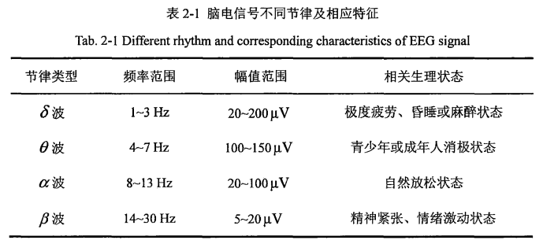

# 论文阅读记录

## 1 基于稳态视觉诱发电位的脑电信号处理方法研究

### 1.1 研究背景

**介绍脑电信号的概念**：脑电信号是大脑皮层产生的一种微弱电流 ，通常可以用来反映神经细胞生理活动 ，其中包含了大量的生理信息 ，在医学领域可用于诊断脑部疾病 

**列举大脑皮层产生的几种不同信号，分别对应了四个数据集中的三个**：大脑 皮层产 生 的 信 号 多 种 多 样 ， 目 前 广泛应用 到 脑－机接 口 技术 中 的 主要 有 Ｐ３ ０ ０ 电位 、 运动 想 象 （ Ｍｏｔｏｒｉｍａｇｅｒｙ，ＭＩ ）信号和稳态视觉诱发电位

**进一步介绍SSVEP产生的原理和优点**：ＳＳＶＥＰ是指人在受到一定频率 的 刺 激时 大脑 皮层诱发 的 节 律性信 号 ， 它 的 优 点 在 于 易 检测 且抗干扰能力强，其通过对 目 标频率 的 分类可准确识别 使用 者 的运动 意 图

**提高分类识别的准确率具有意义**：由 于脑 电 信 号 随机性强 、 稳定 性差 ， 且强度十 分微弱 ， 易 受背 景 噪声的 影 响 ， 因 此提高脑 电信 号 分类 的 准 确 率 从而优化 ＢＣ Ｉ 系 统 的 性能具 有较大 的 难度

### 1.2 SSVEP国内外研究现状

**自发性和诱发性**：脑 电 信 号 根据 其产 生 方式可 分 为 自 发 性 脑 电 和 诱发性脑 电 ， 由 于 自 发性脑 电 信 号 具有 较 强 的 随 机性且 不 易 采集 ， 因 此 在 实验研 究 中 多 数 团 队采用 诱发脑 电 信 号 作 为 Ｂ Ｃ Ｉ 系统 的 输 入。Ｓ Ｓ ＶＥ Ｐ信号作为一种 经 典 的 诱 发性脑 电信 号，具有抗干 扰性 强 、 不 需要 训 练 并且 更 容 易 操 作 和 采集等优势

**信号分析过程**：信 号 预 处理 、 特征 提取 和 信 号 分类

**SSVEP分类算法**：

* 功率谱密度分析算法（PSDA）:最早应 用 在SSVEP分类的算法，通过将信 号进行时 频域转换 ， 从而 得 到 Ｓ Ｓ ＶＥＰ 的 频率特征 ， 该方法运算量 小 、 操作 简单 ， 但对于 脑 电 信 号这样 非 线 性且 随机性较强 的 信 号 ， 其 分类 效 果 较差
* 傅里叶变换（FT）：提取 Ｓ Ｓ ＶＥ Ｐ 的 频 谱特征 并 进 行频 率 识别，但该 方法 需 要 在较长 的 时 间 窗 下 才 能 得 到 良 好 的 分类效 果
* 基于典型相关分析（CCA）：Lin 等人提出的基于典型相关分析的频率识别算法最具代表性，该算法利用脑电信号与参考信号之间的相关系数来表示其相 关性，参考信号由不同频率的正-余弦信号构造并作为 SSVEP 的一个类别，由于该算法在频率识别方面效果显著，各团队纷纷对Ｃ Ｃ Ａ 展开了深入的研究并提出了多种拓展算法

### 1.2 基础知识

**EEG信号分类**：脑电信号是大量神经元同步化放电的结果，因此会体现出一定的节律性。人脑中产生的 EEG 信号根据不同频率波段可分为四种类型：$\delta$ 波、$\theta$ 波、$\alpha$ 波 和 $\beta$ 波

**脑电信号产生方式**：自发型和诱发型

* 自发型脑电信号：大脑皮层 的 神经元在不经过任何外部刺激时产生 的 ， 是受试者在大脑 内 主 动 产生 的 意 识信 号 ， 但想稳 定 的 利用 这种 信 号 需要进行反复训 练 ， 这类信 号较为典 型 的 为运动 想 象信 号 ， 也是 目 前 在脑－机接 口 系 统 中 应 用 最广 泛 的 信 号 之一
* 诱发型脑电信号：在给予大脑一定 外 界刺激时 ， 大脑皮层相应 的 脑 区 不 自 觉 产生 的 电信 号 活动 ， 该 外 界刺 激可 以 是视 觉 、 听 觉 及触觉 等 

**视觉诱发电位**：一种 通过光信 号对大脑 的 视觉 系 统进行刺激而诱发 的 响应信 号 ， 可 以 反 映 大脑 的视觉系 统在特定光刺激下 的 活动情况 ， 常 见 的一些 图 形变化一般都可 能 会诱发 ＶＥＰ ， 比 如 闪 光刺 激 、 光栅变化和 图 形翻转等。视觉诱发 电位根据 其 诱 发 刺 激源 的 不 同 可 以 分 为 两 类 ： 瞬 态视 觉 诱 发 电 位和 稳态视觉诱发 电位

* 瞬态视觉诱发电位：当 人 眼 注视小于 ２ Ｈｚ 的 单 次刺激时 ， 大脑 皮层 的 视觉 系统会产 生相 应 的 信 号 响 应 ， 称之为 ＴＶＥＰ ， 这种 信 号 比 较微弱 且在 实 验中 不 便 于观察
* 稳态视觉诱发电位：当人眼注视大于 ４ Ｈｚ 的周期性视觉刺激时，大脑 皮层随之会产生一种与之相关的周期性响应由于这类视觉刺激的间隔时间较短，所以相应产生的视觉诱发电位也会发生叠加，导致其信号强度大大增强，因此可以直接在频谱分析中观测到 Ｓ ＳＶＥＰ 信 号

### 1.3 SSVEP 分类算法

常用的 SSVEP 分类算法主要有：典型相关分析、多变量同步指数分析、任务相关成分分析

> 一般对 SSVEP 进行频率识别时，需要将原始信号与 **人为构造** 的参考信号进行对比，通过客观的评价指标选出与原始信号最匹配的参考信号，该参考信号的类别就是待分类信号的类别

## 2 基于卷积神经网络的SSVEP分类算法研究

### 2.1 绪论

基于脑电信号的SSVEP分类算法目前主要分为三类：

1. 无需训练(training-free)的分类方法。该分类算法**不需要训练数据或先验数据**，**无需训练**即可开始使用脑机接口系统
   
   * 功率谱密度分析(Power Spectral Density Analysis，PSDA)：利用快速傅里叶变换（Fast Fourier Transform，FFT）**将时域的 SSVEP 响应 EEG 信号转换到频域**上，根据当前信号频域的**幅值**、**相位**与不同频率刺激源进行匹配得到分类结果
   * 典型相关性分析(Canonical Correlation Analysis，CCA)：一种多元统计分析方法，它提供了一种反映两组指标之间潜在相关性的方法。CCA 被用来计算 **EEG 信号**与 SSVEP刺激目标对应的**参考信号**之间的相关性，然后根据相关性大小得出分类结果
   * 能量最小化(Minimum Energy Combination)：通过空间滤波器将多通道的 EEG 信号进行**降维**，从而转换到低纬度空间，然后提取其中的特性，完成对信号进行分类

2. 指定用户(user-dependent)的分类方法
3. 无需指定用户(user-independent)的分类方法

### 2.2 SSVEP产生原理及信号特点

#### 2.2.1 产生原理

诱发电位：大脑在受到外界刺激后，大脑所产生的电活动，与自发电位（大脑自发产生的电活动）不同的是，诱发电位分为听觉诱发电位、躯体感觉诱发电位和视觉诱发电位

视觉诱发电位(visual evoked potential，VEP)：人眼受到**外界视觉刺激**后，大脑皮层所产生的电活动。根据所受视觉刺激的时间长短可分为**瞬态视觉诱发电位**和**稳态视觉诱发电位**

> 当刺激间隔**高于**单次诱发电位时长时，产生**瞬态视觉诱发电位**
> 当刺激间隔**低于**单次诱发电位时长时则产生**不断重叠**的 VEP 并形成**稳态视觉诱发电位**

当人在注视着以不低于约 6Hz 频率闪烁的光源时，大脑的视觉皮层会产生相应的振荡，从而导致脑电信号中相应**频率和谐波的振幅更强**

#### 2.2.2 信号特点

SSVEP 脑电信号是 EEG 信号的一种，SSVEP 脑电信号极易受到各种因素的干扰，因此，在进行SSVEP 实验时，EEG 数据中会采集到不需要的电生理信号：

* 眨眼导致的眼电伪迹（ocular artifact）
* 颈部肌肉运动发出的肌电伪迹（muscle artifact）
* 运动伪迹（motion artifact）：当被试者移动时，由电缆移动和电极位移引起的运动伪迹

特点：

1.  SSVEP 脑电信号幅度非常微弱。信号幅值通常低于 10μV 左右，有效的频率范围为 5-50Hz
2.  SSVEP 脑电信号是一种周期信号，其频率特性明显。SSVEP 响应在频谱上与刺激目标通常有着很大的相关性

### 2.3 SSVEP 分类算法研究

#### 2.3.1 无需训练的 SSVEP 分类算法

这种分类算法不需要任何训练数据或先验数据就可以直接对获取到的 SSVEP 数据进行分类

#### 2.3.2 指定用户的 SSVEP 分类算法

这类算法需要将特定被试者的部分 SSVEP 数据用作训练数据或先验数据来生成分类算法模型，并且该分类算法模型只能用于该用户

#### 2.3.3 无指定用户的 SSVEP 分类算法

将多个被试者的 SSVEP 数据用作训练数据或先验数据，得到一个通用的分类算法模型，并且该分类算法模型可用在 SSVEP 数据未被用作训练数据或先验数据的用户