# 软件测试基础

## 1 软件开发和测试理论

### 1.1 软件开发生命周期

#### 1.1.1 定义

软件开发生命周期 (Software Development Life Cycle，SDLC) , 是指软件开发过程中的一系列阶段，从需求分析到系统维护。SDLC旨在确保软件项目在**质量、进度和成本**等方面的成功，同时也有助于团队成员之间更好地协作和管理项目

#### 1.1.2 阶段

软件开发生命周期的主要阶段：

1. 需求分析：通过与客户沟通，了解客户的需求与期望，从而确定软件项目的目标和需求，然后将这些需求转化为详细的规格说明书
2. 设计：设计软件项目的**架构和模块**，并制定详细的设计文档。设计阶段的关键是确保软件项目的**可扩展性、可维护性和安全性**
3. 编码：开发人员会根据设计文档编写软件代码。这个阶段的关键是**确保代码质量**，包括**可读性、可维护性和可测试性**等
4. 测试：对软件项目进行各种测试，包括**单元测试、集成测试和系统测试**等。这个阶段的目的是确保软件项目的**质量和稳定性**
5. 部署：将软件项目部署到生产环境中。这个阶段的关键是确保软件项目的部署流程是**可靠和自动化**的
6. 维护：对软件项目进行维护和支持。这个阶段的关键是及时发现和解决问题，确保软件项目始终保持**高质量和可用性**

#### 1.1.3 常见的软件开发生命周期模型

过程模型是指导软件开发过程的方法论，常见的过程模型包括：瀑布模型、V 模型、原型模型、增量模型、螺旋模型等

##### (1) 瀑布模型

瀑布模型（Waterfall Model）是最早出现的软件开发模型，是传统软件开发方法的代表。它是一种**线性顺序模型**，将SDLC分为**需求分析、设计、实现、测试和维护**等阶段。其特点是：规定了它们 **自上而下、相互衔接的固定次序**，**每个阶段必须在前一个阶段完成之后才能开始**

##### (2) 增量模型

增量模型是一种迭代模型，将SDLC分为多个增量阶段，每个阶段都可以**独立**完成。每个增量阶段增加了新的功能，直到项目完成为止

当使用增量模型时，第 1 个增量往往是核心的产品，即**第 1 个增量实现了基本的需求**，但很多补充的特征还没有发布。客户对每一个增量的使用和评估都作为下一个增量发布的新特征和功能，这个过程在每一个增量发布后不断重复，直到产生了最终的完善产品。增量模型强调**每一个增量均发布一个可操作的产品**

在增量模型中，每个迭代阶段都得到开发，因此**每个阶段**都将经历**软件开发生命周期的要求、设计、编码，最后是测试模块**。每个阶段开发的功能都将添加到以前开发的功能上

##### (3) 螺旋模型

螺旋模型是一种迭代模型，结合了瀑布模型和增量模型的优点。它将SDLC分为多个迭代循环，每个迭代循环包括**风险评估**、需求分析、设计、实现、测试和部署等阶段

螺旋模型最大的特点在于**引入了其他模型不具备的风险分析**，使软件在无法排除重大风险时有机会停止，以减小损失

##### (4) V模型

V模型是一种**基于瀑布模型**的SDLC模型，将测试阶段与开发阶段相对应。它将SDLC分为需求分析、设计、编码、单元测试、集成测试、系统测试和验收测试等阶段

V 模型是一个著名的、**以测试为驱动**的开发模型，该模型强调开发过程中**测试贯穿始终**

#### 1.1.4 参考资料

[1] 软件开发生命周期. url:https://cloud.tencent.com/developer/techpedia/1620

[2] 项目管理之一 软件开发生命周期（软件开发过程、瀑布模型、敏捷开发等）. url:https://zhuanlan.zhihu.com/p/453000751

### 1.2 软件测试生命周期

#### 1.2.1 定义

软件测试生命周期 (Software Testing Life Cycle, STLC), 以一种明确的顺序来分步执行具体任务的**测试流程**,其目的是确保生产的软件能实现既定的质量目标。

在软件测试生命周期流程中，每个阶段的实施都是以特定的计划和一定的规则进行的。软件测试生命周期的各个阶段都会产生不同的**目标和项目可交付成果**

#### 1.2.2 软件测试生命周期阶段

1. 需求分析阶段：在此阶段，测试人员分析SDLC(软件开发生命周期)的需求文档，以检查客户所述的要求。在检查要求后，测试人员制定测试计划以检查软件是否满足要求
2. 测试计划阶段：它包括了**所有与测试计划相关的活动**。例如，这项工作需要多少测试人员参与，哪些测试人员应该负责哪些模块的测试，完成这些测试需要多少天，哪些错误跟踪软件适用于该软件的发布，哪些自动化测试工具适用于该软件的发布
3. 设置环境：测试环境的设置是一项独立的活动，可以与测试用例开发一起启动，需要一组必要的软件和硬件来创建测试环境
4. 测试用例执行：在该阶段，需要有一套完整的测试用例和详细的客户需求，并将测试用例与客户需求之间的比对，再根据比对结果将测试用例标记为通过还是未通过
5. 缺陷跟踪：如果出现产品特性和功能与客户需求不符的情况，测试人员会实施缺陷跟踪。实施缺陷跟踪的目的是确保产品的属性和功能与客户需求一致
6. 测试用例执行报告：测试用例的执行结果由测试领导编写。测试用例的执行结果包括：哪些测试工程师完成了哪些模块测试，发现了多少个bug，以及测试用例执行状态即有多少个测试用例处于通过状态，有多少个处于未通过状态
7. 测试用例评审报告：测试用例评审会由测试经理主持，并邀请所有参与此次测试的测试工程师参加。测试经理会与测试工程师们详细讨论整个测试流程。测试用例评审内容：主要讨论与整个测试相关的成功经验、失败原因以及改正措施

#### 1.2.3 参考资料

[1] 什么是软件测试生命周期？ url:https://cn.wintesting.com/what-is-software-testing-life-cycle/

### 1.3 测试方法

#### 1.3.1 等价类

#### 1.3.2 边界值

#### 1.3.3 判定表

##### (1) 适用场景

有多个输入条件、多个输出结果、输入条件之间可以相互组合、输入条件和输出条件存在依赖或制约关系

但条件个数不宜过多

##### (2) 案例

#### 1.3.4 场景法

##### (1) 适用场景

在测试后期，对项目的所有功能模块进行组合测试

测试依据：业务流程图

#### 1.3.5 错误推测法

### 1.4 如何设计测试用例？

1. 场景法
   
   在当前这个界面的每一个按钮、可交互的构件都要去测试

2. 从流程去考虑
   
   比如登录这一流程，就可以有登录成功和登录失败两种情况
   而登录失败又可以考虑多种情况，验证码登录、密码登录、邮箱登录等等。例如密码登录失败，还需要考虑密码登录失败的各种原因：比如边界值（密码位数小于最小值、密码位数大于最大值）、等价类（密码不匹配的情况）还有密码中有不合法字符或不合法的数字、字母、字符搭配

3. 非功能测试场景
   
   例如网络状况、兼容性问题、接口、数据校验、UI

4. 业务上

#### 1.4.1 测试用例的核心要素

常见的有以下几个要素：

1. 测试编号：用例ID，表示用例的唯一性。通常为字符+数字
2. 测试主题：测试标题，要求简洁明了无歧义
3. 测试简介：描述测试用例所属范围/模块
4. 测试重要程度（优先级）：表示测试用例的重要程度。通常为P1、P2、P3...(这里的P表示Priority)
5. 预置条件：执行当前步骤所需要的前提条件
6. 测试输入：执行测试所需要的测试数据
7. 测试步骤：执行测试的详细步骤
8. 预期结果：该功能所要达到的预期结果

| 测试编号 |       测试主题       | 测试简介 | 优先级 |           预置条件           | 测试输入 |                            测试步骤                             |       预期结果       |
| :------: | :------------------: | :------: | :----: | :--------------------------: | :------: | :-------------------------------------------------------------: | :------------------: |
| Login_01 | 验证登录功能是否正常 | 登录模块 |   P3   | 处于登录页面且用户账号已注册 |    空    | 1. 输入6位账号:114514 2.输入6位密码:666666 3.点击登录按钮 | 登录成功并跳转至主页 |

### 1.5 软件缺陷

#### 1.5.1 定义

软件在运行过程中出现的任何问题，称为**缺陷**，简称Bug

#### 1.5.2 软件缺陷的判定标准

可以看到，前四个标准都是围绕着**需求（规格）说明书**来进行判定

#### 1.5.3 缺陷产生原因和阶段

#### 1.5.4 软件缺陷的核心内容

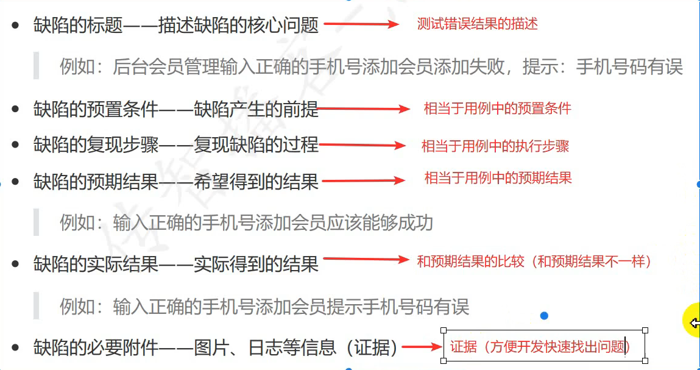

与测试用例的核心元素有共通之处

#### 1.5.5 缺陷的其他要素

* 缺陷编号：一个编号唯一标识一个缺陷
* 缺陷状态：描述缺陷生命周期过程
  * 新建(new):表示缺陷的产生
  * 打开(open):表示开发确认通过
  * 拒绝(rejected):开发确认不通过，认为不是Bug
  * 进行中(inprogress)
  * 已修复(fixed)
  * 延迟修复(delay)
  * 测试通过(closed):表示测试通过，已关闭
  * 测试不通过(reopen/open):表示测试不通过，重新打开
* 缺陷所属模块：缺陷产生的范围，属于哪个模块
* 缺陷的优先级(Priority, P1,P2,...)
* 缺陷的严重程度(Serious, S1,S2,...)
* 缺陷的类型：描述缺陷的产生属于哪种类型
  * 功能问题
  * 兼容性问题
  * UI问题
  * 安全问题
  * 架构问题

#### 1.5.6 缺陷的跟踪流程

该图分为左右两个部分，左半部分以测试为主，同时也是测试能执行的操作，右半部分以开发为主，是开发能执行的操作

有一点需要和前面写测试用例时区分开，写测试用例时标题可能会带「是否」，例如，登录是否成功，但**在缺陷报告中不能出现这种模棱两可的词汇**

## 2 功能测试实战：TPshop商城

### 2.1 测试环境搭建

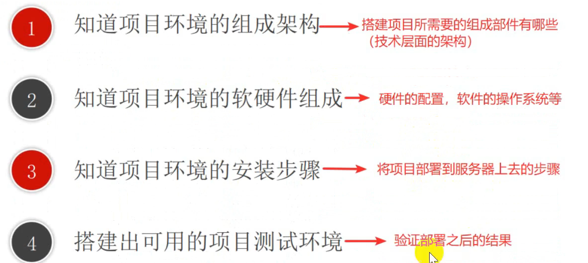

了解项目的组成架构

了解项目环境的软硬件组成

了解项目环境的安装步骤并搭建可用的测试环境

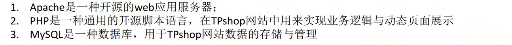

### 2.2 熟悉项目

弄清楚两个关键问题：

* 项目的核心模块：单个模块的功能
* 项目的业务流程（业务逻辑）：用户如何适用

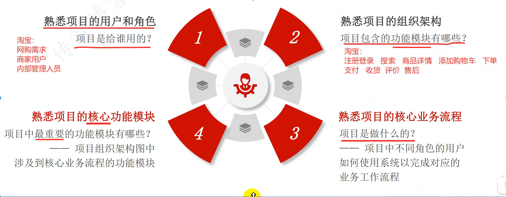

* 了解项目是给谁用的
* 熟悉项目的功能模块
* 熟悉**核心业务流程**
* 熟悉**核心功能模块**

#### 2.2.1 熟悉项目的用户和角色

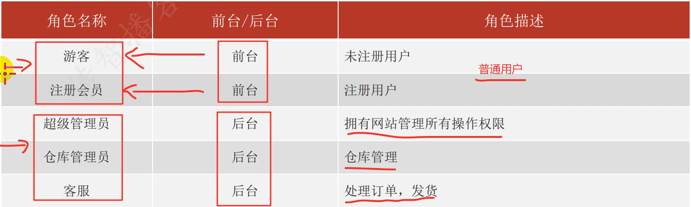

普通用户分为两种：游客（未注册）和会员（已注册），这两种角色主要在前台上进行相关操作

后端用户有三类：客服、仓库管理员、超级管理员

* 客服：负责处理订单、收货等
* 仓库管理：负责商品的上下架
* 超级管理员：负责整个系统的管理和维护，**拥有网站管理的所有权限**

#### 2.2.2 熟悉项目的核心业务流程

核心业务流程主要有：

* 商品购买流程
* 商品发货流程
* 商品退换货流程

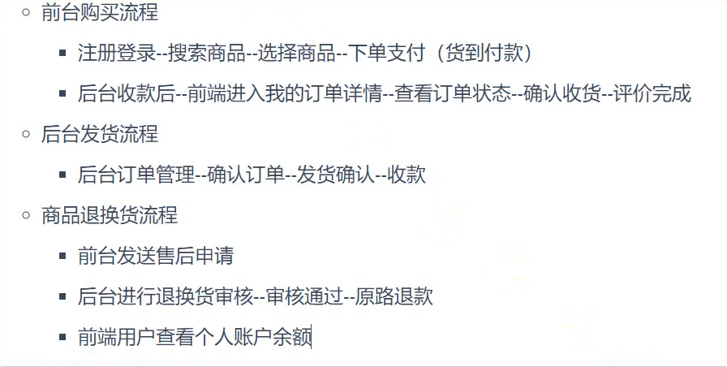

##### (1) 购买流程和后台发货流程

用户进行注册登录后，通过搜索框来搜索心仪的商品，选择所要购买的商品后，加入购物车并进行下单（填写完相关信息后比如姓名、联系电话、填写备注等）支付（这里选择货到付款的方式）。这时客服接到订单后在后台查看订单相关信息（商品收获地址等），确认无误后确认订单，然后将商品发货后需要在后台进行发货确认。待用户收到商品并付款成功，客服在后台确认收款无误后，用户方能确认收货

##### (2) 商品退换货流程

用户收到商品后不满意，在前台填写完相关信息后发起售后申请（退款/退货），客服在后台进行审核，审核通过后将金额原路退还，用户在前台个人账户界面查看金额是否到账

#### 2.2.3 找出项目的核心模块

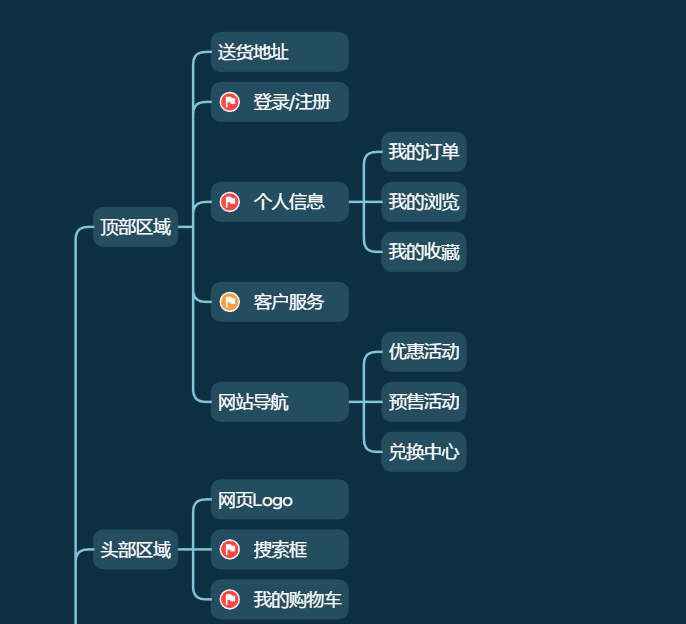

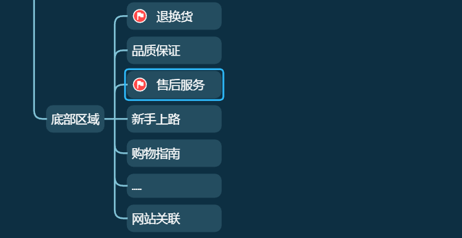

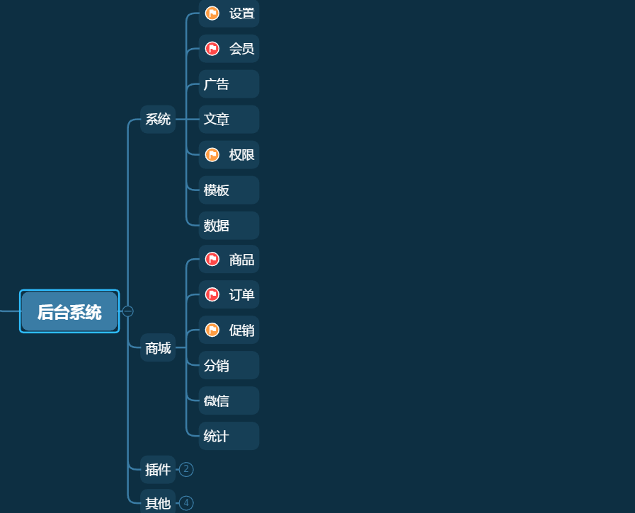

该项目中的核心模块主要与**用户**有关、与**商品**有关

#### 2.2.4 项目测试流程

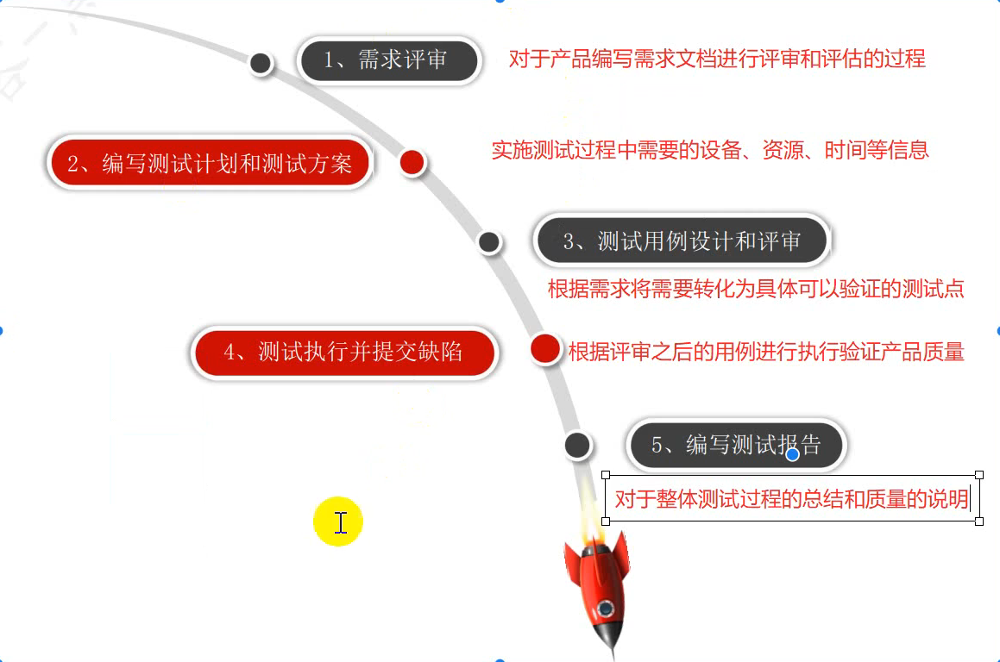

* 需求评审：对产品编写的需求文档进行评审和评估
* 编写测试计划和测试方案：主要包含进行测试过程中需要的资源、设备、时间等信息
* 测试用例设计和评审：将需求转化为可以验证的测试点
* 测试执行并提交缺陷：根据评审后的测试用例进行测试并验证产品质量
* 编写测试报告：最后形成一份测试报告，是对整个测试过程中的总结和说明

#### 2.2.5 测试计划和测试方案

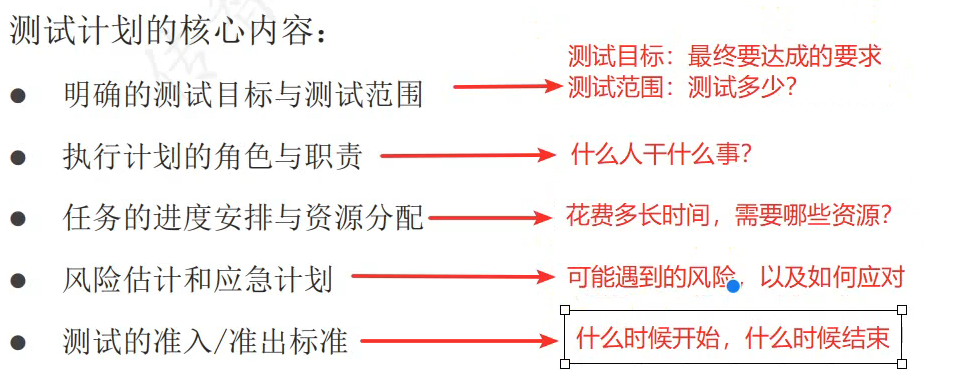

* 测试目标和测试范围：测试目标即最终要达到的目标，测试范围即测试覆盖的范围
* 角色和职责：参与测试的人员以及相对应分配到的任务
* 进度安排和资源分配：测试预计要花费的时间，在测试过程中需要用的资源（人力、金钱、硬件资源等）
* 风险评估和应急计划：可能遇到的风险及对应的解决方案
* 测试的准入/准出标准：也就是测试的开始时间和结束时间

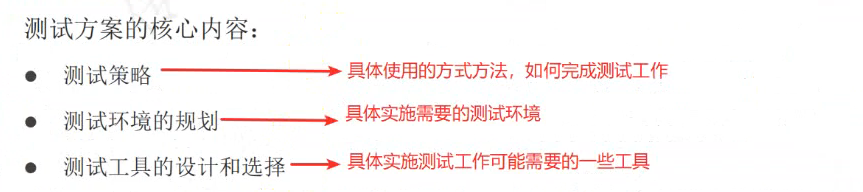

测试方案侧重于「怎么测」，比如测试过程中使用什么方法、在什么样的环境下进行测试以及会使用到哪些工具

