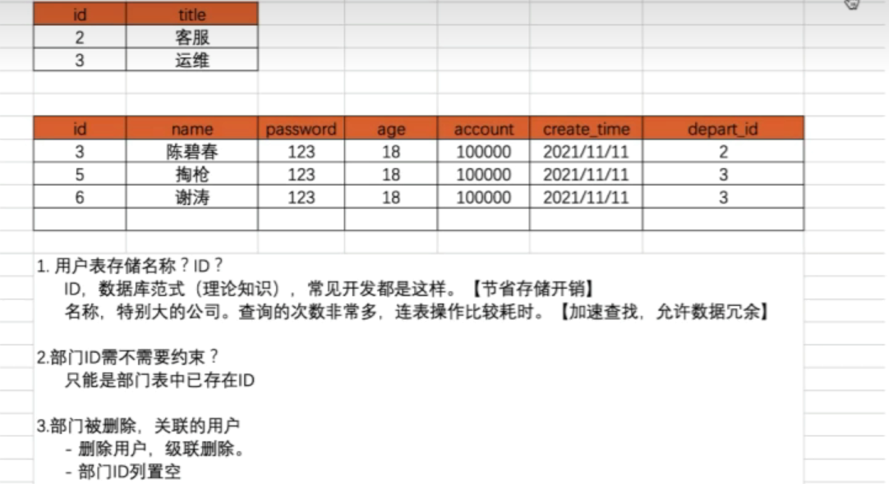
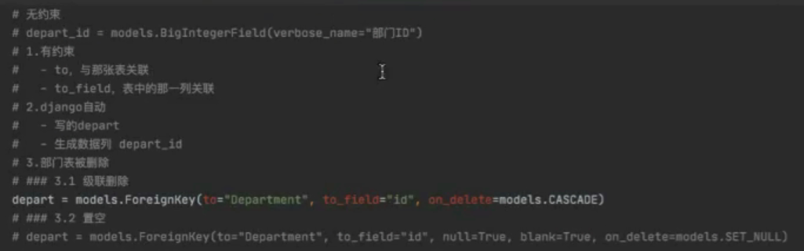
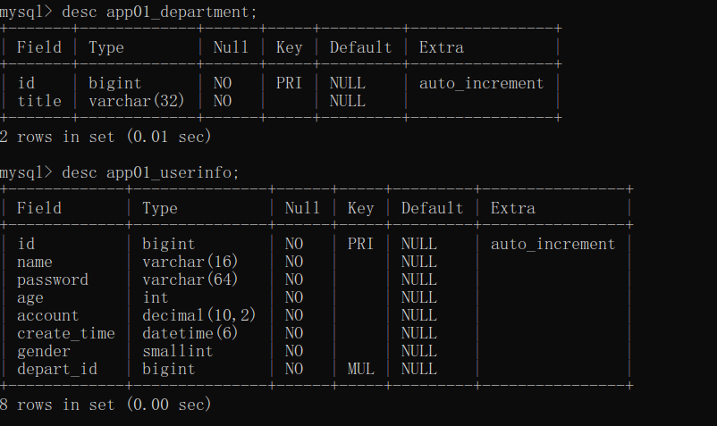
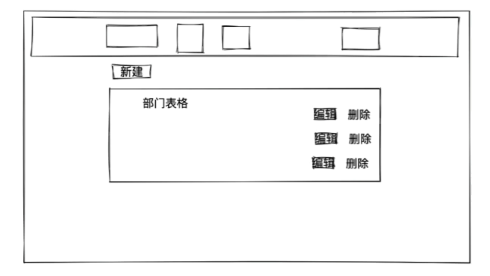
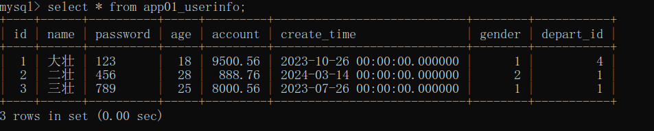

# 五天Django学习+项目实战

## 1 Day1

### 1.1 orm

#### 1.1.1 创建数据库

`create database day15 DEFAULT CHARSET utf8 COLLATE utf8_general_ci`

#### 1.1.2 Django连接数据库

在settings文件中进行配置和修改

```
DATABASES = {
     'default': {
        'ENGINE': 'django.db.backends.mysql',
        'NAME':  'sms',
        'USER': 'root',
        'PASSWORD': '1234560',
        'HOST': '127.0.0.1',
        'PORT': 3306
     }
}
```

#### 1.1.3 Django操作表

创建表，在models.py中

```Python
class UserInfo(models.Model):
    name = models.CharField(max_length=32)
    password = models.CharField(max_length=64)
    age = models.IntegerField()
```

执行命令，在终端中输入以下两条命令：

```
python manage.py makemigrations
python manage.py migrate
```

在表中新增列时，必须要对新增列指定数据：

* 手动输入一个值
* 指定默认值
* 允许为空

#### 1.1.4 操作表中的数据

#### 1.1.5 案例：用户管理

##### (1) 展示用户列表

* url
* 函数
  * 获取所有的用户信息
  * HTML渲染

insert into app01_userinfo(name, password, age) values ("张三", "123", 18);

insert into app01_userinfo(name, password, age) values ("李四", "1235", 28);

##### (2) 添加用户

* url
* 函数
  * GET：显示页面，输入内容
  * POST：提交->添加到数据库

## 2 Day2

### 2.1 新建项目

### 2.2 创建app

### 2.3 设计表结构



和部门表进行关联，则用户表中需要创建一个字段来存储部门表中部门ID

并且需要对部门ID进行约束



### 2.4 在MySQL中生成表

在命令行中连接MySQL生成数据库

`create database day16 DEFAULT CHARSET utf8 COLLATE utf8_general_ci`

修改配置文件，连接数据库

```
DATABASES = {
     'default': {
        'ENGINE': 'django.db.backends.mysql',
        'NAME':  'sms',
        'USER': 'root',
        'PASSWORD': '1234560',
        'HOST': '127.0.0.1',
        'PORT': 3306
     }
}
```

Django命令生成数据库表，在Pycharm中执行命令，在终端中输入以下两条命令：

```
python manage.py makemigrations
python manage.py migrate
```



### 2.5 静态文件管理


### 2.6 部门管理

> 先用最原始的方法来实现
> 但其实Django中提供的Form和ModelForm组件会更方便

#### 2.6.1 部门列表



#### 2.6.2 数据库数据

先手动添加两条记录

`insert into app01_department(title) values ('销售部');`

`insert into app01_department(title) values ('技术部');`

### 2.7 模板的继承

Django中支持模板的继承

定义模板：

```HTML

<!DOCTYPE html>
<html lang="en">

<head>
    <meta charset="UTF-8">
    <title>Document</title>

    <link rel="stylesheet" href="">
    <link rel="stylesheet" href="">

    <style>
        .navbar {
            border-radius: 0;
        }
    </style>
</head>

<body>

<!-- 导航条, https://v3.bootcss.com/components/#navbar -->
<nav class="navbar navbar-default">
    <div class="container">
        <!-- Brand and toggle get grouped for better mobile display -->
        <div class="navbar-header">
            <button type="button" class="navbar-toggle collapsed" data-toggle="collapse"
                    data-target="#bs-example-navbar-collapse-1" aria-expanded="false">
                <span class="sr-only">Toggle navigation</span>
                <span class="icon-bar"></span>
                <span class="icon-bar"></span>
                <span class="icon-bar"></span>
            </button>
            <a class="navbar-brand" href="#">员工管理系统</a>
        </div>

        <!-- Collect the nav links, forms, and other content for toggling -->
        <div class="collapse navbar-collapse" id="bs-example-navbar-collapse-1">
            <ul class="nav navbar-nav">
                <li><a href="/depart/list/">部门管理</a></li>
                <li><a href="#">部门管理</a></li>

            </ul>
            <ul class="nav navbar-nav navbar-right">
                <li><a href="#">登录</a></li>
                <li class="dropdown">
                    <a href="#" class="dropdown-toggle" data-toggle="dropdown" role="button" aria-haspopup="true"
                       aria-expanded="false">大壮<span class="caret"></span></a>
                    <ul class="dropdown-menu">
                        <li><a href="#">个人资料</a></li>
                        <li><a href="#">我的信息</a></li>
                        <li role="separator" class="divider"></li>
                        <li><a href="#">注销</a></li>
                    </ul>
                </li>
            </ul>
        </div><!-- /.navbar-collapse -->
    </div><!-- /.container-fluid -->
</nav>
<!-- 新建区域 -->
<div>
        

        
</div>

<script src=""></script>
<script src=""></script>
</body>

</html>

```

继承模板：

```HTML




    <div class="container">
        <div class="panel panel-default">
            <div class="panel-heading">
                <h3 class="panel-title"> 新建部门 </h3>
            </div>
            <div class="panel-body">
                <form method="post">
                    
                    <div class="form-group">
                        <label>部门名称</label>
                        <input type="text" class="form-control" placeholder="标题" name="title"/>
                    </div>


                    <button type="submit" class="btn btn-primary">保存</button>
                </form>
            </div>
        </div>
    </div>



```

### 2.8 用户管理

#### 2.8.1 用户列表:user_list

#### 2.8.2 往数据库中添加数据

```sql
insert into app01_userinfo(name, password, age, account, create_time, gender, depart_id) 
values("大壮", "123", 18, 9500.56, "2023-10-26", 1, 4);

insert into app01_userinfo(name, password, age, account, create_time, gender, depart_id) 
values("二壮", "456", 28, 888.76, "2024-03-14", 2, 1);

insert into app01_userinfo(name, password, age, account, create_time, gender, depart_id) 
values("三壮", "789", 25, 8000.56, "2023-07-26", 1, 1);
```

查看数据库表中的数据

