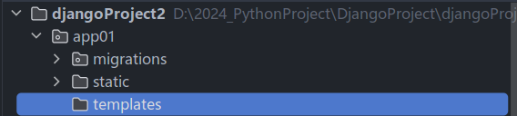

# 五天Django学习+项目实战

## 1 Day1

### 1.1 orm

#### 1.1.1 创建数据库

`create database day15 DEFAULT CHARSET utf8 COLLATE utf8_general_ci`

#### 1.1.2 Django连接数据库

在settings文件中进行配置和修改

```
DATABASES = {
     'default': {
        'ENGINE': 'django.db.backends.mysql',
        'NAME':  'sms',
        'USER': 'root',
        'PASSWORD': '1234560',
        'HOST': '127.0.0.1',
        'PORT': 3306
     }
}
```

#### 1.1.3 Django操作表

创建表，在models.py中

```Python
class UserInfo(models.Model):
    name = models.CharField(max_length=32)
    password = models.CharField(max_length=64)
    age = models.IntegerField()
```

执行命令，在终端中输入以下两条命令：

```
python manage.py makemigrations
python manage.py migrate
```

在表中新增列时，必须要对新增列指定数据：

* 手动输入一个值
* 指定默认值
* 允许为空

#### 1.1.4 操作表中的数据

#### 1.1.5 案例：用户管理

##### (1) 展示用户列表

* url
* 函数
  * 获取所有的用户信息
  * HTML渲染

insert into app01_userinfo(name, password, age) values ("张三", "123", 18);

insert into app01_userinfo(name, password, age) values ("李四", "1235", 28);

##### (2) 添加用户

* url
* 函数
  * GET：显示页面，输入内容
  * POST：提交->添加到数据库

## 2 Day2

### 2.1 新建项目

### 2.2 创建app

### 2.3 设计表结构


和部门表进行关联，则用户表中需要创建一个字段来存储部门表中部门ID

并且需要对部门ID进行约束


### 2.4 在MySQL中生成表

在命令行中连接MySQL生成数据库

`create database day16 DEFAULT CHARSET utf8 COLLATE utf8_general_ci`

修改配置文件，连接数据库

```
DATABASES = {
     'default': {
        'ENGINE': 'django.db.backends.mysql',
        'NAME':  'sms',
        'USER': 'root',
        'PASSWORD': '1234560',
        'HOST': '127.0.0.1',
        'PORT': 3306
     }
}
```

Django命令生成数据库表，在Pycharm中执行命令，在终端中输入以下两条命令：

```
python manage.py makemigrations
python manage.py migrate
```


### 2.5 静态文件管理



### 2.6 部门管理

> 先用最原始的方法来实现
> 但其实Django中提供的Form和ModelForm组件会更方便

#### 2.6.1 部门列表


#### 2.6.2 数据库数据

先手动添加两条记录

`insert into app01_department(title) values ('销售部');`

`insert into app01_department(title) values ('技术部');`