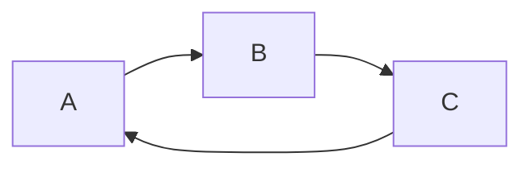

# Markdown Math Configuration

---

行内公式：

单位圆 $x^2 + y^2 = 1$

公式块：

$$
\begin{cases}
x = \rho \cos \theta \\
y = \rho \sin  \theta \\
\end{cases}
$$

---

上标和下标

上标 $x^{2} + y^{12} = 1$

下标 $x_1 + y_{12} = 1$

---

分式

较小的行内分式分数 $\frac{1}{2}$

展示型的分式 $\displaystyle\frac{(x + 1)}{x - 1}$

$\displaystyle \frac{(x + 1)}{(y - 1)}$

---

根式

平方根 $\sqrt{2}$

$n$ 次方根 $\sqrt[n]{2}$

---

累加、累乘与积分

累加 $\sum_{k = 1}^{n}\frac{1}{k} \quad \displaystyle \sum_{k=1}^{n}\frac{1}{k}$

累乘 $\prod_{k=1}^{n}\frac{1}{k} \quad \displaystyle \prod_{k=1}^{n} $

积分 $\displaystyle \int_{0}^{1} x \mathrm{d}x$

$\displaystyle \int_0^1x{\rm d}x \quad \iint_{D_{xy}} \quad \iiint_{\Omega_{xyz}}$

---

括号修饰

圆括号 $\displaystyle \left( \sum_{k = 1}^{n}\frac{1}{k} \right)^{2}$

方括号 $\displaystyle \left[ \sum_{k = 1}^{n}\frac{1}{k} \right]^{2}$

花括号 $\displaystyle \left\{ \sum_{k=1}^{n}\frac{1}{k} \right\} ^{2}$

尖括号 $\displaystyle \left<\sum_{k=1}^{n}\frac{1}{k} \right>^{2}$

$\displaystyle \left\langle\sum_{k=1}^{n}\frac{1}{k} \right\rangle^2$

---

多行算式对齐

居中：

$$
\begin{aligned}
y &=(x+5)^{2}-(x+1)^{2} \\
&=(x^{2}+10x+25)-(x^{2}+2x+1) \\
&= 8x+24 \\
\end{aligned}
$$

左对齐：

$\begin{aligned}
y &= (x+5)^{2}-(x+1)^{2} \\
&= (x^{2}+10x+25)-(x^{2}+2x+1) \\
&= 8x+24 \\
\end{aligned}$

---

方程组

$$
\begin{cases}
    k_{11}x_1+k_{12}x_2+ \cdots +k_{1n}x_n=b_1\\
    k_{21}x_1+k_{22}x_2+ \cdots +k_{2n}x_n = b_2\\
    \cdots  \\
    k_{n1}x_1+k_{n2}x_2+ \cdots +k_{nn}x_n = b_n \\
\end{cases}
$$

---

矩阵

$$
\begin{bmatrix}
1 & 1 & \cdots & 1 \\
1 & 1 & \cdots & 1 \\
\vdots & \vdots & \ddots & \vdots \\
1 & 1 & \cdots 1 \\
\end{bmatrix}
$$

$$
\begin{pmatrix} 
1 & 1 & \cdots & 1 \\ 
1 & 1 & \cdots & 1 \\
\vdots & \vdots & \ddots & \vdots \\
1 & 1 & \cdots & 1 \\
\end{pmatrix}
$$

行列式：

$$
\begin{vmatrix} 1 & 1 & \cdots & 1 \\
1 & 1 & \cdots & 1 \\ 
\vdots & \vdots & \ddots & \vdots \\
1 & 1 & \cdots & 1 \\
\end{vmatrix}
$$

---

公式编号与引用

$$
x+2 \tag{1.2}
$$

$$
\begin{equation}
    x^{n}+y^{n}=z^{n}
\end{equation}
$$

由公式 $(1.2)$ 可得结论

$\mathbb{R}$

---

各种图

